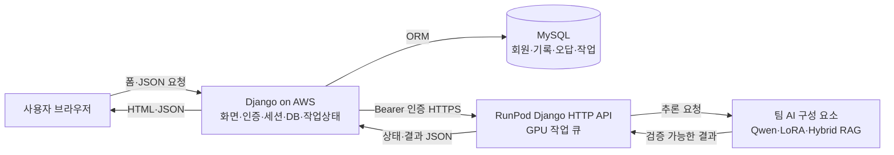
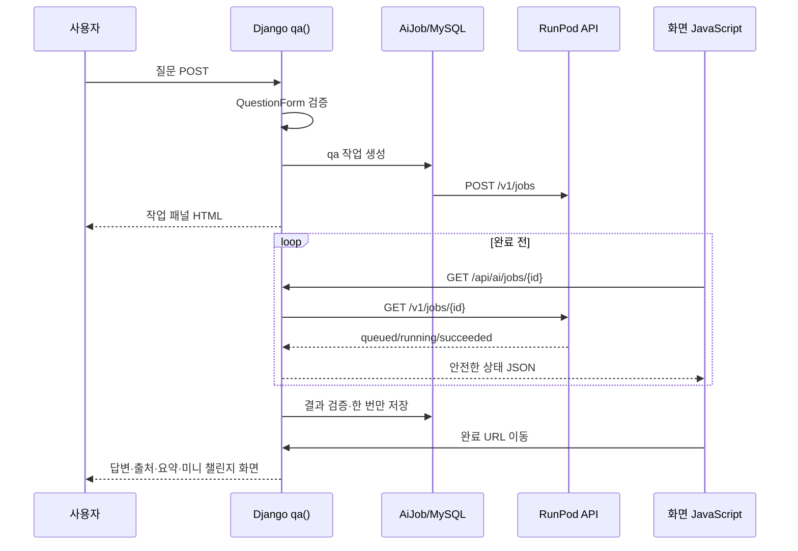
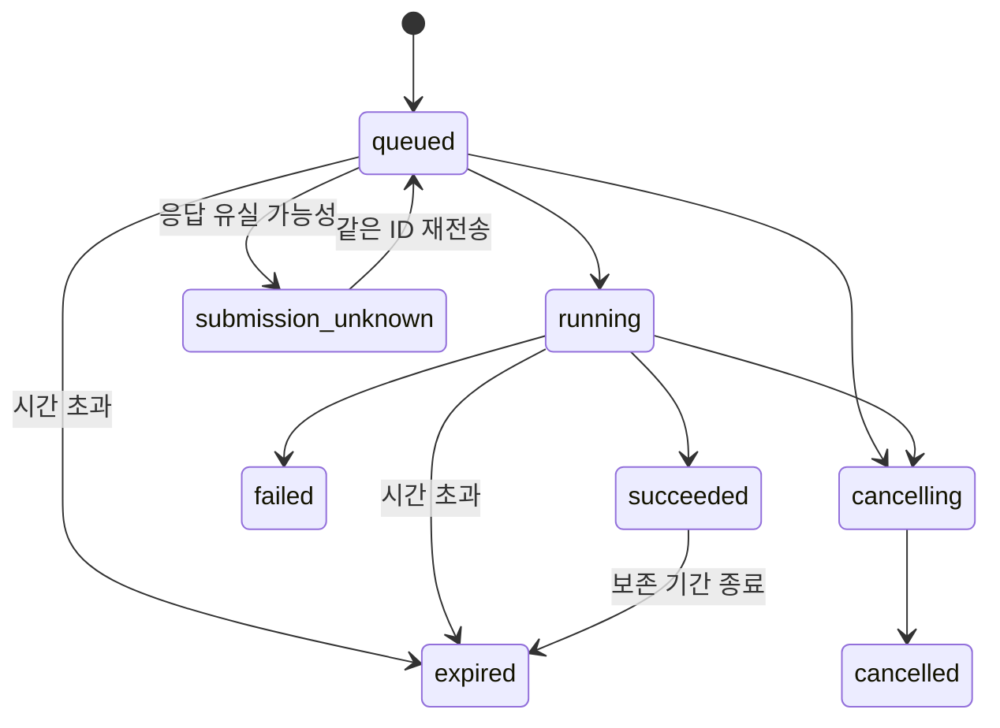

# PiCare 4차 프로젝트 개인 작업 발표 정리

> 작성 목적: 발표자가 최지흠의 담당 범위와 구현 의도를 정확히 설명할 수 있도록 만든 인수인계 자료
>
> 기준: 현재 저장소 코드와 Git 커밋 이력을 함께 확인했으며, 3차 프로젝트 내용은 포함하지 않았다.

---

## 0. 발표 전에 반드시 구분할 범위

이 프로젝트의 AI 모델·검색·웹 서비스는 여러 팀원이 함께 만든 결과다. 발표에서는 아래 표기대로 역할을 구분한다.

| 표기 | 의미 | 발표 표현 |
|---|---|---|
| **직접 구현** | Git 이력과 코드에서 최지흠의 구현이 확인되는 영역 | “제가 구현했습니다.” |
| **연동 구현** | 팀원이 만든 AI·RAG 기능을 Django 화면, DB, API 흐름에 연결한 영역 | “팀의 AI 기능을 Django 서비스에 연결했습니다.” |
| **전체 시스템 구성 요소** | 서비스에는 존재하지만 개인 구현으로 주장하지 않는 영역 | “전체 시스템에서는 이 기능을 사용합니다.” |

### 개인 작업의 핵심 한 문장

**기존 Streamlit 중심 기능을 Django 웹 서비스로 전환하고, 사용자 화면·회원 기능·기록 저장·미니 챌린지·오답노트·비동기 AI 작업을 연결한 뒤 AWS와 RunPod가 분리된 운영 구조까지 구성했다.**

### 개인 구현으로 말해도 되는 핵심 영역

- **직접 구현**: 초기 Django 프로젝트 골격과 화면 전환
- **직접 구현**: 회원가입·로그인 화면과 전체 프론트 통합
- **직접 구현**: Q&A 결과에서 동적 미니 챌린지로 이어지는 사용자 흐름
- **직접 구현**: 제품 추천 기록 모델과 마이페이지 표시 연동
- **직접 구현**: 원격 AI 작업 상태를 관리하는 Django 측 `AiJob` 흐름과 RunPod 호출 경계
- **직접 구현**: RunPod HTTP 서버의 FastAPI 의존 제거 및 Django 요청·응답 방식 전환
- **직접 구현**: 로딩 스피너 표시 버그 수정
- **직접 구현**: 오답노트 저장 후 현재 문제 화면 유지
- **연동 구현**: 팀원이 만든 Q&A 요약·질문 아카이브 기능을 Django 화면과 DB에 연결
- **연동 구현**: 팀의 Q&A·추천·퀴즈 생성·RAG 결과를 Django에서 호출하고 표현

### 개인 구현으로 말하면 안 되는 영역

- Qwen 모델 자체 개발 또는 사전학습
- QLoRA 파인튜닝 알고리즘과 학습 결과 전체
- Hybrid RAG 검색 로직 전체
- Chroma 인덱스와 문서 청크 생성 전체
- 팀원이 만든 Q&A 요약 모델 로직 자체

이 영역은 **전체 시스템 구성 요소**로만 소개한다.

---

## 1. 담당 영역 한눈에 보기

| 담당 영역 | 분류 | 사용자에게 보이는 결과 | 대표 파일 |
|---|---|---|---|
| Streamlit → Django 전환 | 직접 구현 | URL 기반 웹 페이지와 폼 요청 구조 | `web_app/manage.py`, `picare_web/`, `portal/` |
| 웹 UI와 공통 레이아웃 | 직접 구현 | 소개, Q&A, 추천, 로그인, 결과 화면 | `web_app/templates/`, `web_app/static/portal/css/picare.css` |
| 회원가입·로그인 | 직접 구현 | 계정 생성, 로그인, 로그아웃, 세션 유지 | `web_app/accounts/` |
| 제품 추천 결과 저장 | 직접 구현 | 추천 결과를 마이페이지에서 재확인 | `RecommendationRecord`, `recommendation_save()` |
| Q&A 화면·기록 | 연동 구현 | AI 답변, 출처, 요약, 질문 기록 | `qa()`, `QuestionRecord` |
| 미니 챌린지 | 직접 구현·연동 구현 | Q&A 직후 최대 3문항 생성·채점·취소 | `mini_challenge_*`, `qa.html`, `quiz_panel.html` |
| 오답노트 | 직접 구현 | 오답 저장·목록·상세·삭제 | `WrongNote`, `wrong_note_*()` |
| 원격 AI 작업 관리 | 직접 구현·연동 구현 | 로딩, 상태 조회, 취소, 실패 처리 | `AiJob`, `ai_jobs.py`, `remote_ai.py` |
| RunPod HTTP 경계 Django 전환 | 직접 구현 | `/health/*`, `/v1/jobs*` API | `src/runpod_api/` |
| AWS 웹 배포 연결 | 직접 구현·연동 구현 | Django·MySQL은 AWS, GPU 추론은 RunPod | `Dockerfile.aws`, `deploy/aws-entrypoint.sh` |
| UX 버그 수정 | 직접 구현 | 스피너 정상 종료, 저장 후 문제 유지 | `quiz_panel.html`, `qa.html`, `views.py` |

---

## 2. 전체 서비스에서 담당한 위치



### 발표 설명

> “제가 맡은 중심 영역은 브라우저와 AI 기능 사이의 Django 서비스 계층입니다. 사용자 요청을 검증하고, 작업 상태를 DB에 기록하며, GPU가 필요한 요청만 RunPod로 보내고, 결과를 다시 화면과 사용자 기록으로 연결했습니다.”

### 서버별 책임

| 서버 | 책임 | 올리지 않는 것 |
|---|---|---|
| AWS Django | 화면, 회원, 세션, CSRF, MySQL, AI 작업 상태, 결과 보관 | GPU 모델 |
| AWS MySQL | 사용자별 추천·질문·오답·커뮤니티·작업 상태 | 모델 파일 |
| RunPod | GPU 모델 초기화, 작업 큐, Q&A·추천·퀴즈 실행 | 회원 DB와 웹 화면 |

이 분리는 AWS의 작은 CPU 인스턴스가 대형 모델을 직접 적재하지 않도록 하고, RunPod를 중지하더라도 웹·회원·기록 영역을 별도로 관리할 수 있게 한다.

---

## 3. Django 프로젝트 구조와 실행 진입점

```text
web_app/
├── manage.py                    # Django 관리 명령 진입점
├── picare_web/
│   ├── settings.py             # 환경변수, DB, 세션, 보안, AI 백엔드 설정
│   ├── urls.py                 # 프로젝트 최상위 URL 연결
│   ├── wsgi.py                 # Gunicorn 운영 실행 진입점
│   ├── asgi.py                 # ASGI 진입점
│   └── celery.py               # 로컬 GPU 퀴즈 작업용 Celery 설정
├── accounts/
│   ├── forms.py                # 회원가입·로그인 검증 폼
│   ├── views.py                # 회원가입·로그인·로그아웃 처리
│   └── urls.py                 # 계정 URL
├── portal/
│   ├── models.py               # 서비스 영속 데이터 모델
│   ├── forms.py                # Q&A·추천·게시물 입력 검증
│   ├── views.py                # 페이지와 JSON API 요청 처리
│   ├── urls.py                 # 기능별 URL
│   ├── services.py             # 팀 AI 서비스 조립 경계
│   ├── result_service.py       # 기능별 결과 형식 통일
│   ├── ai_jobs.py              # 원격 작업 상태 전이와 소유권 검사
│   ├── remote_ai.py            # AWS → RunPod HTTP 클라이언트
│   ├── tasks.py                # 로컬 Celery 퀴즈 생성 작업
│   └── tests.py                # Q&A·퀴즈·오답노트 통합 테스트
├── templates/                  # Django 템플릿과 화면 JavaScript
└── static/                     # CSS와 정적 자원
```

### 실행 방식

개발 환경에서는 다음 진입점을 사용한다.

```bash
python web_app/manage.py migrate
python web_app/manage.py runserver 0.0.0.0:8000
```

AWS 운영 환경에서는 `Dockerfile.aws`로 이미지를 만들고 `deploy/aws-entrypoint.sh`가 다음 순서로 실행한다.

1. `python web_app/manage.py migrate --noinput`
2. `gunicorn picare_web.wsgi:application`
3. 내부 포트 `0.0.0.0:8000`에서 두 개의 worker로 요청 처리

발표에서는 “개발 서버인 `runserver`가 아니라 Gunicorn을 운영 서버로 사용했다”고 설명한다.

---

## 4. 주요 파일·클래스·함수 색인

### 4.1 프로젝트 설정과 회원 기능

| 파일/구성 요소 | 입력 | 처리 | 출력 | 분류 |
|---|---|---|---|---|
| `picare_web/settings.py::_database_config()` | `DJANGO_DB_*` 또는 `MYSQL_*` | MySQL/테스트 DB 설정 조립 | Django `DATABASES` 설정 | 직접 구현·통합 |
| `settings.py::PICARE_AI_BACKEND` | `local` 또는 `remote` | AI 실행 위치 선택 | 로컬 서비스 또는 RunPod 경로 | 직접 구현·연동 구현 |
| `accounts.forms.SignupForm` | 아이디, 이메일, 비밀번호 | Django 기본 검증 + 이메일 중복 검사 | 검증된 `User` 입력 | 직접 구현 |
| `accounts.views.signup()` | GET/POST 요청 | 사용자 생성 후 로그인 | 회원가입 화면 또는 메인 이동 | 직접 구현 |
| `accounts.views.login_view()` | 로그인 폼 | 인증 및 DB 세션 생성 | 로그인 상태 | 직접 구현 |
| `accounts.views._safe_next()` | 이동할 `next` URL | 외부 URL 차단 | 안전한 내부 URL | 직접 구현 |

### 4.2 Q&A·추천·기록

| 파일/함수 | 입력 | 처리 | 출력 | 분류 |
|---|---|---|---|---|
| `portal.views.qa()` | 질문 폼 | 로컬/원격 백엔드 분기, 결과 화면 구성 | Q&A HTML 또는 원격 작업 패널 | 직접 구현·연동 구현 |
| `_store_qa_response()` | 서버가 만든 `ChatResponse` | 최신 Q&A를 세션에 보관, 이전 퀴즈 정리 | 미니 챌린지 입력 상태 | 직접 구현 |
| `_save_question_record()` | Q&A 응답·요약 | 로그인 사용자의 응답 스냅샷 저장 | `QuestionRecord` | 연동 구현 |
| `recommend()` | 추천 조건 폼 | 추천 요청, 결과 화면 구성 | 추천 HTML 또는 원격 작업 패널 | 직접 구현·연동 구현 |
| `recommendation_save()` | 서버 세션의 저장 토큰 | 사용자·토큰·스냅샷 검증 | JSON 저장 결과 | 직접 구현 |
| `_save_recommendation_record()` | 검증된 입력·응답 | 트랜잭션과 중복 확인 후 저장 | `RecommendationRecord` | 직접 구현 |
| `result_service.FeatureResult` | 기능별 서로 다른 결과 | 공통 필드로 정규화 | 화면/API 공통 결과 | 직접 구현·통합 |

### 4.3 미니 챌린지·오답노트

| 파일/함수 | 입력 | 처리 | 출력 | 분류 |
|---|---|---|---|---|
| `mini_challenge_start_api()` | 최신 Q&A 세션, `max_questions=3` | 원격 `AiJob` 또는 Celery 작업 생성 | `202` + 작업 ID | 직접 구현·연동 구현 |
| `mini_challenge_job_api()` | 작업 ID | 소유권 확인, 상태 조회, 성공 결과 보관 | 진행 상태 또는 공개 퀴즈 JSON | 직접 구현 |
| `cancelAPI()` | 작업 ID | 현재 세션의 작업만 취소 | `cancelled/cancelling` JSON | 직접 구현 |
| `mini_challenge_submit_api()` | 퀴즈·문제·선택지 ID | 서버 세션의 정답으로 채점 | 정오답·해설·근거 JSON | 직접 구현 |
| `wrong_note_save()` | 제출 완료된 오답 | 오답 검증 후 DB 저장 | 일반 요청은 이동, JS 요청은 JSON | 직접 구현 |
| `wrong_note_list/detail/delete()` | 로그인 사용자 | `owner=request.user` 범위 조회 | 목록·상세·삭제 결과 | 직접 구현 |

### 4.4 원격 AI 작업

| 파일/함수 | 역할 | 핵심 안전장치 | 분류 |
|---|---|---|---|
| `models.AiJob` | Q&A·추천·퀴즈 작업 상태 보관 | UUID, owner, 세션 해시, 만료 시각 | 직접 구현·연동 구현 |
| `ai_jobs.session_hash()` | 세션 키를 SHA-256으로 변환 | 원본 세션 키 외부 노출 방지 | 직접 구현 |
| `ai_jobs.owned_job()` | 현재 사용자의 작업 조회 | 사용자와 브라우저 세션 동시 확인 | 직접 구현 |
| `ai_jobs.create_job()` | 이전 작업 정리 후 새 작업 제출 | DB 행 잠금, 동일 세션 직렬화 | 직접 구현·연동 구현 |
| `ai_jobs.refresh_job()` | 상태 갱신 | 타임아웃·만료·취소 반영 | 직접 구현 |
| `views._finalize_remote_job()` | 완료 결과를 Django에 한 번만 반영 | 트랜잭션, `finalized_at` 검사 | 직접 구현 |
| `remote_ai.RunPodClient` | RunPod API 호출 | HTTPS 강제, Bearer 토큰, 응답 계약 검증 | 직접 구현·연동 구현 |

### 4.5 RunPod HTTP 서버 경계

| 파일/함수 | 역할 | 출력 | 분류 |
|---|---|---|---|
| `src/runpod_api/__main__.py::main()` | Gunicorn 단일 worker 실행 | `0.0.0.0:${AI_API_PORT}` | 직접 구현 전환 |
| `ApiSettings.from_env()` | 토큰·큐·타임아웃 설정 검증 | `ApiSettings` | 직접 구현 전환 |
| `ServerState.start()` | 모델 초기화를 백그라운드에서 시작 | 준비 상태 + 작업 큐 | 직접 구현 전환·연동 구현 |
| `live()` | HTTP 프로세스 생존 확인 | `{"live": true}` | 직접 구현 전환 |
| `ready()` | 모델과 큐 준비 확인 | `ready`, `message` | 직접 구현 전환 |
| `submit()` | 인증된 작업 접수 | 작업 상태 JSON | 직접 구현 전환 |
| `get_job()` | 작업 상태·결과 조회 | 작업 상태 JSON | 직접 구현 전환 |
| `cancel_job()` | 작업 취소 요청 | 취소 상태 JSON | 직접 구현 전환 |

`src/runpod_api`는 현재 Django의 `HttpRequest`, `JsonResponse`, URL 라우팅, HTTP 메서드 데코레이터를 사용한다. 따라서 발표에서는 “FastAPI를 사용했다”가 아니라 **“RunPod의 HTTP API 경계를 Django 방식으로 전환했다”**고 설명한다.

---

## 5. Q&A 동작 흐름



### 핵심 구현 포인트

1. `QuestionForm`이 빈 질문과 길이를 먼저 검증한다.
2. `PICARE_AI_BACKEND=remote`이면 Django가 모델을 직접 불러오지 않고 `AiJob`을 만든다.
3. 브라우저는 약 1초 간격으로 작업 상태 API를 조회한다.
4. 완료 결과는 Pydantic 계약으로 다시 검증한다.
5. `_finalize_remote_job()`은 `finalized_at`이 없는 성공 작업만 반영해 중복 저장을 막는다.
6. 로그인 사용자에게는 질문 기록을 저장하고, 최신 답변은 미니 챌린지를 위해 세션에도 둔다.

### 발표 한 문장

> “웹 요청이 GPU 응답을 기다리며 멈추지 않도록 요청과 결과 확인을 분리하고, 완료된 결과만 Django가 검증한 뒤 화면과 사용자 기록에 반영했습니다.”

---

## 6. Dynamic Mini Challenge 동작 흐름

### 기능 목적

Q&A 답변을 읽은 직후 사용자가 내용을 이해했는지 최대 3문항으로 확인한다. 문제 생성 코어는 팀 AI 기능을 사용하고, 사용자가 기다리고 취소하고 다시 시도하며 답을 제출하는 웹 흐름은 Django에서 관리한다.

### 생성 과정

1. Q&A가 `answered` 상태이고 공식 인용이 있을 때만 자동 시작한다.
2. 브라우저가 `POST /api/qa/mini-challenge`를 호출한다.
3. 서버는 세션의 최신 Q&A를 사용한다. 브라우저가 임의의 답변 원문을 보내게 하지 않는다.
4. 원격 모드에서는 `kind=quiz`인 `AiJob`을 생성한다.
5. 브라우저가 작업 상태를 폴링한다.
6. 성공하면 서버는 정답을 포함한 전체 퀴즈를 세션에 저장한다.
7. 브라우저에는 `_public_quiz_payload()`로 문제와 선택지만 전달한다.

### 답안 제출 과정

```text
문제 ID + 사용자가 선택한 선택지
        ↓
mini_challenge_submit_api()
        ↓
서버 세션에서 해당 퀴즈와 정답 조회
        ↓
중복 제출 검사
        ↓
서버에서 채점
        ↓
정오답 + 해설 + 인용 근거 반환
```

### 보안상 중요한 점

- 정답은 문제 생성 응답 단계에서 브라우저로 보내지 않는다.
- 채점은 서버에 저장된 `correct_choice_id`를 기준으로 한다.
- 작업 ID가 있어도 현재 세션 소유 작업이 아니면 조회할 수 없다.
- 이전 질문에서 생성한 작업은 새 질문이 시작되면 취소·무효화한다.
- 늦게 도착한 취소 작업의 성공 결과는 화면에 노출하지 않는다.

### 발표 한 문장

> “문제 생성은 AI 기능에 맡기되, 작업 소유권·취소·정답 보호·중복 제출은 Django가 책임지도록 설계했습니다.”

---

## 7. 오답노트 동작과 UX 개선

### 데이터 저장 내용

`WrongNote`에는 다음 정보를 사용자별로 저장한다.

- 문제와 선택지
- 사용자가 고른 선택지
- 정답 선택지
- 해설
- 근거 문서 ID와 인용문
- 생성·수정 시각

### 저장 조건

- 로그인 사용자만 저장 가능
- 실제 제출한 문제만 저장 가능
- 정답은 오답노트에 저장하지 않음
- 목록·상세·삭제 모두 `owner=request.user`로 제한

### 기존 문제

동적으로 만든 “오답노트에 저장” 버튼이 일반 HTML 폼을 제출했다. 저장 뷰가 성공 후 상세 페이지로 이동했기 때문에, 사용자는 풀이 중이던 나머지 문제를 더 이상 볼 수 없었다.

### 수정 내용

1. JavaScript가 `Accept: application/json`으로 비동기 저장을 요청한다.
2. `wrong_note_save()`는 요청 유형에 따라 두 방식으로 응답한다.
   - 일반 폼: 기존처럼 오답노트 상세 화면으로 이동
   - JavaScript: `201`과 저장 메시지·상세 URL을 JSON으로 반환
3. 성공하면 저장 버튼을 비활성화하고 “오답노트에 저장됨”으로 바꾼다.
4. 원하는 사용자만 “오답노트 보기” 링크를 눌러 이동한다.
5. 실패하면 현재 문제 화면을 유지하고 버튼을 다시 활성화한다.

### 이 결정의 의미

기존 일반 요청과의 호환성을 깨지 않고, 미니 챌린지 화면에서만 더 나은 비동기 UX를 제공했다.

---

## 8. 원격 AI 작업 상태 설계

### `AiJob`의 주요 필드

| 필드 | 목적 |
|---|---|
| `id` | 추측하기 어려운 UUID 작업 ID |
| `owner` | 로그인 사용자 소유권 |
| `session_hash` | 비로그인 사용자까지 브라우저 세션 단위로 구분 |
| `kind` | `qa`, `recommendation`, `quiz` 구분 |
| `status` | 대기·실행·취소·성공·실패·만료 상태 |
| `input_payload` | RunPod로 보낸 입력 스냅샷 |
| `result_payload` | 성공한 결과 JSON |
| `cancel_requested` | 취소 의도 보존 |
| `finalized_at` | Django 부수 효과의 중복 실행 방지 |
| `deadline_at` | 실행 제한 시각 |
| `expires_at` | 결과 보존 만료 시각 |
| `question_record`, `quiz_id` | 완료 결과와 Django 데이터 연결 |

### 상태 흐름



### 중요한 예외 처리

| 상황 | Django 처리 |
|---|---|
| RunPod 연결 실패 | `connection_unavailable` |
| 작업 큐 초과 | `queue_full` / HTTP 429 |
| 인증 실패 | `authentication_failed` |
| 작업 없음 | `job_not_found` / HTTP 404 |
| JSON 형식 불일치 | `invalid_response` |
| 제출 응답이 유실됐을 가능성 | `submission_unknown`으로 두고 같은 UUID만 재시도 |
| 취소 후 성공 결과가 늦게 도착 | 결과를 폐기하고 `cancelled` 유지 |
| 제한 시간 초과 | 원격 취소 후 `expired` 처리 |

### 동시성 처리

- `transaction.atomic()`으로 상태 전이를 한 트랜잭션으로 묶는다.
- `select_for_update()`로 동일 작업 또는 동일 세션의 동시 변경을 직렬화한다.
- 새 작업을 만들 때 같은 세션·같은 종류의 이전 작업을 `is_current=False`로 바꾼다.
- 완료 후 저장 작업은 `finalized_at`으로 정확히 한 번만 실행한다.

발표에서는 단순히 “API를 호출했다”보다 **“웹 서버가 원격 GPU 작업의 생명주기를 DB에서 관리했다”**는 점을 강조한다.

---

## 9. Django ↔ RunPod API 연결

### AWS 측 `RunPodClient`

`web_app/portal/remote_ai.py`는 GPU 라이브러리를 import하지 않는 작은 HTTP 경계다.

| 메서드 | RunPod 요청 | 목적 |
|---|---|---|
| `submit(job)` | `POST /v1/jobs` | 작업 등록 |
| `status(job)` | `GET /v1/jobs/{job_id}` | 상태·결과 조회 |
| `cancel(job)` | `POST /v1/jobs/{job_id}/cancel` | 작업 취소 |
| `readiness()` | `GET /health/ready` | 모델과 큐 준비 확인 |

### 인증과 URL 검증

- 모든 작업 요청은 `Authorization: Bearer ...` 헤더를 사용한다.
- 토큰은 코드가 아니라 AWS와 RunPod 환경변수에 같은 값으로 설정한다.
- 운영 URL은 HTTPS만 허용한다.
- 예외적으로 로컬 테스트의 `localhost`, `127.0.0.1`, `::1`만 HTTP를 허용한다.
- URL에 사용자명·비밀번호가 포함된 설정은 거부한다.
- 실제 비밀값은 Git에 기록하지 않는다.

### RunPod 측 Django HTTP API

RunPod 서버는 다음 URL을 제공한다.

```text
GET  /health/live
GET  /health/ready
POST /v1/jobs
GET  /v1/jobs/{job_id}
POST /v1/jobs/{job_id}/cancel
```

`python -m src.runpod_api`를 실행하면 Gunicorn이 `AI_API_PORT`에 바인딩한다. 기본값은 `8000`이며 GPU 모델을 중복 적재하지 않도록 worker는 1개다.

### FastAPI를 제거한 이유에 대한 발표 답변

> “프로젝트에서 실제로 학습하고 사용한 웹 프레임워크가 Django였고, RunPod API에 별도 FastAPI 계층을 유지할 필요가 없었습니다. API 계약은 유지하면서 요청·응답과 URL 라우팅을 Django 방식으로 바꿔 프레임워크 수와 의존성을 줄였습니다. 모델·작업 큐 로직 자체와 HTTP 경계는 분리했습니다.”

---

## 10. 데이터베이스 설계와 사용자 데이터 흐름

### 현재 주요 모델

| 모델 | 저장 내용 | 사용자 분리 방식 |
|---|---|---|
| `UserProfile` | 사용자 확장 지점 | `OneToOne(User)` |
| `Post` | 커뮤니티 글 | `author` |
| `Comment` | 댓글 | `author` |
| `PostLike` | 좋아요 | `(post, user)` 유일 제약 |
| `DrawerItem` | 명령어 실험실 저장 항목 | `owner` |
| `WrongNote` | 미니 챌린지 오답 | `owner` |
| `RecommendationRecord` | 추천 입력·응답 스냅샷 | `owner` |
| `QuestionRecord` | Q&A 응답·요약·공개 상태 | `owner` |
| `AiJob` | 원격 AI 작업 상태 | `owner + session_hash` |

### JSONField를 사용한 이유

AI 응답은 일반 문자열 외에도 인용, 경고, 선택지, 해설, 입력 조건처럼 구조가 변할 수 있는 데이터를 포함한다. 따라서 검색과 소유권에 필요한 값은 일반 컬럼으로 두고, 당시 결과를 재현하기 위한 전체 입력·응답은 `JSONField` 스냅샷으로 저장했다.

### 데이터 보호 방식

- 상세·삭제 조회에는 사용자 소유권 조건을 함께 적용한다.
- 브라우저가 보낸 결과를 그대로 DB에 저장하지 않는다.
- 서버 세션에 저장된 결과를 Pydantic 모델로 재검증한다.
- 추천 저장에는 세션 토큰과 로그인 사용자 ID를 함께 검사한다.
- AI 작업은 URL의 UUID만으로 조회할 수 없고 세션 해시·사용자까지 일치해야 한다.

---

## 11. AWS 배포에서 Django가 맡는 역할

### 사용한 구성

```text
외부 사용자
   ↓ 80/443
Nginx 또는 Load Balancer
   ↓ 127.0.0.1:8000
AWS EC2의 picare-web 컨테이너
   ↓ Docker network / 3306
picare-mysql 컨테이너

picare-web
   ↓ HTTPS / Bearer token
RunPod의 8000 HTTP Service
```

### 포트 설명

- Django/Gunicorn 애플리케이션 내부 포트: `8000`
- AWS에서 확인한 안전한 바인딩: `127.0.0.1:8000:8000`
- MySQL 컨테이너 내부 포트: `3306`
- 외부 공개 포트: 일반적으로 Nginx/로드 밸런서의 `80`, `443`
- RunPod HTTP Service: 컨테이너 포트 `8000`을 HTTPS 프록시 URL로 공개

즉 `8000:8000`은 애플리케이션끼리 연결하기 위한 포트이고, 사용자가 접속하는 최종 포트는 80/443으로 분리할 수 있다.

### AWS 이미지 구성

`Dockerfile.aws`는 다음 원칙을 가진다.

- 가벼운 `python:3.12-slim` 사용
- 웹 전용 `requirements-web.txt`만 설치
- 기본 AI 백엔드를 `remote`로 설정
- 정적 파일 수집
- 모델 파일과 GPU 라이브러리는 포함하지 않음

### 환경변수 그룹

| 그룹 | 예시 이름 | 주의 |
|---|---|---|
| Django | `DJANGO_SECRET_KEY`, `DJANGO_ALLOWED_HOSTS`, 보안 쿠키 설정 | 운영값은 비공개 |
| MySQL | `DJANGO_DB_*`, Compose의 `MYSQL_*` | 비밀번호는 Git 금지 |
| RunPod | `PICARE_AI_BACKEND`, `AI_API_URL`, `AI_API_TOKEN` | AWS·RunPod 토큰 일치 |
| 작업 제한 | `AI_HTTP_TIMEOUT`, `AI_JOB_TIMEOUT` | 웹 통신과 전체 작업 제한을 구분 |

현재 `compose.yaml`의 MySQL 컨테이너 생성에는 `MYSQL_PASSWORD`와 `MYSQL_ROOT_PASSWORD`가 별도로 필요하다. Django 접속값인 `DJANGO_DB_PASSWORD`만 입력해서는 Compose 변수 검증을 통과하지 않으므로 발표나 재배포 시 둘의 역할을 구분해야 한다.

### CI/CD와 현재 작업의 관계

CI/CD는 코드를 자동으로 테스트·빌드·배포하는 절차다. 다음 항목은 CI/CD가 생겨도 그대로 필요한 배포 기반이다.

- Django/RunPod 책임 분리
- Dockerfile과 시작 스크립트
- 환경변수 계약
- 마이그레이션 절차
- 포트와 네트워크 설계
- 상태 확인 URL
- 원격 작업 API 계약

따라서 현재 작업은 수동 배포를 한 번 한 것이 아니라, 이후 CI/CD가 자동화할 대상 자체를 만든 것이다.

---

## 12. 직접 해결한 문제 사례

### 12.1 Streamlit 중심 구조를 사용자 서비스로 확장

**문제**

- 페이지·URL·회원·세션·DB 중심 서비스를 확장하기 어려움
- 여러 기능의 결과 화면과 사용자 기록을 하나의 서비스로 묶어야 함

**해결**

- Django 프로젝트와 `accounts`, `portal` 앱 구성
- 폼 검증, URL 라우팅, 템플릿 상속, ORM 도입
- 팀 AI 서비스는 공개 메서드만 호출하도록 `services.py`에서 경계 설정

**성과**

- 회원별 추천·질문·오답 기록을 제공할 수 있는 웹 서비스 구조 확보

### 12.2 긴 GPU 요청 때문에 웹 요청이 멈추는 문제

**문제**

- Q&A·추천·퀴즈가 모델 실행을 기다리는 동안 요청이 길게 유지됨
- 사용자가 취소하거나 상태를 알기 어려움

**해결**

- `AiJob`으로 작업 상태를 영속화
- 작업 생성, 상태 조회, 취소 API 분리
- 브라우저 폴링과 완료 후 한 번만 저장하는 finalization 적용

**성과**

- 로딩·취소·실패·재시도를 화면에서 구분
- AWS와 RunPod의 장애 경계를 분리

### 12.3 취소·실패 후 스피너가 계속 보이는 문제

**원인**

`hidden` 속성으로 요소를 숨겼지만 같은 요소의 Bootstrap `d-flex`가 `display: flex !important`를 적용해 숨김을 덮어썼다.

**수정**

- `dynamicQuizLoading`, `dynamicQuizActions` 바깥 요소에서 `d-flex` 제거
- 기존 flex 클래스는 내부 자식 요소로 이동
- JavaScript의 `loading.hidden`, `actions.hidden` 로직은 유지
- 회귀 테스트로 바깥 요소에 Bootstrap display utility가 없는지 확인

**발표 포인트**

> “JavaScript 상태 문제처럼 보였지만 실제 원인은 CSS 우선순위였습니다. 상태 제어 대상과 레이아웃 대상을 분리해 최소한의 HTML 변경으로 해결했습니다.”

### 12.4 오답 저장 후 풀이 화면이 사라지는 문제

**원인**

오답 저장 버튼이 일반 폼 제출을 수행하고 저장 성공 후 상세 페이지로 이동했다.

**수정**

- 비동기 JSON 저장 경로 추가
- 성공 시 버튼 비활성화와 상세 링크 표시
- 실패 시 현재 화면 유지와 재시도 허용
- 기존 일반 폼 리다이렉트 동작 유지

**성과**

- 한 문제를 저장해도 나머지 문제를 계속 풀 수 있음
- 기존 사용 방식과 새 UX의 하위 호환성 유지

### 12.5 사용하지 않은 FastAPI 의존이 남은 문제

**문제**

- 팀이 Django 중심으로 개발했지만 RunPod HTTP 경계에 FastAPI가 추가됨
- 프레임워크와 의존성이 불필요하게 늘어남

**해결**

- API URL과 JSON 계약은 유지
- Django `HttpRequest`, `JsonResponse`, URLconf, 메서드 데코레이터로 교체
- Gunicorn 실행 진입점 구성

**성과**

- AWS와 RunPod의 HTTP 계층을 같은 프레임워크 지식으로 관리

---

## 13. 테스트와 검증 관점

### 자동 테스트로 확인하는 핵심 시나리오

- 회원가입 폼과 인증 흐름
- 추천 결과 저장, 중복 저장 방지, 사용자 소유권
- Q&A 결과 저장과 질문 기록
- 미니 챌린지 생성 시작·상태 조회·취소·제출
- 정답을 초기 퀴즈 JSON에 노출하지 않는지
- 다른 세션의 작업에 접근할 수 없는지
- 오답만 오답노트에 저장되는지
- 일반 폼 저장은 기존 리다이렉트를 유지하는지
- 비동기 저장은 `201 JSON`을 반환하는지
- 로딩·액션 바깥 요소에 `d-flex`가 없는지
- RunPod 작업 계약과 인증·오류 코드
- 배포 필수 자산 존재 여부

### 발표 직전 권장 검증

```bash
python web_app/manage.py check
python web_app/manage.py test portal accounts
python scripts/verify_deployment_assets.py --target aws
git diff --check
```

RunPod 자산 검증은 실제 adapter 경로를 지정해 별도로 실행한다.

```bash
python scripts/verify_deployment_assets.py \
  --target runpod \
  --adapter-path /workspace/models/picare-qwen3-4b-qlora
```

테스트 결과를 발표 자료에 숫자로 넣을 때는 발표 직전에 다시 실행한 실제 결과만 사용한다.

---

## 14. Git으로 확인된 주요 작업 이력

| 커밋 | 날짜 | 확인된 작업 | 발표 분류 |
|---|---|---|---|
| `055cdaa` | 2026-09-11 | Streamlit 기능을 Django 구조와 화면으로 전환 | 직접 구현 |
| `7ec7c75` | 2026-09-14 | 회원가입과 전체 프론트 구현 | 직접 구현 |
| `6b2eba2` | 2026-09-17 | Q&A 기반 취소 가능한 동적 미니 챌린지 연동 | 직접 구현·연동 구현 |
| `9bfe48a` | 2026-09-17 | 공통 결과 프론트와 추천 기록 모델 | 직접 구현 |
| `11f1eaf` | 2026-09-17 | 회원가입 인증 및 추천 마이페이지 흐름 보강 | 직접 구현 |
| `5e5490f` | 2026-09-18 | RunPod 비동기 AI 서빙과 AWS Django 연동 | 직접 구현·연동 구현 |
| `e253c1f` | 2026-09-18 | 팀원의 Q&A 요약·질문 아카이브 작업을 Django에 연결 | 연동 구현 |
| `51447bf` | 2026-09-18 | RunPod FastAPI HTTP 계층을 Django로 전환 | 직접 구현 |
| `f58c803` | 2026-09-18 | 미니 챌린지 스피너 숨김 문제 수정 | 직접 구현 |
| `a2677d9` | 2026-09-18 | 오답 저장 후 문제 화면 유지 | 직접 구현 |
| `1a0e245` | 2026-09-18 | 주요 프론트·백엔드 함수 설명과 문서화 | 직접 구현 |

주의: 커밋 작성자가 같더라도 메시지와 코드가 팀원 작업 연동임을 밝힌 경우 원본 AI 기능까지 개인 구현으로 확대해서 설명하지 않는다.

---

## 15. 발표 슬라이드 권장 구성

### 슬라이드 1. 담당 역할

- Django 웹 서비스 전환
- 사용자 화면·회원·기록 기능
- 비동기 RunPod 연동
- AWS 웹 배포 경계

**말할 문장**: “저는 AI 기능을 실제 사용자가 이용할 수 있는 Django 서비스로 만드는 역할을 맡았습니다.”

### 슬라이드 2. 전환 전후

```text
전: Streamlit에서 기능 단위 실행
후: Django URL·폼·회원·세션·DB·템플릿 기반 웹 서비스
```

### 슬라이드 3. 전체 아키텍처

브라우저 → AWS Django → MySQL, AWS Django → RunPod API → 팀 AI 구성 요소 그림을 사용한다.

### 슬라이드 4. Django 구조

`accounts`, `portal`, `templates`, `models`, `views`, `services`의 책임을 보여준다.

### 슬라이드 5. Q&A와 비동기 작업

요청 생성 → 상태 폴링 → 완료 검증 → 화면·기록 반영 순서로 설명한다.

### 슬라이드 6. 미니 챌린지

최신 Q&A만 사용, 최대 3문항, 서버 채점, 취소·재시도, 정답 보호를 강조한다.

### 슬라이드 7. 사용자 데이터

추천 기록, 질문 기록, 오답노트와 `owner` 기반 소유권을 소개한다.

### 슬라이드 8. AWS·RunPod 분리

AWS에는 Django·MySQL, RunPod에는 GPU 모델이라는 역할 분리를 설명한다.

### 슬라이드 9. 문제 해결 사례

스피너의 `hidden` 대 `d-flex !important`, 오답 저장 리다이렉트 문제를 전후 비교한다.

### 슬라이드 10. 결과와 확장

- 사용자 서비스 형태 완성
- 원격 AI 장애와 웹 서버 분리
- 테스트 가능한 API 계약
- CI/CD가 자동화할 배포 기반 확보

---

## 16. 시연 권장 순서

1. 회원가입 또는 로그인
2. Q&A에서 질문 제출
3. 비동기 로딩 화면과 취소 버튼 설명
4. 답변·공식 출처 확인
5. 자동 생성된 미니 챌린지 풀이
6. 일부러 오답 선택
7. 오답노트에 저장해도 나머지 문제가 남아 있는 모습 확인
8. 오답노트 보기 링크로 상세 화면 이동
9. 마이페이지에서 질문·추천 기록 확인

### 시연 전 체크리스트

- AWS Django 컨테이너 실행 여부
- MySQL health 상태
- RunPod Pod 실행과 포트 8000 HTTP Service 공개 여부
- `/health/live`가 `200`인지
- 인증된 `/health/ready`가 `ready: true`인지
- AWS의 `AI_API_URL`이 현재 Pod ID를 포함한 실제 주소인지
- AWS와 RunPod의 `AI_API_TOKEN`이 같은지
- 브라우저에서 새 세션으로 한 번 전체 흐름 확인

RunPod는 모델 적재에 시간이 걸리므로 `live=true`만 보고 시연을 시작하지 않고 `ready=true`까지 확인한다.

---

## 17. 1~2분 발표 스크립트

안녕하세요. 저는 PiCare 4차 프로젝트에서 기존 Streamlit 중심 기능을 Django 웹 서비스로 전환하고, 사용자 화면과 데이터 저장, 그리고 원격 AI 연동을 담당했습니다.

제가 맡은 핵심은 AI 모델 자체를 개발하는 일이 아니라, 팀에서 만든 Q&A와 추천, 미니 챌린지 기능을 사용자가 실제 웹에서 안정적으로 이용하도록 연결하는 일이었습니다. Django에서 회원가입과 로그인, 폼 검증, 세션, MySQL 기반 기록 저장을 구성했고, 추천 기록과 질문 기록, 오답노트를 사용자별로 관리하도록 구현했습니다.

GPU 작업은 시간이 오래 걸리기 때문에 AWS의 Django가 모델을 직접 실행하지 않도록 했습니다. Django는 `AiJob`에 작업 상태를 저장하고 HTTPS와 Bearer 토큰으로 RunPod에 요청합니다. 브라우저는 작업 상태를 조회하면서 로딩, 취소, 실패, 재시도를 처리하고, 성공 결과는 Django가 다시 검증한 뒤 한 번만 저장합니다.

미니 챌린지에서는 정답을 처음부터 브라우저에 보내지 않고 서버 세션에서 채점하도록 했습니다. 또 Bootstrap의 `d-flex` 때문에 취소 후에도 스피너가 남던 문제와, 오답 저장 시 상세 페이지로 이동해 나머지 문제를 풀 수 없던 문제를 수정했습니다.

최종적으로 AWS는 웹·회원·DB를, RunPod는 GPU 추론을 담당하도록 분리했습니다. 이 구조는 이후 CI/CD가 추가되더라도 그대로 자동화의 기반으로 사용할 수 있습니다.

---

## 18. 3~5분 상세 발표 스크립트

안녕하세요. 저는 PiCare 4차 프로젝트에서 Django 웹 프레임워크 영역과 AWS·RunPod 연결을 중심으로 작업했습니다.

초기에는 주요 기능이 Streamlit 흐름에 맞춰져 있었습니다. 기능을 확인하기에는 편하지만, 회원별 데이터와 URL 구조, 폼 검증, 세션, 커뮤니티와 마이페이지를 포함한 일반 웹 서비스로 확장하려면 별도의 구조가 필요했습니다. 그래서 `picare_web` 프로젝트와 `accounts`, `portal` 앱을 구성하고, 팀의 기존 AI 서비스를 Django View에서 호출할 수 있도록 연결했습니다.

화면 요청은 URL, View, Form, Template 순서로 처리됩니다. 사용자가 Q&A 질문을 입력하면 Form이 먼저 입력을 검증합니다. 운영 모드에서는 Django가 GPU 모델을 직접 불러오지 않고 MySQL에 `AiJob`을 만든 뒤 RunPod에 작업을 제출합니다. 브라우저는 상태 API를 주기적으로 조회하고, Django는 RunPod의 대기, 실행, 성공, 실패, 취소 상태를 DB에 반영합니다.

여기서 단순 API 호출보다 작업 생명주기 관리가 중요했습니다. 작업은 로그인 사용자와 브라우저 세션 해시를 함께 확인하므로 다른 사용자의 UUID를 알아도 조회할 수 없습니다. 취소 의도를 DB에 먼저 기록해 취소 직후 성공 결과가 늦게 도착해도 노출하지 않고, `finalized_at`을 사용해 완료 결과가 중복 저장되지 않도록 했습니다. 제출 응답이 유실됐을 가능성이 있으면 새로운 작업을 만들지 않고 같은 UUID만 재시도합니다.

Q&A 결과에는 답변과 공식 출처를 보여주고, 로그인 사용자라면 질문 기록을 저장합니다. Q&A 요약 생성 자체는 팀원 작업이며, 저는 그 결과를 Django의 질문 기록과 화면에 연결했습니다.

Q&A가 정상 답변과 인용 근거를 가지면 미니 챌린지가 이어집니다. 서버는 최신 Q&A 세션을 기준으로 최대 3문항을 생성하며, 문제와 선택지는 브라우저에 보내지만 정답은 서버 세션에 남깁니다. 사용자가 답을 제출하면 서버가 채점하고 해설과 근거를 반환합니다. 그래서 개발자 도구로 초기 응답만 확인해 정답을 알아내는 것을 방지했습니다.

오답노트에서도 사용자 경험 문제를 해결했습니다. 원래 저장 버튼은 일반 폼 제출이라 상세 페이지로 이동했고, 사용자는 남은 문제를 볼 수 없었습니다. 이를 비동기 JSON 저장으로 바꿔 현재 화면을 유지하고, 저장 완료 표시와 상세 링크만 제공했습니다. 기존 일반 폼의 리다이렉트 방식은 그대로 남겨 호환성도 유지했습니다.

또 취소나 실패 후 스피너가 계속 남는 문제가 있었습니다. JavaScript는 `hidden`을 설정하고 있었지만 Bootstrap의 `d-flex`가 `display: flex !important`를 적용하고 있었습니다. 상태를 제어하는 바깥 요소와 flex 레이아웃을 담당하는 안쪽 요소를 분리해 문제를 해결하고 회귀 테스트를 추가했습니다.

배포 구조는 AWS와 RunPod를 분리했습니다. AWS에는 Django, Gunicorn, MySQL을 두고 사용자 요청과 데이터를 처리합니다. RunPod에는 GPU 모델과 작업 큐를 두고, 두 서버는 HTTPS와 공통 Bearer 토큰으로 통신합니다. RunPod API에 남아 있던 FastAPI 계층은 기존 API 계약을 유지하면서 Django 요청·응답 구조로 전환해 프로젝트의 웹 프레임워크를 통일했습니다.

결과적으로 제 작업은 팀의 AI 기능을 웹 화면에 보여주는 데서 끝나지 않고, 회원별 기록, 작업 소유권, 비동기 상태, 취소와 실패, 배포 경계까지 포함해 실제 서비스 흐름으로 만든 것입니다.

---

## 19. 예상 질문과 답변

### Q1. 왜 Django를 사용했나요?

Django는 URL 라우팅, 폼 검증, 인증, 세션, ORM, 보안 미들웨어를 한 구조에서 제공한다. 이번 프로젝트처럼 회원별 질문·추천·오답 기록과 커뮤니티까지 필요한 서비스에 적합했다.

### Q2. FastAPI는 왜 제거했나요?

FastAPI 자체의 문제가 아니라 프로젝트에서 실제 사용하는 프레임워크를 하나로 줄이기 위한 선택이었다. RunPod API의 URL과 JSON 계약은 유지하고 HTTP 요청·응답 계층만 Django로 바꿨다.

### Q3. 일반 Django `request`로 RunPod API를 호출할 수 없나요?

Django의 `request`는 들어온 HTTP 요청을 표현한다. 외부 RunPod 서버로 나가는 요청에는 `requests` 라이브러리를 사용한다. 반대로 RunPod 서버에서 들어오는 요청을 받는 부분은 Django `HttpRequest`와 `JsonResponse`를 사용한다.

### Q4. 왜 AWS에서 모델을 실행하지 않았나요?

웹 서버는 CPU·메모리 요구가 비교적 작지만 모델 추론은 GPU와 큰 메모리가 필요하다. 비용과 장애 범위를 나누기 위해 AWS는 웹·DB, RunPod는 GPU 추론을 담당하게 했다.

### Q5. 왜 완전한 WebSocket 대신 폴링을 사용했나요?

작업 상태가 초 단위로 변하고 API가 단순한 상태 조회 구조이므로 폴링으로 요구사항을 충족할 수 있었다. 구현·운영 복잡도를 낮추고 Django의 일반 HTTP 구조를 그대로 사용할 수 있다는 장점이 있다.

### Q6. 다른 사용자의 작업 ID를 알면 볼 수 있나요?

볼 수 없다. `owned_job()`이 작업 UUID뿐 아니라 로그인 사용자와 브라우저 세션 해시를 함께 검사한다.

### Q7. 퀴즈 정답이 브라우저에 노출되지 않나요?

최초 문제 표시 JSON에는 정답을 제외한다. 전체 퀴즈는 서버 세션에 저장하고, 사용자가 선택지를 제출한 뒤 서버가 채점 결과를 반환한다.

### Q8. 취소 직전에 작업이 완료되면 어떻게 하나요?

취소 의도를 DB에 먼저 저장한다. 이후 성공 결과가 도착해도 `_apply_remote()`이 결과를 폐기하고 취소 상태를 유지한다.

### Q9. 결과를 왜 세션과 DB 양쪽에 저장하나요?

세션은 현재 Q&A와 퀴즈처럼 짧은 사용자 흐름과 정답 보호에 사용한다. DB는 로그인 사용자가 나중에 다시 볼 질문·추천·오답 기록과 원격 작업 상태에 사용한다.

### Q10. 포트가 `8000:8000`인데 사용자는 왜 80이나 443으로 접속하나요?

8000은 Django 애플리케이션 내부 포트다. 운영에서는 Nginx나 로드 밸런서가 외부 80/443 요청을 받고 내부 8000으로 전달한다.

### Q11. RunPod Pod ID가 바뀌면 어떻게 하나요?

새 Pod의 HTTP Service 주소로 AWS 환경변수 `AI_API_URL`을 갱신하고 Django 컨테이너를 재시작해야 한다. 토큰은 AWS와 RunPod에 같은 값을 유지한다.

### Q12. CI/CD가 추가되면 지금 한 배포 작업이 없어지나요?

없어지지 않는다. CI/CD는 Docker 이미지, 환경변수 계약, 포트, 시작 스크립트, 헬스체크 같은 현재 배포 구조를 자동으로 반복하는 도구다.

### Q13. 가장 어려웠던 부분은 무엇인가요?

AI 호출 자체보다 웹 요청과 긴 GPU 작업의 생명주기를 일치시키는 일이었다. 중복 제출, 취소 경쟁, 늦게 도착한 결과, 세션 소유권, 실패 후 재시도까지 함께 고려해야 했다.

### Q14. QLoRA와 Hybrid RAG도 직접 구현했나요?

그 부분은 팀 전체 AI 구성 요소다. 개인 담당은 그 결과를 Django 요청·화면·기록·원격 작업 흐름에 안전하게 연결한 영역이다.

---

## 20. 발표자가 기억할 핵심 표현

### 권장 표현

- “팀 AI 기능을 Django 서비스에 연동했습니다.”
- “원격 GPU 작업의 상태와 소유권을 Django DB에서 관리했습니다.”
- “정답은 서버 세션에 두고 서버에서 채점했습니다.”
- “AWS 웹 서버와 RunPod GPU 서버의 역할을 분리했습니다.”
- “FastAPI를 썼다가 배웠다고 주장하는 것이 아니라, 불필요한 FastAPI 경계를 Django로 전환했습니다.”
- “오답 저장과 스피너 문제를 사용자 흐름과 CSS 우선순위 관점에서 수정했습니다.”

### 피해야 할 표현

- “제가 Qwen이나 QLoRA 모델을 만들었습니다.”
- “제가 Hybrid RAG 전체를 구현했습니다.”
- “Django request로 외부 서버에 요청했습니다.”
- “8000 포트를 그대로 인터넷 전체에 열었습니다.”
- “API 토큰은 OpenAI 키입니다.”

`AI_API_TOKEN`은 OpenAI 키가 아니라 AWS Django와 RunPod API 사이의 내부 인증용 공유 토큰이다.

---

## 21. 최종 요약

### 문제

- Streamlit 중심 기능을 사용자 서비스로 확장해야 했다.
- GPU 추론이 길어 웹 요청과 사용자 경험을 분리해야 했다.
- 회원별 결과와 오답을 안전하게 저장해야 했다.
- AWS와 RunPod의 역할과 인증 경계가 필요했다.

### 해결

- Django 프로젝트, 앱, URL, 폼, 템플릿, ORM 구조 구성
- 회원·세션·사용자별 기록 기능 구현
- `AiJob` 기반 비동기 작업 상태와 취소·만료·중복 방지 구현
- HTTPS/Bearer 기반 RunPod 연결과 응답 계약 검증
- 미니 챌린지 서버 채점과 오답노트 UX 구현
- AWS 웹·DB와 RunPod GPU 추론 역할 분리

### 발표 마무리 한 문장

**“제 역할은 팀의 AI 결과가 실제 사용자에게 안전하고 끊김 없이 전달되도록 Django를 중심으로 화면, 데이터, 비동기 작업, 배포 구조를 완성한 것입니다.”**
