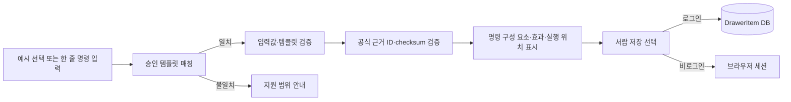
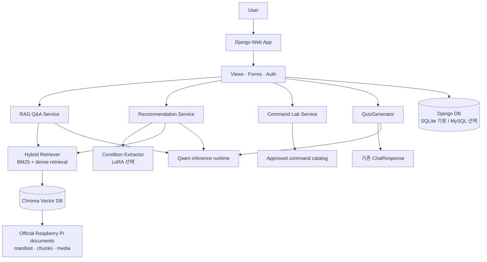

# PiCare

Raspberry Pi 공식 문서를 바탕으로 질문에 답하고, 조건에 맞는 제품과 명령어를 안내하는 Django 기반 학습·지원 웹 서비스입니다. 답변은 검색된 공식 문서 근거와 함께 제공하며, 답변을 바탕으로 복습 문제를 동적으로 만들 수 있습니다.

> 이 문서는 저장소의 현재 코드와 설정 파일을 기준으로 작성했습니다. 모델·벡터 인덱스·데이터베이스 연결이 필요한 기능은 해당 실행 환경이 준비되어야 동작합니다.

## 프로젝트 소개

PiCare는 Raspberry Pi를 처음 사용하는 사람이 제품 선택, 설정, 명령어 사용, 문서 학습을 한 곳에서 진행할 수 있도록 만든 서비스입니다.

- 공식 문서 기반 근거를 우선하는 RAG 질의응답
- 사용자 조건과 제품 카탈로그를 함께 사용하는 제품 추천
- 검수된 템플릿만 보여 주는 안전한 명령어 실험실
- 방금 받은 Q&A 답변으로 만드는 Dynamic Mini Challenge
- 회원, 커뮤니티, 서랍, 오답노트 등 사용자별 활동 저장

## 3차 프로젝트 대비 개선점

| 구분 | 4차 프로젝트에서 확장한 내용 |
| --- | --- |
| 서비스화 | Django 웹 애플리케이션, URL·View·Form·Model 구조로 기능을 통합했습니다. |
| 사용자 기능 | 회원가입·로그인, 게시글·댓글·좋아요, 명령어 서랍, 오답노트를 추가했습니다. |
| 학습 경험 | 고정 문제은행 중심의 학습과 별도로, Q&A 결과에 근거한 Dynamic Mini Challenge 경로를 추가했습니다. |
| 명령어 안내 | 승인된 카탈로그와 공식 문서 근거를 확인하는 명령어 실험실을 구현했습니다. 실제 명령을 실행하지 않습니다. |
| 입력 범위 표시 | Q&A와 제품 추천 입력에 최소 1자·최대 10,000자 안내와 공통 검증을 적용했습니다. 앞뒤 공백을 제거하고 범위를 벗어난 요청은 모델·검색 호출 전에 처리합니다. |
| 긴 요구사항·추천 조건 | 긴 자연어 요구사항의 마지막 조건이 조건 추출 프롬프트에 보존되도록 회귀 테스트를 추가했고, 유선 LAN·최소 카메라 커넥터 수·최소 디스플레이 출력 수 등 제품 필터 조건을 확장했습니다. |
| 실행 환경 | 기본 Django DB 설정과 Docker Compose MySQL 컨테이너, GPU/QLoRA 의존성을 분리했습니다. |

## 주요 기능

| 기능 | 구현 내용 |
| --- | --- |
| RAG 기반 질의응답 | Hybrid Retriever가 승인된 공식 문서 청크를 찾고, 근거·인용을 포함한 `ChatResponse`를 만듭니다. |
| Raspberry Pi 제품 추천 | 조건 추출, 제품 카탈로그 후보 선택, 후보 범위 RAG, 근거 기반 추천 응답을 연결합니다. |
| 명령어 실험실 | 승인된 템플릿을 분석·조합하고 입력값과 문서 근거를 검증합니다. 명령은 표시만 하며 실행하지 않습니다. |
| Dynamic Mini Challenge | Q&A의 최종 답변·실제 인용으로 1~3문항을 생성하고 Django Q&A 화면에서 제출·채점합니다. |
| 회원가입 / 로그인 | Django 기본 사용자 모델을 활용한 가입, 로그인, 로그아웃과 프로필 확장 모델이 있습니다. |
| 사용자 게시판 | 게시글, 댓글, 좋아요, 사용자별 조회를 DB 모델과 화면으로 제공합니다. |
| 질문 아카이브 | 질문 목록과 상세 화면을 제공합니다. |
| 사용자 저장 | 로그인 사용자는 명령어 서랍과 선택한 오답 문항을 DB에 저장·조회·삭제할 수 있습니다. |
| MySQL / Docker | Docker Compose로 MySQL 컨테이너를 실행하고, Django 환경 변수로 DB 연결을 구성할 수 있습니다. |

RAG와 추천은 문서 manifest, Chroma 인덱스, 모델 설정 등 런타임 자산이 준비된 경우에 실행됩니다.

## 핵심 기능 동작

### RAG 기반 질의응답

사용자 질문은 공통 입력 검증과 안전성 판단을 먼저 통과한 뒤, BM25와 dense retrieval을 결합한 Hybrid Retriever로 전달됩니다. 검색 대상은 공식 확인 및 승인 상태를 가진 문서 청크이며, 답변 생성기는 검색 근거를 포함한 프롬프트만 사용합니다.

- 검색 근거가 부족하거나 모델이 근거 부족을 표시하면 답변을 보류합니다.
- 답변의 citation은 문서 ID, 청크 ID, 제목, 섹션, 공식 원문 URL과 quote를 함께 전달합니다.
- 입력 범위를 벗어난 요청, 안전하지 않은 요청, 검색 오류는 각각 정해진 `ChatResponse` 상태로 처리합니다.

### Raspberry Pi 제품 추천

자유롭게 작성한 사용 목적과 선택 조건을 조건 JSON으로 변환하고, 검수된 제품 카탈로그에서 먼저 후보를 고릅니다. 이후 후보 제품의 공식 문서 범위에서만 Hybrid RAG를 수행해 추천 이유와 인용을 만듭니다.

- Wi-Fi·카메라·GPIO·모니터 사용 여부 외에 유선 LAN, 최소 카메라 커넥터 수, 최소 디스플레이 출력 수를 필터 조건으로 지원합니다.
- 입력하지 않은 선택 조건은 임의로 필수 조건으로 만들지 않으며, 명시적으로 확인하지 못한 요구사항은 확인 필요 항목으로 표시합니다.
- 추천 후보는 최대 3개이며, 제품 사실과 추천 근거는 카탈로그와 공식 문서로 다시 확인합니다.

### 사용자·커뮤니티 기능

Django 기본 사용자 인증을 바탕으로 회원가입, 로그인, 로그아웃, 프로필 화면을 제공합니다. 커뮤니티에서는 게시글·댓글·좋아요를 사용자 계정에 연결하고, 마이페이지에서 자신의 활동을 모아 볼 수 있습니다.

- 게시글과 댓글의 수정·삭제는 작성자 기준으로 제한됩니다.
- 좋아요는 사용자와 게시글 조합이 중복되지 않도록 DB 제약을 둡니다.
- 오답노트와 명령어 서랍은 소유자별로 조회·삭제되며, 다른 사용자의 항목에는 접근할 수 없습니다.

### 명령어 실험실

명령어 실험실은 사용자가 입력한 명령을 실행하는 기능이 아닙니다. 승인된 명령어 카탈로그의 템플릿과 일치하는 경우에만 명령을 분석하거나, 허용된 입력 필드만 바꾸어 재조합합니다.



사용자는 명령 전체와 각 구성 요소를 나누어 보고, 무엇을 바꿀 수 있는지와 문서상 효과·실행 위치·주의사항을 확인합니다. 지원 명령은 카탈로그의 canonical command와 대조하며, 새 옵션을 LLM이나 사용자의 입력으로 임의 추가하지 않습니다.

- 쉘 연산자·줄바꿈·제어 문자를 거부하고, 각 편집 값은 템플릿별 형식 검증을 통과해야 합니다.
- 명령어와 연결된 evidence ID·checksum·공식 URL을 확인하며, 검수되지 않았거나 근거가 변경된 항목은 노출하지 않습니다.
- 로그인 사용자는 서버가 만든 명령어 스냅샷을 서랍에 저장하고, 다시 열 때 현재 카탈로그와 근거를 재검증합니다.

| 구분 | 동작 원칙 |
| --- | --- |
| 지원 범위 | 승인 상태인 카탈로그 템플릿만 분석·조합합니다. 일치하지 않는 명령은 지원 범위로 확정하지 않습니다. |
| 편집 가능 값 | 템플릿에서 명시한 필드만 변경할 수 있으며, 길이·형식·추가 옵션 여부를 검증합니다. |
| 근거 | 각 템플릿의 문서 청크 checksum과 공식 URL을 확인한 뒤 효과와 주의사항을 표시합니다. |
| 실행 정책 | `display_only`입니다. 셸·서브프로세스·모델 추론으로 실제 명령을 실행하지 않습니다. |
| 저장 | 저장된 명령은 재표시 전 최신 카탈로그와 근거를 다시 검증해, 변경된 내용을 그대로 신뢰하지 않습니다. |

## Dynamic Mini Challenge

### 기능 목적과 처리 흐름

고정된 주제별 문제를 꺼내는 대신 **현재 Q&A의 검증된 답변과 인용**을 재료로 문제를 만듭니다.


### Grounding과 validation

- 새 Retriever, RAG, Chroma 검색을 다시 호출하지 않습니다. Q&A의 최종 답변과 답변에 실제로 사용된 citation만 변환합니다.
- `answered` 상태이고 citation이 있는 Q&A만 문제 생성을 시도합니다. 근거가 부족하면 `insufficient_content`를 반환합니다.
- Qwen의 구조화 출력은 엄격한 JSON parser를 거치며, 파싱 실패는 기존 Q&A를 실패시키지 않고 `generation_failed`로 분리합니다.
- 문항은 1~3개이며, 선택지는 A~D 네 개, 단일 정답, 하나의 허용된 evidence와 supporting quote를 가져야 합니다.
- evidence allowlist, quote 원문 매칭, 문항 중복 제거를 통과한 문항만 `available` 응답에 포함됩니다.
- Quiz 생성기는 Q&A 서비스에 주입된 answer generator를 감싸 사용하므로 Q&A와 Quiz가 같은 Qwen runtime을 재사용합니다.
- 채점 결과는 세션에 유지되며, 로그인 사용자가 실제로 틀린 문항을 저장할 때만 `WrongNote` 레코드가 생성됩니다.

| 상태 | 의미 | 기존 Q&A에 미치는 영향 |
| --- | --- | --- |
| `available` | 검증을 통과한 문항이 1개 이상 있습니다. | Q&A와 함께 퀴즈를 표시합니다. |
| `insufficient_content` | 답변 citation 또는 검증 가능한 근거가 부족합니다. | 답변은 그대로 표시하고 퀴즈만 생략합니다. |
| `generation_failed` | 모델 출력 파싱 또는 생성 과정이 실패했습니다. | 답변은 그대로 표시하고 퀴즈 오류만 분리합니다. |

현재 Q&A 화면에는 기존 문제은행 기반 inline challenge 경로도 별도로 남아 있습니다. Dynamic Mini Challenge만 일관되게 노출하려면 화면·라우팅을 정리하는 후속 작업이 필요합니다.

## 시스템 아키텍처



## 기술 스택

| 영역 | 사용 기술 |
| --- | --- |
| Web | Python, Django, Django Templates, HTML/CSS/JavaScript |
| 데이터베이스 | Django ORM, SQLite(기본), MySQL 8.4(Compose 선택 구성) |
| 검색·RAG | ChromaDB, sentence-transformers, rank-bm25, Hybrid Retrieval |
| LLM | Qwen3-4B-Instruct-2507, Transformers, structured generation |
| 조건 추출 학습 | QLoRA, PEFT, bitsandbytes, Accelerate |
| 데이터 | Raspberry Pi 공식 문서 manifest·chunk, 제품·명령어 카탈로그 |
| 테스트·평가 | pytest, Quiz evaluation fixture, RunPod GPU smoke/evaluation |
| 배포·실행 보조 | Docker Compose, dotenv, RunPod GPU 환경 |

## 프로젝트 구조

```text
.
├── web_app/                    # Django project
│   ├── accounts/               # 회원가입·인증 관련 app
│   ├── picare_web/             # settings, root URL, ASGI/WSGI
│   ├── portal/                 # Q&A, 추천, 실험실, 퀴즈, 게시판 View·Model·Form
│   ├── templates/portal/       # Django 화면 템플릿
│   └── static/                 # 정적 자산
├── src/
│   ├── contracts/              # ChatResponse, QuizResponse 등 계약
│   ├── rag/                    # Hybrid Retriever, Chroma 설정
│   ├── services/               # RAG Q&A, 추천, 명령어, Quiz 서비스
│   ├── rag_to_llm/             # Qwen answer/quiz generator adapter
│   └── condition_extraction/   # LoRA 조건 추출
├── document_pipeline/          # 공식 문서 수집·정제·인덱싱 자산
├── data/products/              # 제품·명령어·기존 챌린지 카탈로그
├── training/                   # QLoRA 학습 스크립트·설정
├── eval/                       # Quiz fixture, 실행 스크립트, 결과
├── tests/                      # 단위·통합·Django·GPU smoke 테스트
├── docs/                       # 계약, 실행 가이드, 검증 문서
├── compose.yaml                # MySQL 컨테이너 구성
└── requirements*.txt           # 기본/GPU/학습 의존성
```

## 실행 환경

### Django 로컬 실행

Python 3.12 환경을 권장합니다. 실행 전 `.env.example`을 참고해 `.env`를 만들고, 비밀 값과 모델·인덱스 관련 설정을 채워야 합니다.

```bash
python -m venv .venv
source .venv/bin/activate
pip install -r requirements.txt

python web_app/manage.py migrate
python web_app/manage.py runserver 8001
```

기본 DB 엔진은 SQLite입니다. 이 상태에서는 `web_app/db.sqlite3`에 Django 데이터가 저장됩니다.

### Docker Compose와 MySQL

Compose는 MySQL 8.4 서비스만 제공합니다.

```bash
docker compose up -d mysql
```

MySQL을 Django DB로 사용하려면 컨테이너에 필요한 `MYSQL_*` 값과 별도로, Django가 읽는 아래 값을 `.env`에 설정해야 합니다.

```dotenv
DJANGO_DB_ENGINE=django.db.backends.mysql
DJANGO_DB_NAME=picare
DJANGO_DB_USER=picare_app
DJANGO_DB_PASSWORD=change-me
DJANGO_DB_HOST=127.0.0.1
DJANGO_DB_PORT=3306
```

설정 후 `python web_app/manage.py migrate`를 실행합니다. 팀 환경에서 사용하는 계정·비밀번호·호스트는 공유된 보안 채널에서 관리하고 저장소에 넣지 않습니다.

### RAG 및 Qwen / LoRA GPU 환경

- CPU 중심 개발·테스트 의존성: `requirements.txt`
- Qwen 4-bit 추론과 LoRA 조건 추출: `requirements-gpu.txt`
- QLoRA 학습: `requirements-training.txt`

GPU 실행에는 준비된 문서 manifest와 Chroma 인덱스, 모델 접근 권한, 환경 변수가 필요합니다.

- [RunPod Pod 설정](docs/guides/runpod-pod-setup.md)
- [RunPod Django 실행](docs/runpod-django-setup.md)
- [QLoRA 학습 가이드](docs/guides/finetuning-training.md)
- [RAG Q&A 가이드](docs/llm-rag-qa.md)

## 역할 분담

| 영역 | 담당 |
| --- | --- |
| 데이터 수집·검수 | 전체 조원 |
| 명령어 실험실 | 양원 |
| Dynamic Mini Challenge | 나은 |
| 프론트엔드 | 지흠 |
| 백엔드 | 혜리 |
| RAG·추천·실행 환경 연계 | 공동 구현 |

## 테스트 및 평가

### 테스트 범위

`tests/`에는 계약, RAG, 추천, 명령어 카탈로그/서비스/UI, Django 인증·웹 흐름, Dynamic Quiz parser·validation·adapter·generator, Qwen smoke 테스트가 포함되어 있습니다.

Dynamic Mini Challenge의 CPU 단위 테스트는 다음처럼 실행할 수 있습니다.

```bash
python -m pytest -q \
  tests/test_quiz_contracts.py \
  tests/test_quiz_adapters.py \
  tests/test_quiz_generator.py \
  tests/test_quiz_parser.py \
  tests/test_quiz_validation.py \
  tests/test_huggingface_quiz_text_generator.py
```

실제 Qwen 생성 smoke/evaluation은 CUDA가 가능한 RunPod 환경에서 실행합니다. 평가 자산은 `eval/quiz_generation_cases.v1.jsonl`, `eval/run_quiz_generation_evaluation.py` 및 결과 파일에 있습니다.

### 4차 확장 정량 기록

아래 수치는 서로 다른 검증 문서의 기록을 구분해 정리한 것입니다. 문서·청크 수는 명령어 실험실 확장 시점의 재생성·색인 기록이며, 조건 추출 성능은 고정 holdout 20건의 Base와 QLoRA 비교 결과입니다.

| 항목 | 확인된 기록 | 근거 |
| --- | ---: | --- |
| 공식 문서 / 승인 RAG 청크 | 23개 / 381개 | 명령어 실험실 검증에서 재생성·Chroma 색인을 확인 |
| Q&A·추천 최대 입력 길이 | 10,000자 | 공통 입력 계약과 Django Form에 동일 적용 |
| 조건 JSON 필드 | 21개 | `ConditionPayload`의 현재 엄격 계약 기준 |
| 조건 JSON Schema 준수율 | Base 100% → QLoRA 100% | 고정 holdout 20건 |
| 전체 조건 Exact Match | Base 10.0% → QLoRA 45.0% | 고정 holdout 20건 |
| 필드별 Macro F1 평균 | Base 78.79% → QLoRA 90.61% | 고정 holdout 20건 |
| 입력에 없는 조건 생성 비율 | Base 16.34% → QLoRA 5.88% | 고정 holdout 20건 |

제품 추천 Top-1 정확도는 평가 데이터의 `expected_product_ids`가 비어 있어 산출하지 않았습니다. 조건 추출 성능을 제품 추천 정확도로 바꾸어 해석하지 않습니다.

### Dynamic Mini Challenge 최종 평가

저장소의 [최종 평가 문서](docs/validation/mini-challenge-final-evaluation.md)는 RunPod GPU 4-bit Qwen 환경에서 고정 fixture 25건을 대상으로 한 결과입니다. 사람 검수 전의 의미적 선택지 품질은 수치로 단정하지 않습니다.

| 지표 | 최종 기록 |
| --- | ---: |
| JSON parse 성공률 | 18/20 (90.0%) |
| Parser 통과 문항의 구조·근거 검증 통과 | 18/18 (100.0%) |
| 검증된 Quiz 제공률 | 18/20 (90.0%) |
| Allowlist 위반 / quote 원문 매핑 실패 | 0 / 0 |
| Supporting quote 원문 매칭 | 18/18 (100.0%) |
| `available` 분류 F1 / 전체 정확도 | 94.7% / 92.0% |
| Warm structured generation 평균 / p95 | 10.73초 / 15.43초 |

평가 조건과 실패 사례는 반드시 [원문](docs/validation/mini-challenge-final-evaluation.md)과 함께 확인합니다. 이 평가는 positive fixture당 1문항 생성 기준이며, 다문항 품질이나 사람 검수 결과를 대신하지 않습니다.

## 문서와 계약

- [Mini Challenge 프론트엔드·백엔드 인계 계약](docs/data-contracts/mini-challenge-handoff.md)
- [QuizResponse JSON Schema](docs/schemas/quiz-response.schema.json)
- [명령어 실험실 데이터 계약](docs/data-contracts/command-lab.md)
- [Django 모델 계약](docs/data-contracts/portal-models.md)
- [문서·RAG 데이터 계약](docs/data-contracts/rag-corpus.md)
- [명령어 실험실 검증 기록](docs/validation/2026-09-11-command-lab.md)
