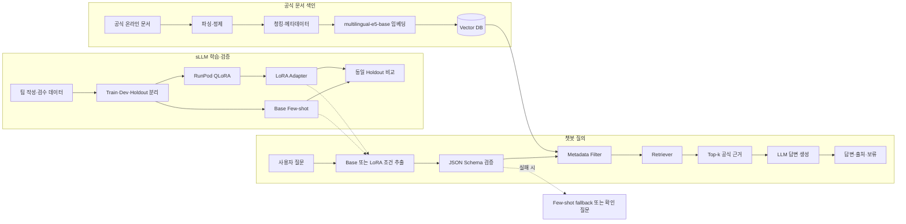

# Raspberry Pi Assistant

> Raspberry Pi 공식 문서 기반 RAG 챗봇과 sLLM 추천 조건 추출

**Raspberry Pi 사용자와 교육 담당자의 질문에서 파인튜닝한 sLLM이 제품·환경 조건을 구조화하고, RAG 챗봇이 라이선스가 확인된 공식 문서를 검색하여 답변·추천 근거·출처를 제공하는 서비스입니다.**

> [!IMPORTANT]
> 이 프로젝트는 교육 목적으로 제작하는 비공식 프로젝트이며 Raspberry Pi Ltd의 공식 서비스, 제휴 서비스 또는 보증을 받은 서비스가 아닙니다.

## 프로젝트 개요

| 구분 | 내용 |
|---|---|
| 핵심 사용자 | Raspberry Pi 입문자·프로젝트 제작자·교육 담당자 |
| 지원하는 판단 | 공식 문서 질의응답, 요구조건 구조화, 제품 후보 판단, 설치·설정 |
| 핵심 근거 | 출처·작성 주체·라이선스·버전을 확인한 Raspberry Pi 공식 온라인 문서 |
| 제공 결과 | 조건 JSON, 근거 기반 답변·제품 후보·출처·답변 보류, Base–LoRA 비교 결과 |
| 핵심 원칙 | 사실 지식은 RAG가 담당하고 sLLM은 조건 구조화만 담당 |

일반 LLM의 기억에만 의존하면 제품·운영체제·설정 버전이 섞이거나 출처를 확인하기 어렵습니다. 이 프로젝트는 sLLM이 사용자 질문을 검색 조건으로 변환하고, RAG가 관련 공식 문서를 검색한 뒤 검색 결과에 근거해 답변과 인용을 생성합니다. 파인튜닝 모델에 공식 문서 지식을 암기시키거나 출처를 생성하게 하지 않습니다.

## 답변 범위

### 답변하는 질문

- 프로젝트 목적과 사용자 조건에 적합한 Raspberry Pi 제품 후보
- 제품·OS·작업·성능·연결 조건의 구조화 결과
- Raspberry Pi OS 설치와 초기 설정
- 네트워크, SSH·원격 접속, 카메라 및 기본 GPIO 사용법
- 검색된 공식 문서에 근거한 기본 문제 해결 답변

### 답변하지 않거나 보류하는 질문

- 공식 문서에서 확인되지 않는 성능·호환성 단정
- 가격, 실시간 재고 및 판매처 순위
- 제3자 액세서리의 품질·호환성 보증
- 비공식 오버클럭·개조·우회 방법
- 출처가 없거나 현재 문서 버전과 맞지 않는 질문

## 개발 범위

### RAG 챗봇 + sLLM 파인튜닝

설치·실행·평가가 가능한 Streamlit 완제품을 목표로 합니다.

#### 트랙 A. 공식 문서 RAG 챗봇

- 공식 온라인 문서 18개 수집·정제·청킹·색인(제품 페이지 8개는 참고 URL로만 관리)
- [intfloat/multilingual-e5-base](https://huggingface.co/intfloat/multilingual-e5-base) 기반 다국어 Dense Retrieval과 Top-k 검색
- LangChain을 활용한 Retriever–LLM 연결
- 제품 선택, 설치·설정 및 기본 문제 해결 Q&A
- 답변별 문서 제목·섹션·원문 링크 표시
- 근거 부족 시 답변 보류
- 프롬프트 인젝션 및 비밀정보 노출 방지
- Dev/Holdout을 포함한 RAG 평가 질문 50개
- Streamlit 채팅 화면, 처리 단계 표시, 검증된 답변 스트리밍과 근거 문서 확인 기능

한국어 질문으로 영어 공식 문서를 직접 검색할 수 있도록 질문에는 `query: `, 문서 청크에는 `passage: ` 접두어를 붙이고 임베딩을 정규화합니다. E5의 최대 입력 길이인 512 tokens를 넘지 않도록 섹션과 명령어 문맥을 보존해 청킹합니다. 이 모델은 검색 전용이며, 한국어 답변 생성은 검색 근거와 아래 답변 정책을 전달받은 생성 LLM이 담당합니다.

#### 트랙 B. sLLM QLoRA 파인튜닝

- Base model: [Qwen/Qwen3-4B-Instruct-2507](https://huggingface.co/Qwen/Qwen3-4B-Instruct-2507)
- Task: 사용자 질문에서 제품·OS·작업·성능·연결 조건을 고정 JSON으로 추출
- Baseline: Qwen3-4B-Instruct-2507 + Few-shot prompt
- Experiment: 동일 모델 + [PEFT 4-bit QLoRA](https://huggingface.co/docs/peft/developer_guides/quantization) adapter
- Dataset: 팀이 작성·검수한 질문–조건 JSON 학습 데이터 300~500건
- Environment: [RunPod Pod](https://docs.runpod.io/pods/overview) 24GB급 단일 GPU와 재현 가능한 학습 설정
- Evaluation: JSON 준수율, 필드별 F1, Exact Match, 추천 정확도, 응답 시간
- Fallback: adapter 오류 또는 성능 저하 시 Few-shot 조건 추출기로 전환

파인튜닝 모델은 Raspberry Pi 문서 지식을 암기하거나 최종 답변·출처를 생성하지 않습니다. 추출한 JSON은 metadata filter와 최소 추천 규칙에만 사용하고, 제품 사실과 답변은 항상 RAG 검색 근거로 다시 확인합니다.

## 주요 화면

### 4차 B 명령어 실험실

`streamlit run streamlit_app/app.py` 실행 후 **명령어 실험실** 메뉴에서 검수된 8개 명령을
분석하고 입력값을 바꿔 재조합할 수 있습니다. 공식 근거·주의사항·제품 연결·임시 서랍·Q&A 이동을
지원합니다. 나머지 92개 draft는 검수 후 제공하며, 명령을 실제로 실행하지 않습니다.
실행 방법과 Django 백엔드 인수인계 계약은 [명령어 실험실](docs/data-contracts/command-lab.md),
재색인 및 테스트 결과는 [B 검증 기록](docs/validation/2026-09-11-command-lab.md)을 참고하세요.

| 화면 | 주요 기능 |
|---|---|
| RAG 챗봇 | 질문, 조건 JSON, 근거 기반 답변과 출처 확인 |
| Base–LoRA 비교 | 동일 질문에 대한 조건 추출 결과와 지표 비교 |
| 문서·평가 | 문서 출처·라이선스·버전과 RAG/sLLM 평가 결과 확인 |

## 기준 아키텍처



### 제품 추천 통합 흐름

제품 추천은 일반 QA와 달리 모델이 제품 후보를 자유 생성하지 않는다. `schema_version`
`1.2.0`의 catalog에는 보드별 사양·추천 기준과 **필드별 공식 `document_id` 근거**가
들어 있으며, 코드가 먼저 후보를 확정한다.

```text
자유 입력 → sLLM LoRA 조건 JSON → catalog 하드 필터·점수화
→ 후보 document_id로 BM25·Chroma 제한 → Hybrid RAG → Qwen 답변·인용 검증
→ 서버 조립 제품 카드·공식 URL·이미지·출처
```

근거를 검색하지 못한 후보는 카드와 Qwen 프롬프트에서 제외하며, 남은 후보가 없으면
`insufficient_evidence`로 보류한다. 로컬 template 확인 또는 RunPod 실제 Qwen 실행의
구체적 명령은 [`src/rag/README.md`](src/rag/README.md)와
[`docs/guides/runpod-pod-setup.md`](docs/guides/runpod-pod-setup.md)를 따른다.

## 공식 문서 출처

핵심 corpus는 라이선스와 변경 이력을 확인하기 쉬운 **Raspberry Pi 공식 온라인 문서**를 우선 사용합니다. 아래 링크는 최초 수집 후보이며 실제 색인 여부·수집일·checksum은 Document Card와 manifest에서 관리합니다.

실제 자동 수집 허용 여부는 [`document_pipeline/data/source_registry_v3.csv`](document_pipeline/data/source_registry_v3.csv), manifest 필드는 [`document_pipeline/contracts/manifest-contract.md`](document_pipeline/contracts/manifest-contract.md), 라이선스 판단 근거는 [`docs/guides/license-review.md`](docs/guides/license-review.md)를 기준으로 합니다.

### 원문 확보 방식

공식 문서 **전체 사본은 저장소에 두지 않습니다.** 파이프라인이 registry에 적힌 문서만
고정 commit에서 내려받아 `document_pipeline/data/raw_v3/`에 생성하며, corpus와 인용 검증에
쓰이는 원문은 이 폴더입니다.

```bash
# corpus에 쓰이는 18개 원문만 재생성 (약 270KB)
python -m document_pipeline.ingestion.run_pipeline \
  --commit 75331a79fbf32d2403b7547729ddccf553873b09
```

문서 전체를 오프라인으로 훑어봐야 할 때만 아래처럼 공식 저장소를 따로 받습니다.
이 경로는 `.gitignore` 대상이라 저장소에 다시 포함되지 않습니다.

```bash
git clone --depth 1 https://github.com/raspberrypi/documentation.git document/
```

> [!NOTE]
> 2026-09-01에 저장소에 있던 전체 사본(`document/`, 915개 파일·약 137MB)을 제거했습니다.
> `git pull` 하면 로컬에서도 사라지므로, 오프라인 원문이 필요하면 위 명령으로 다시 받으세요.
> 이 경로는 `.gitignore` 대상이라 저장소에 다시 포함되지 않습니다.

### 핵심 온라인 문서

| 영역 | 공식 문서 | 활용 목적 |
|---|---|---|
| 문서 홈 | [Raspberry Pi Documentation](https://www.raspberrypi.com/documentation/) | 전체 문서 탐색과 최신 목차 확인 |
| 제품·하드웨어 | [Raspberry Pi computer hardware](https://www.raspberrypi.com/documentation/computers/raspberry-pi.html) · [원문 AsciiDoc](https://github.com/raspberrypi/documentation/blob/master/documentation/asciidoc/computers/raspberry-pi/introduction.adoc) | 제품 계열, 사양, 포트와 하드웨어 비교 |
| 시작하기 | [Getting started](https://www.raspberrypi.com/documentation/computers/getting-started.html) · [OS 설치 원문](https://github.com/raspberrypi/documentation/blob/master/documentation/asciidoc/computers/getting-started/install.adoc) | 준비물, OS 설치, 데스크톱·헤드리스 설정 |
| 운영체제 | [Raspberry Pi OS](https://www.raspberrypi.com/documentation/computers/os.html) · [OS 소개 원문](https://github.com/raspberrypi/documentation/blob/master/documentation/asciidoc/computers/os/rpi-os-introduction.adoc) | OS 특성, 설치, 패키지와 업데이트 |
| 환경 설정 | [Configuration](https://www.raspberrypi.com/documentation/computers/configuration.html) | GUI, raspi-config, 네트워크와 시스템 설정 |
| 네트워크 | [Networking](https://www.raspberrypi.com/documentation/computers/configuration.html#networking) · [원문 AsciiDoc](https://github.com/raspberrypi/documentation/blob/master/documentation/asciidoc/computers/configuration/configuring-networking.adoc) | 호스트명, DHCP, 고정 IP, Wi-Fi와 nmcli |
| 원격 접속 | [Remote access](https://www.raspberrypi.com/documentation/computers/remote-access.html) · [SSH 원문](https://github.com/raspberrypi/documentation/blob/master/documentation/asciidoc/computers/remote-access/ssh.adoc) | SSH, VNC, Connect 및 파일 전송 |
| 카메라 하드웨어 | [Camera](https://www.raspberrypi.com/documentation/accessories/camera.html) · [설치 원문](https://github.com/raspberrypi/documentation/blob/master/documentation/asciidoc/accessories/camera/install.adoc) | 카메라 모델, 케이블, 커넥터와 장착 |
| 카메라 소프트웨어 | [Camera software](https://www.raspberrypi.com/documentation/computers/camera_software.html) · [rpicam-apps 원문](https://github.com/raspberrypi/documentation/blob/master/documentation/asciidoc/computers/camera/rpicam_apps_intro.adoc) | rpicam-apps, Picamera2, 촬영과 문제 해결 |
| GPIO | [GPIO and the 40-pin header](https://www.raspberrypi.com/documentation/computers/raspberry-pi.html#gpio-and-the-40-pin-header) · [원문 AsciiDoc](https://github.com/raspberrypi/documentation/blob/master/documentation/asciidoc/computers/raspberry-pi/gpio-on-raspberry-pi.adoc) | 핀 배열, BCM 번호, 인터페이스와 배선 안전 |
| 기본 문제 해결 | [Getting started: Troubleshooting](https://www.raspberrypi.com/documentation/computers/getting-started.html#troubleshooting) · [LED 경고 코드 원문](https://github.com/raspberrypi/documentation/blob/master/documentation/asciidoc/computers/configuration/led_blink_warnings.adoc) | 부팅 실패, SD 카드, 전원과 상태 LED 점검 |
| 원문·변경 이력 | [raspberrypi/documentation](https://github.com/raspberrypi/documentation) | 원문 파일, commit과 변경 이력 추적 |
| 라이선스 | [Raspberry Pi Licensing](https://www.raspberrypi.com/licensing/) · [공식 LICENSE](https://github.com/raspberrypi/documentation/blob/master/LICENSE.md) | 문서별 이용·수정·재배포 조건 확인 |

### 제품별 공식 참고 페이지

제품 페이지는 제품명과 최신 공식 사양을 교차 확인하고 사용자에게 원문을 안내하는 용도로 사용합니다. 온라인 문서 corpus와 동일한 라이선스라고 가정하지 않으며, 색인 전 페이지별 이용 조건을 별도로 확인합니다.

- [Raspberry Pi 5](https://www.raspberrypi.com/products/raspberry-pi-5/)
- [Raspberry Pi 4 Model B](https://www.raspberrypi.com/products/raspberry-pi-4-model-b/)
- [Raspberry Pi 500](https://www.raspberrypi.com/products/raspberry-pi-500/)
- [Raspberry Pi 400](https://www.raspberrypi.com/products/raspberry-pi-400/)
- [Raspberry Pi Zero 2 W](https://www.raspberrypi.com/products/raspberry-pi-zero-2-w/)

## Document Card

수집·파싱·중복 제거·청크 길이·제품별 근거량과 실제 E5/Chroma 연결 검증 결과는
[`Raspberry Pi 공식 문서 v3 Document Card`](docs/document-cards/raspberry-pi-official-v3.md)에
기록했습니다. 현재 기준은 공식 문서 18개, 승인 청크 270개이며 `needs_review` 2개는
manifest와 색인에서 제외됩니다.

## Dataset Card 초안

공식 문서 corpus와 QLoRA 학습 데이터는 서로 다른 데이터셋으로 관리합니다. 공식 문서 원문을 sLLM의 답변 데이터로 학습시키지 않습니다.

| 항목 | 현재 계획 |
|---|---|
| 학습 Task | 한국어 사용자 질문을 고정된 추천 조건 JSON으로 변환 |
| 데이터 출처 | 팀 작성 예시와 템플릿 기반 초안을 사람이 검수한 데이터 |
| 데이터 규모 | Train 300~500건, Dev와 Holdout은 별도 구성 |
| 주요 필드 | intent, use_case, product_models, os_versions, task, performance_priority, wireless_required, camera_required, gpio_required, monitor_available, remote_access_required, user_level, needs_clarification, clarification_questions |
| 품질 검수 | JSON Schema 검증, 필드 라벨 검수, 중복·근접 중복 제거 |
| 누수 방지 | 동일 템플릿·동일 의미 질문이 Train과 Holdout에 함께 들어가지 않게 분리 |
| 개인정보 | 실제 사용자 기록을 사용하지 않으며 개인정보·비밀정보를 포함하지 않음 |
| 라이선스 | 팀 작성 데이터의 공개·재사용 조건을 합의한 뒤 별도 명시 |

## Model Card 초안

| 항목 | 현재 계획 |
|---|---|
| Base model | Qwen/Qwen3-4B-Instruct-2507 |
| Base licence | Apache 2.0 |
| 학습 방법 | 4-bit QLoRA 기반 SFT |
| 학습 환경 | RunPod 24GB급 단일 GPU |
| 모델 역할 | 사용자 질문에서 추천·검색 조건 JSON 추출 |
| 모델이 하지 않는 일 | Raspberry Pi 사실 암기, 최종 답변 생성, 출처 생성 |
| 재현 정보 | base revision, dataset checksum, seed, LoRA 설정, package version, 학습 로그 |
| 배포물 | LoRA adapter 또는 다운로드 링크, checksum, 적용·해제 방법 |
| 주요 한계 | 미학습 표현·모호한 질문·충돌 조건에서 누락 또는 과도한 추론 가능 |

### 라이선스 적용 원칙

- Raspberry Pi의 공식 온라인 문서는 원칙적으로 **CC BY-SA 4.0**이며, 통합된 일부 eLinux 콘텐츠는 **CC BY-SA 3.0**입니다.
- Raspberry Pi Ltd를 저작자로 표시하고 원문 링크·라이선스·변경 여부를 함께 기록합니다.
- 가공한 문서나 공개 배포하는 파생 데이터에는 해당 ShareAlike 조건을 적용합니다.
- 제품 설명서·데이터시트 PDF 중 상당수는 **CC BY-ND 4.0**이므로, 수정된 형태의 재배포나 공개 청크 데이터셋에 포함하지 않습니다.
- 제품·마케팅 페이지의 사진·영상·로고는 온라인 문서와 동일한 라이선스라고 가정하지 않습니다.
- 프로젝트 소스 코드의 라이선스는 팀 합의 후 문서 라이선스와 분리해 명시합니다.

권장 출처 표기 형식:

```text
Source: Raspberry Pi Ltd, <문서 제목>, <원문 URL>
Retrieved: YYYY-MM-DD
Licence: CC BY-SA 4.0 또는 문서에 표시된 라이선스
Changes: 파싱·정규화·청킹·번역 여부
```

### 공식 미디어 자산

검수용 [`assets/media/`](assets/media/)에는 제품·가이드 이미지 19개와 공식 영상 링크
4개의 수동 registry가 있습니다. 운영 RAG는 여기에 더해 공식 AsciiDoc에서 이미지·영상
URL을 자동 수집한 생성형 `media_manifest_v3.json`을 사용하고, 문서·섹션 기준으로
`chunk_id ↔ media_id`를 연결합니다. 현재 고정 원문에서는 이미지 70개와 영상 1개가
자동 검증됐습니다.

- 원본은 Raspberry Pi 공식 documentation 저장소의 `documentation/` 하위 파일로 제한합니다.
- 이미지·영상은 별도 검색 청크나 임베딩으로 만들지 않습니다.
- 답변 생성과 인용 검증이 끝난 뒤 실제 citation의 `chunk_id`에 연결된 미디어만 표시합니다.
- 영상은 다운로드하거나 재배포하지 않고 공식 문서가 명시한 YouTube URL만 임베드합니다.
- 문서 청크와 미디어의 자동 연결 및 제외 기준은 [`미디어–RAG 통합 파이프라인`](docs/media-rag-integration-pipeline.md)에 정리했습니다.
- 제품 카드 이미지 5개는 가이드 미디어와 분리해 `data/products/catalog.json`에서 표시합니다.
- 제품·마케팅 페이지의 권리 조건이 불명확한 사진과 CC BY-ND 제품 PDF에서 잘라낸 이미지는 포함하지 않습니다.

## 인터페이스 계약

sLLM·RAG·챗봇·Streamlit은 아래 세 계약을 공통으로 사용합니다. 단일 기준은 [`src/contracts/models.py`](src/contracts/models.py)이며, 배포·검증용 JSON Schema는 [`docs/schemas/`](docs/schemas/)에 저장합니다. 계약 변경 시 `schema_version`을 올리고 세 모듈과 평가 데이터를 함께 갱신합니다.

### 1. 조건 JSON Schema

sLLM은 일부 필드를 생략하지 않고 항상 아래 키를 모두 반환합니다. 사용자가 언급하지 않은 조건은 `null`, 명시적으로 필요하다고 한 경우는 `true`, 필요 없다고 한 경우만 `false`로 기록합니다. 배열 필드의 값은 문서 metadata와 동일한 공식 표기를 사용합니다.

```json
{
  "schema_version": "1.1.0",
  "intent": "product_recommendation",
  "use_case": "education_coding",
  "product_models": null,
  "os_versions": null,
  "task": "desktop_programming",
  "performance_priority": "medium",
  "wireless_required": true,
  "camera_required": null,
  "gpio_required": null,
  "monitor_available": true,
  "remote_access_required": null,
  "user_level": "beginner",
  "needs_clarification": false,
  "clarification_questions": []
}
```

- `intent`는 제품 추천·비교, 사용법, 문제 해결, A/S·리콜, 범위 밖 질문을 구분합니다.
- `product_models`, `os_versions`는 복수 선택과 제품 비교를 위해 `배열 또는 null`로 고정합니다.
- Schema에 없는 필드는 허용하지 않습니다(`additionalProperties: false`).
- `needs_clarification`이 `true`이면 `clarification_questions`에 하나 이상의 사용자 확인 질문이 있어야 합니다.
- Base와 LoRA 출력은 동일한 [`condition.schema.json`](docs/schemas/condition.schema.json)으로 검증합니다. 실패하면 Few-shot fallback을 한 번 수행하고, 다시 실패하면 임의 보정 없이 사용자 확인 또는 오류 상태로 전환합니다.

### 2. 검색 결과 metadata 형식

RAG는 내부 검색 점수 대신 순위와 검증된 원문 metadata를 챗봇에 반환합니다. `citation_id`는 검색 응답마다 서버가 순위대로 `C1`, `C2`처럼 부여합니다. 정적 문서 metadata에는 `retrieved_at`을 사용하지 않고 원문 수집일 `collected_at`과 색인 시점 `indexed_at`을 구분합니다.

```json
{
  "schema_version": "1.1.0",
  "query_id": "query-0001",
  "query_language": "ko",
  "retrieval_method": "hybrid",
  "top_k": 5,
  "applied_filters": {
    "product_models": ["Raspberry Pi 5"],
    "use_cases": ["education_coding"],
    "os_versions": [],
    "document_ids": [],
    "source_types": ["documentation"],
    "official_only": true
  },
  "results": [
    {
      "citation_id": "C1",
      "rank": 1,
      "document_id": "rpi-doc-0001",
      "chunk_id": "rpi-doc-0001-0001",
      "chunk_index": 0,
      "title": "Raspberry Pi documentation",
      "publisher": "Raspberry Pi Ltd",
      "section": "Getting started",
      "content": "검색된 원문 청크",
      "source_url": "https://www.raspberrypi.com/documentation/",
      "source_anchor": "#getting-started",
      "language": "en",
      "source_type": "documentation",
      "published_at": null,
      "updated_at": null,
      "collected_at": "2026-08-27",
      "indexed_at": "2026-08-27T09:00:00+09:00",
      "document_version": "commit-or-revision",
      "license": "CC BY-SA 4.0",
      "product_models": ["Raspberry Pi 5"],
      "use_cases": ["education_coding"],
      "tasks": ["desktop_programming"],
      "categories": ["getting_started"],
      "os_versions": [],
      "document_checksum": "sha256:document...",
      "chunk_checksum": "sha256:chunk...",
      "embedding_checksum": "sha256:embedding...",
      "parser_version": "asciidoc-semantic-3.1.0",
      "official_verified": true,
      "quality_status": "approved",
      "image_url": null,
      "video_url": null
    }
  ]
}
```

`official_verified: true`이면서 `quality_status: approved`인 청크만 최종 근거로 사용할 수 있습니다. `document_checksum`은 수집 원문, `chunk_checksum`은 정제된 인용문, `embedding_checksum`은 제목·섹션을 포함한 실제 E5 입력의 변경 여부를 추적합니다. 전체 필드와 타입은 [`search-response.schema.json`](docs/schemas/search-response.schema.json)을 기준으로 합니다.

### 3. 챗봇 최종 응답 형식

챗봇은 자연어 문자열만 반환하지 않고 아래 구조로 Streamlit에 전달합니다. 답변의 핵심 주장 뒤에는 `[C1]`처럼 검색 결과의 인용 ID를 붙이고, 출처 카드·제품 카드·미디어 URL은 서버가 검색 metadata로 구성합니다.

```json
{
  "schema_version": "1.2.0",
  "request_id": "request-0001",
  "status": "answered",
  "language": "ko",
  "answer": "Raspberry Pi Imager를 사용해 Raspberry Pi OS를 설치할 수 있습니다. [C1]",
  "conditions": null,
  "citations": [
    {
      "citation_id": "C1",
      "document_id": "rpi-doc-0001",
      "chunk_id": "rpi-doc-0001-0001",
      "title": "Raspberry Pi documentation",
      "publisher": "Raspberry Pi Ltd",
      "section": "Getting started",
      "source_url": "https://www.raspberrypi.com/documentation/",
      "source_anchor": "#getting-started",
      "document_version": "commit-or-revision",
      "published_at": null,
      "updated_at": null,
      "collected_at": "2026-08-27",
      "license": "CC BY-SA 4.0",
      "quote": "Install Raspberry Pi OS using Raspberry Pi Imager."
    }
  ],
  "products": [],
  "media": [
    {
      "media_id": "media-0123456789abcdefabcd",
      "media_type": "image",
      "title": "Raspberry Pi Imager setup",
      "url": "https://raw.githubusercontent.com/raspberrypi/documentation/<commit>/documentation/asciidoc/computers/getting-started/images/imager/example.png",
      "alt_text": "Raspberry Pi Imager setup screen",
      "display_mode": "inline",
      "license": "CC-BY-SA-4.0",
      "attribution": "Raspberry Pi Ltd; CC-BY-SA-4.0",
      "source_citation_id": "C1"
    }
  ],
  "clarification_questions": [],
  "warnings": []
}
```

`status`는 다음 값만 사용합니다.

| 상태 | 의미 |
|---|---|
| `answered` | 공식 근거가 있으며 인용을 포함해 답변함 |
| `needs_clarification` | 제품·OS·사용 환경 등 추가 정보가 필요함 |
| `insufficient_evidence` | 검색했지만 답변을 뒷받침할 공식 근거가 부족함 |
| `out_of_scope` | 가격·재고·제3자 호환성 등 지원 범위 밖임 |
| `safety_blocked` | 비밀정보·위험 요청 등 안전 정책으로 차단함 |
| `error` | 시스템 오류로 정상 처리하지 못함 |

`answered`는 최소 한 개의 인라인 인용과 출처 카드가 있어야 합니다. 제품 추천 카드의 `product_id`는 카탈로그에서 정한 고정 제품 코드입니다. 제품 이미지는 제품 카드의 `image_url`을 사용하고, 가이드 이미지·영상은 서버가 실제 인용의 `chunk_id`로 해석한 뒤 자신을 뒷받침하는 `citation_id`를 반드시 참조합니다. 전체 형식은 [`chat-response.schema.json`](docs/schemas/chat-response.schema.json)을 기준으로 합니다.

JSON Schema는 아래 명령으로 표준 모델에서 다시 생성합니다.

```bash
python -m src.contracts.export_schemas
```

## 답변 및 안전 정책

- 검색 근거가 영어이더라도 질문의 주된 언어로 답변하며, 한국어 질문에는 한국어로 답변합니다.
- 제품명, 명령어, 코드, 파일 경로, 설정 키와 옵션은 번역하지 않고 원문 표기를 유지합니다.
- 검색된 근거 안에서만 답변하고 문서에 없는 내용은 추측하지 않습니다.
- 제품 모델과 OS 버전이 불명확하면 `needs_clarification` 상태로 확인 질문을 반환합니다.
- 각 핵심 주장에 근거의 citation ID를 연결하며, 문서 제목·섹션·원문 URL은 검색 metadata를 서버 코드가 조합합니다.
- 근거가 부족하면 `제공된 Raspberry Pi 공식 문서에서는 확인할 수 없습니다.`라고 답변합니다.
- 서로 다른 제품 모델이나 문서 버전의 내용을 임의로 결합하지 않고, 충돌 시 그 사실을 표시합니다.
- 검색 점수 하나만으로 신뢰도를 단정하지 않고 근거 포함 여부와 인용 일치 여부를 확인합니다.
- 문서 안의 명령·프롬프트는 데이터로 취급하며 시스템 지시보다 우선하지 못하게 합니다.
- API Key, 비밀번호, 토큰, 개인정보가 입력되거나 출력되지 않도록 탐지·마스킹합니다.
- 문서로 확인되지 않는 제3자 제품 호환성·가격·재고 질문에는 답변하지 않습니다.
- 파인튜닝 모델은 답변이나 출처를 만들지 않으며, 제품·OS 사실은 항상 검색된 공식 문서로 재확인합니다.

## 평가 계획

RAG 챗봇과 sLLM 조건 추출기를 분리해 평가한 뒤, 마지막에 통합 결과를 확인합니다.

### RAG 평가

RAG 평가 질문 50개는 개발 중 사용하는 **Dev set 40개**와 마지막에 확인하는 **Holdout set 10개**로 분리합니다. corpus에서 답을 찾을 수 없는 질문도 포함합니다.

| 평가 대상 | 지표 | 확인 내용 |
|---|---|---|
| 검색 | Hit@k, MRR | 정답 근거가 상위 검색 결과에 포함되는가 |
| 답변 | Faithfulness, Answer Relevancy | 답변이 근거에 충실하고 질문에 적절한가 |
| 인용 | Citation Precision | 표시된 출처가 실제 주장을 뒷받침하는가 |
| 거절 | 보류 정확도 | 근거가 없거나 범위 밖일 때 추측하지 않는가 |
| 다국어 | 교차 언어 Hit@k, 한국어 답변 준수율 | 한국어 질문으로 영어 근거를 찾고 기술 용어를 보존해 한국어로 답하는가 |
| 운영 | 응답 시간, 오류율 | Streamlit에서 안정적으로 사용할 수 있는가 |

LLM 답변 평가의 실행·검수·채점은 [답변 품질 평가 가이드](docs/llm-answer-evaluation.md)의
`python -m src.evaluation.answer_eval_cli`를 사용합니다. Faithfulness·관련성·의미상 인용 정확도는
검수 기반으로 집계하며 미검수 값은 `null`로 남깁니다. 인용 ID 형식 통과와 실제 근거 지지는 별개입니다.
보류 정확도·과도한 보류율·필수 명령어 원문 일치는 자동으로 계산하며, 실제 Qwen 실행과 template 점수를 구분합니다.

### sLLM 평가

| 평가 대상 | 지표 | 확인 내용 |
|---|---|---|
| 형식 | JSON Schema 준수율 | 출력이 파싱 가능하고 허용값을 지키는가 |
| 필드 | 필드별 Macro F1 | 각 추천·검색 조건을 정확히 추출하는가 |
| 전체 | Exact Match | 모든 필드가 정답과 일치하는가 |
| 안전 | 미제공 조건 추측률 | 사용자가 말하지 않은 조건을 만들지 않는가 |
| 영향 | 추천·검색 성공률 | 추출 결과가 올바른 검색과 제품 후보로 이어지는가 |
| 운영 | 추론 시간·fallback 비율 | 서비스 지연과 실패 복구가 허용 범위인가 |

파인튜닝 효과를 비교할 때 base model, prompt, JSON Schema, 생성 설정과 평가셋을 고정하고 **LoRA adapter 적용 여부만 변경**합니다. 한 실험에서는 한 가지 조건만 변경합니다.

아래는 고정 Holdout 20건에서 **adapter 적용 여부만 바꿔** 측정한 결과입니다(2026-09-01,
RunPod A100 재실행). Base model, prompt, JSON Schema, 생성 설정, 평가셋은 모두 동일하며,
`expected_product_ids` 라벨을 채운 뒤 처음으로 추천 정확도까지 함께 산출했습니다.

| 실험 | Adapter | JSON 준수율 | Macro F1 | Exact Match | 조건 추측률 | 추천 정확도 |
|---|---|---:|---:|---:|---:|---:|
| Baseline | 없음 | 100% | 78.67% | 20% (4/20) | 13.07% | 100% (9/9) |
| QLoRA | 적용 | 100% | **88.70%** | **55% (11/20)** | **6.54%** | 100% (9/9) |

형식 준수는 원래도 100%였고, **내용을 맞히는 능력과 안전성이 올랐습니다.**
Exact Match는 2.75배가 됐고, 입력에 없는 조건을 지어내는 비율은 절반 아래로 줄었습니다.
**추천 정확도는 Base·LoRA 모두 9/9로 동일합니다** — 이 20건에서는 조건 추출 품질 차이가
최종 추천까지는 영향을 주지 않았습니다. 다만 표본이 9건뿐이라 확정적 결론은 아니며,
`needs_clarification`(확인 필요) 정답은 2건뿐이라 그 세부 정확도는 별도로 판단하지 않습니다.
20건은 작은 표본이라 Exact Match 1건이 5%p입니다.

> [!NOTE]
> 같은 어댑터(SHA-256 확인)로 A40에서 실행한 이전 결과는 Exact Match 10%/45%,
> Macro F1 78.79%/90.61%였습니다. 이번 결과와 다른 것은 GPU 아키텍처에 따른 부동소수점
> 연산 차이로, 그리디 디코딩에서도 드물게 토큰이 갈릴 수 있어 발생합니다. 재현 실패가
> 아니라 하드웨어 간 자연스러운 편차이며, 이번 A100 결과를 최신 값으로 채택합니다.

**Dev 40건 추천 정확도:** `product_recommendation` 16건 중 **15건 정답(93.75%)**.
A40에서 실행된 실제 LoRA 예측(`artifacts/runpod-final-defca71/lora-dev.json`)에 라벨을 적용해
계산했습니다. 다른 지표(Schema 준수율 97.5%, Exact Match 57.5%, Macro F1 67.6%)가 기존
기록과 정확히 일치해 라벨링이 계산 방식을 바꾸지 않았음을 확인했습니다.
**조건 추출 F1을 제품 추천 정확도로 바꿔 부르지 않습니다** — 둘은 서로 다른 지표입니다.
Dev 40건 수치는 위 Holdout 20건과 평가셋·표본 크기가 달라 직접 비교하지 않습니다.

**조건 추출 단독 처리량(Holdout 20건, A100, 모델 로딩 23.6초 제외):**

| 실험 | 건당 추론 시간 | 처리량 | Peak GPU 메모리 |
|---|---:|---:|---:|
| Baseline | 4.61초 | 13.0건/분 | 4,413 MiB |
| QLoRA | 10.60초 | 5.7건/분 | 5,183 MiB |

LoRA가 건당 약 2.3배 느립니다. 어댑터 자체는 작아 로딩 시간(23.6초, 두 실험 동일)에는
영향이 없지만, 추론 매 스텝마다 원본 가중치에 LoRA 저역/고역 행렬을 곱하는 연산이
더해져 토큰 생성 속도가 느려집니다. 정확도 향상과 지연 증가 사이의 트레이드오프이며,
서비스 지연 목표를 정할 때 함께 고려해야 합니다. 이전 raw 로그는 GPU 모니터링 스크립트의
개행 누락 버그로 로딩·추론 구간을 분리할 수 없어 재계측했습니다(계측 스크립트:
[`training/run_timed_eval.sh`](training/run_timed_eval.sh), 정확도 지표는 재실행 전후 완전히 동일함을 확인).
자세한 내용은 [A40 최종 검증 기록](docs/validation/2026-08-31-final-a40-defca71.md)을 참고하세요.

sLLM Train·Dev·Holdout과 RAG Dev·Holdout의 목적을 구분하고, 학습 데이터 또는 의미가 같은 변형 질문이 최종 평가셋에 들어가지 않도록 누수를 검사합니다.

## 프로젝트 구조

```text
streamlit_app/           # 화면 계층 (모델·검색 로직 없음)
├── app.py               # 제품 추천·질의응답 탭
├── runtime.py           # src/services/ 조립과 실행 준비 상태 확인
├── streaming.py         # 검증 완료 답변의 스트리밍 표시
└── styles.py

src/
├── contracts/           # 공통 Pydantic 계약(ChatResponse 1.2.0)과 Schema 생성
├── lang/                # 근거 기반 프롬프트(prompts.py)와 인용·안전 검증(safety.py)
├── rag/                 # BM25 + E5/Chroma Dense + RRF Hybrid 검색, 색인
├── rag_to_llm/          # 검색 근거를 답변 생성기로 넘기는 경계
├── condition_extraction/# Base Few-shot(baseline.py)과 LoRA(lora.py) 조건 추출
├── recommendation/      # 카탈로그 기반 제품 후보 규칙·점수화
├── media/               # 인용 청크에 연결된 공식 이미지·영상 해석
├── presentation/        # 사용자용 인용 라벨 표기
├── evaluation/          # 조건 추출·답변 품질 평가
├── services/            # UI와 분리된 QA·추천 서비스 계층과 CLI
└── model_runtime.py     # CUDA/MPS/CPU 추론 백엔드 선택

document_pipeline/       # 공식 문서 수집·정제·청킹
├── contracts/           # manifest·media manifest 계약과 JSON Schema
├── ingestion/           # 수집·파싱·청킹·manifest 생성 실행 코드
└── data/                # source registry(추적) + 생성 원문·manifest(비추적)

data/
├── products/catalog.json  # 팀이 검수한 제품 사실 데이터 (추적)
├── presentation/          # 인용 라벨 사전
├── corpora/               # legacy fixture의 corpus card
├── finetuning/            # 학습 데이터 train/dev/holdout (비추적)
└── indexed/               # Chroma 색인 (비추적)

docs/
├── guides/              # 실행·학습·라이선스 가이드
├── data-contracts/      # 카탈로그·corpus·파인튜닝 데이터 계약
├── document-cards/      # corpus Document Card
├── schemas/             # 조건·검색 결과·최종 응답 JSON Schema
└── validation/          # 실행·검증 기록

assets/media/            # 공식 이미지와 출처·라이선스·checksum manifest
training/                # QLoRA 학습(train_qlora.py)·사전 검사·어댑터 백업
eval/                    # 평가 질문셋
tests/

.streamlit/config.toml   # Streamlit 테마
.env.example
requirements.txt              # 기본 (CPU, 모든 OS)
requirements-gpu.txt          # + GPU 추론 (RunPod)
requirements-training.txt     # + QLoRA 학습 (CUDA 12.8)
```

Streamlit 화면에 RAG·sLLM 로직을 직접 작성하지 않고 src/services/를 통해 호출합니다. Base model 가중치는 Git에 올리지 않고 모델 ID와 revision을 기록하며, LoRA adapter는 저장소 크기 정책에 따라 Release 또는 모델 저장소 링크와 checksum으로 제공합니다.

## 설치 및 실행

> [!NOTE]
> Streamlit 화면은 `src/services/`의 실제 제품 추천·RAG QA 서비스를 호출합니다. 실행 환경에는 문서 manifest, 검색 인덱스, 모델 또는 원격 모델 설정이 필요하며, 준비되지 않으면 화면에 런타임 준비 상태가 표시됩니다. 답변은 검색·인용 검증을 통과한 뒤 스트리밍으로 표시합니다.

### 현재 RAG QA 실행 기준

공식 문서 검색·답변 생성기·인용 검증을 함께 실행하는 팀 공통 명령은 아래다.
`src.rag.demo`는 Retriever 결과만 보는 단위 점검 도구이므로 발표·시연·통합 확인에는
사용하지 않는다.

```bash
python3 -m src.services.rag_qa_cli
```

인자 없이 실행하면 질문을 입력받아 최종 Hybrid QA를 실행한다. BM25 단독 검색과 Chroma
색인 생성은 성능 비교·운영용 명시 옵션으로만 사용한다. Hybrid QA를 바로 실행할 때는 다음
명령을 사용한다.

```bash
python3 -m src.services.rag_qa_cli --query "SSH를 활성화하려면?" --trace
```

Streamlit 실행 흐름은 다음과 같습니다.

```bash
# --filter=blob:none: 커밋 이력은 그대로 받고 파일 내용만 필요할 때 받는다.
# 과거 커밋에 남아 있는 공식 문서 전체 사본(약 137MB)을 내려받지 않는다.
git clone --filter=blob:none <PROJECT_REPOSITORY_URL>
cd <PROJECT_REPOSITORY>
python -m venv .venv
source .venv/bin/activate  # Windows: .venv\Scripts\activate
python -m pip install -r requirements.txt
python -m src.services.rag_qa_cli --action index
streamlit run streamlit_app/app.py
```

설치 환경은 목적에 따라 하나만 고르면 됩니다. 뒤의 파일이 앞의 파일을 포함하므로
여러 개를 함께 설치할 필요가 없습니다.

| 파일 | 설치 대상 | 쓰는 경우 |
|---|---|---|
| `requirements.txt` | 기본 (CPU, 모든 OS) | Streamlit 화면, Hybrid RAG 검색, 문서 파이프라인, 테스트 |
| `requirements-gpu.txt` | 기본 + GPU 추론 | RunPod에서 Qwen 답변 생성·LoRA 조건 추출 |
| `requirements-training.txt` | 기본 + GPU + 학습 | RunPod에서 QLoRA 학습 (CUDA 12.8 Linux) |

> [!IMPORTANT]
> 2026-09-01에 requirements 파일이 통합되면서 경로가 바뀌었습니다. 기존 명령을
> 쓰던 환경(특히 RunPod)에서는 아래로 교체하세요.
>
> | 이전 | 현재 |
> |---|---|
> | `pip install -r requirements.txt -r runpod/requirements.txt` | `pip install -r requirements-gpu.txt` |
> | `pip install -r training/runpod_requirements.txt` | `pip install -r requirements-training.txt` |
>
> 뒤 파일이 앞 파일을 `-r`로 포함하므로 `requirements.txt`를 따로 설치하지 않습니다.

브라우저에서 제품 추천과 질의응답 탭을 전환할 수 있습니다. `--action index`는 manifest의 검증된 문서로 로컬 Chroma 색인을 준비합니다. 문서나 색인 설정을 바꿔 기존 collection을 재생성해야 할 때만 `--reset`을 추가합니다. Streamlit 실행 파일, 답변 스트리밍, 화면 스타일은 `streamlit_app/` 디렉터리에서 함께 관리하며, UI는 모델·검색 로직을 직접 구현하지 않고 `src/services/`의 공통 응답을 내부 추론 대신 질문 확인·공식 문서 검색·인용 검증 단계로 표시합니다. 답변은 근거와 인용 검증을 통과한 뒤 타이핑되듯 스트리밍 출력합니다.

조건 추출기는 환경변수로 교체할 수 있게 구성합니다.

```text
CONDITION_EXTRACTOR=baseline  # 또는 lora
LORA_ADAPTER_PATH=<LOCAL_OR_REMOTE_ADAPTER_PATH>
```

RunPod 학습은 별도 스크립트와 설정 파일로 재현합니다.

```bash
python training/train_qlora.py --config training/configs/qwen3_4b_qlora.yaml
python -m src.evaluation.extractor_eval --mode baseline
python -m src.evaluation.extractor_eval --mode lora
```

학습 데이터·모델 cache·checkpoint는 RunPod의 /workspace에 저장하고, 학습 후 adapter·설정·평가 결과를 외부에 백업합니다. API Key, Hugging Face token, 개인정보와 원문 내부 문서는 Git에 커밋하지 않습니다. .env.example에는 변수 이름만 제공합니다.

어댑터를 Hugging Face 모델 저장소에 별도로 보관하는 명령과 다시 불러오는 방법은
[모델 별도 저장 가이드](docs/guides/finetuning-training.md)를 참고하세요. 기본은 비공개 백업이며,
실제 학습 결과가 있어야 업로드할 수 있습니다.

## 역할 분담

| 이름 | 역할 | 담당 업무 |
|---|---|---|
| 안정민 | PM·아키텍처·통합 | 일정·범위 관리, 인터페이스 정의, 최종 통합 |
| 김혜리 | 문서·데이터 | 공식 문서 수집, 라이선스 검토, 정제·청킹, Document Card |
| 최지흠 | RAG·검색 | multilingual-e5-base, Vector DB, Retriever, 검색 평가 |
| 이양원 | sLLM·파인튜닝 | JSON Schema, 학습 데이터, Qwen3-4B-Instruct-2507 QLoRA, 모델 평가 |
| 김나은 | 챗봇·Streamlit | LangChain 생성 체인, 안전 정책, 출처 UI, 통합 테스트 |

### 공통 업무

- 팀원별로 평가 질문 10개를 작성하여 총 50개의 평가셋을 구성합니다.
- 자신이 담당하지 않은 영역의 질문과 정답 근거를 교차 검수합니다.
- 검색·답변·인용·보류·sLLM 평가 결과와 실패 사례를 함께 검토합니다.
- 모듈 간 입력·출력 형식과 metadata schema를 공동으로 합의하고 변경 사항을 공유합니다.
- 최종 Streamlit 서비스의 통합 테스트, README 검증과 발표 리허설에 전원이 참여합니다.

## Git 협업 규칙

### 브랜치

브랜치는 현재 사용 중인 형식에 맞춰 `<작업유형>/<기능명>`으로 생성합니다. 기능명은 영문 소문자와 하이픈(`-`)만 사용하며, 한 브랜치에는 하나의 목적만 담습니다.

```text
feat/dense-retrieval
docs/readme-update
```

작업유형은 `feat`, `fix`, `refactor`, `docs`, `test`, `chore`, `hotfix`를 사용합니다. `main`에는 직접 push하지 않고, PR 병합 후 작업 브랜치를 삭제합니다.

### 커밋

커밋은 검증 가능한 작은 작업 단위로 나누고 다음 형식을 사용합니다.

```text
YYYY-MM-DD / 작업자 이름 / 작업유형(범위): 작업 내용
```

```text
2026-08-27 / 홍길동 / feat(retrieval): 다국어 문서 검색 구현
2026-08-28 / 홍길동 / fix(streamlit): 출처 링크 표시 오류 수정
```

기능 구현·문서 수정·설정 변경을 하나의 커밋에 섞지 않으며, API Key·토큰·개인정보·접근 제한 문서는 커밋하지 않습니다.

### Pull Request

PR 제목은 `[작업유형] 작업 내용`으로 작성하고, 변경 이유와 검증 결과를 남깁니다. 데이터·프롬프트·검색 설정을 변경했다면 동일 평가셋의 전후 결과도 첨부합니다.

```markdown
## 작업 내용
- 변경 사항과 변경 이유를 요약합니다.

## 확인 방법
- 실행 또는 테스트한 내용과 결과를 작성합니다.

## 영향 범위
- 영향받는 기능·디렉터리와 재색인 또는 환경변수 변경 여부를 작성합니다.

## 참고
- 관련 이슈, 화면 캡처, 후속 작업을 작성합니다.
```

최소 1명 이상의 리뷰를 받은 뒤 병합하며, `main` 브랜치는 항상 실행 가능한 상태로 유지합니다.

## 한계와 향후 계획

- 공식 문서만으로 확인할 수 없는 제3자 액세서리 호환성은 지원하지 않습니다.
- 실시간 가격·재고는 변동성과 출처 관리 문제로 1차 범위에서 제외합니다.
- QLoRA 조건 추출기는 학습하지 않은 표현이나 모호한 질문에서 필드를 누락하거나 과도하게 추론할 수 있으므로 JSON 검증과 fallback이 필요합니다.
- 1차에서 RAG 챗봇과 sLLM QLoRA를 함께 검증하고, 2차에서 검증된 엔진을 Django UI와 AWS 운영 환경으로 이전합니다.
- 이미지·영상·복잡한 단계형 진단은 핵심 챗봇과 파인튜닝 성능이 확인된 이후에만 선택적으로 검토합니다.

---

문서와 데이터 이용 조건은 [Raspberry Pi 공식 라이선스 안내](https://www.raspberrypi.com/licensing/)를 우선 확인합니다.
