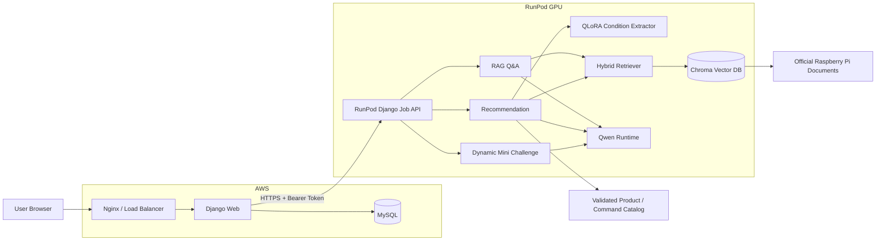

# PiCare

<div align="center">


</div>

1. [프로젝트 핵심 기능](#1-프로젝트-핵심-기능)
2. [3차 프로젝트 대비 확장](#2-3차-프로젝트-대비-확장)
3. [전체 서비스 아키텍처](#3-전체-서비스-아키텍처)
4. [핵심 서비스](#4-핵심-서비스)
5. [Django Backend / Frontend](#5-django-backend--frontend)
6. [질문 아카이브](#6-질문-아카이브)
7. [주요 데이터 모델](#7-주요-데이터-모델)
8. [RunPod Job API](#8-runpod-job-api)
9. [기술 스택](#9-기술-스택)
10. [프로젝트 구조](#10-프로젝트-구조)
11. [실행 방법](#11-실행-방법)
12. [주요 환경 변수](#12-주요-환경-변수)
13. [기능 상태](#13-기능-상태)
14. [검증 결과](#14-검증-결과)
15. [QLoRA 평가 해석 주의](#15-qlora-평가-해석-주의)
16. [테스트](#16-테스트)
17. [배포](#17-배포)
18. [역할 분담](#18-역할-분담)
19. [주요 문서](#19-주요-문서)
20. [현재 한계](#20-현재-한계)
21. [프로젝트 방향](#21-프로젝트-방향)

> Raspberry Pi 공식 문서를 기반으로 **질문 답변, 제품 추천, 명령어 학습, 복습 퀴즈, 사용자 기록 관리**를 하나의 Django 웹 서비스로 연결한 프로젝트입니다.

PiCare는 Raspberry Pi 입문자가 제품을 선택하고, OS·네트워크·SSH·카메라·GPIO 같은 설정을 진행하면서 생기는 질문을 공식 문서 근거와 함께 해결할 수 있도록 설계했습니다.

단순한 챗봇에 그치지 않고, **RAG 기반 Q&A → 제품 추천 → 복습 퀴즈 → 질문/추천 기록 → 커뮤니티 및 오답노트**까지 이어지는 학습형 웹 서비스 구조를 목표로 합니다.

> 이 README는 현재 저장소의 `main` 코드와 `docs/validation/` 검증 문서를 기준으로 정리했습니다. 모델 가중치, Chroma 인덱스, 데이터베이스, RunPod GPU 자산처럼 저장소 외부에 존재하는 런타임 자산은 별도 환경 설정이 필요합니다.

---

## 1. 프로젝트 핵심 기능

- **공식 문서 기반 RAG Q&A**
  - Raspberry Pi 공식 문서만 검색 근거로 사용
  - BM25 + Dense Hybrid Retrieval
  - 답변·citation·공식 이미지/영상 연결
  - 근거 부족 시 `insufficient_evidence`로 응답 보류

- **QLoRA 조건 추출 기반 제품 추천**
  - 사용자의 자연어 요구를 구조화된 조건 JSON으로 변환
  - 검수된 Raspberry Pi 제품 카탈로그를 기준으로 후보 선택
  - 후보 범위의 공식 문서를 다시 검색해 추천 이유와 주의점 생성
  - LLM이 제품 사양·URL·이미지를 임의 생성하지 않도록 서버에서 검증된 데이터 조합

- **Dynamic Mini Challenge**
  - 직전에 받은 Q&A의 최종 답변과 citation을 재사용
  - 별도 검색 없이 1~3개의 객관식 복습 문제 생성
  - 근거 검증·quote 매칭·문항 구조 검증 후 노출
  - 오답은 로그인 사용자의 오답노트에 저장

- **Command Lab**
  - 승인된 명령어 템플릿만 분석
  - 명령 실행 없이 구조·옵션·효과·실행 위치를 학습용으로 설명
  - 위험한 셸 연산자·제어문자 차단
  - 공식 근거와 checksum을 검증한 명령만 제공

- **Django 사용자 서비스**
  - 회원가입·로그인·로그아웃
  - 질문 기록 및 공개 질문 아카이브
  - 추천 결과 저장
  - 커뮤니티 게시글·댓글·좋아요
  - 명령어 서랍
  - 오답노트
  - 마이페이지

- **AWS ↔ RunPod 분리 운영 구조**
  - AWS Django: 화면·인증·세션·MySQL·사용자 기록·AI 작업 상태
  - RunPod: GPU 모델·Qwen·QLoRA·RAG 추론
  - 비동기 Job API를 통해 상태 조회·취소·실패 처리

---

## 2. 3차 프로젝트 대비 확장

이 저장소는 [3차 PiCare 프로젝트](https://github.com/skn-33-Raspberry-Pi-Assistant/skn_33_3rd_5team)의 **공식 문서 기반 RAG Q&A**와 **QLoRA 조건 추출 기반 제품 추천**을 계승해, Django 기반 사용자 서비스와 학습·기록 기능으로 확장한 4차 프로젝트입니다.

| 영역 | 4차 프로젝트 확장 내용 |
| --- | --- |
| 웹 서비스 | AI 기능을 Django URL·View·Form·Model·Template 구조로 통합 |
| 사용자 기능 | 회원가입·로그인·프로필·커뮤니티·마이페이지 추가 |
| 사용자 기록 | 질문·추천·명령어·오답 기록을 사용자 단위로 저장 |
| Q&A 학습 | Q&A 결과를 Dynamic Mini Challenge로 연결 |
| 명령어 학습 | 승인 카탈로그 기반 Command Lab 추가 |
| 검색 근거 | 공식 문서와 승인 RAG 청크 범위 확대 |
| 추천 입력 | 최대 입력 길이와 추천 조건 필드 확장 |
| 운영 구조 | AWS 웹 서비스와 RunPod GPU 추론 서버 분리 |
| 비동기 처리 | AI 작업 생성·상태 조회·취소·실패 처리를 `AiJob`으로 관리 |

---

## 3. 전체 서비스 아키텍처

### 운영 기준 구조



### 책임 분리

| 영역 | 주요 책임 |
| --- | --- |
| AWS Django | 화면, 인증, 세션, 사용자 데이터, MySQL, AI 작업 상태, 결과 저장 |
| AWS MySQL | 회원·질문·추천·오답·커뮤니티·작업 상태 |
| RunPod API | GPU 작업 생성, 상태 조회, 취소, 결과 반환 |
| Qwen / QLoRA / RAG | Q&A, 조건 추출, 추천 설명, Quiz 생성 |
| Chroma | 공식 문서 임베딩 검색 |

로컬 개발 환경에서는 AI 백엔드를 직접 호출할 수 있고, 운영 환경에서는 `PICARE_AI_BACKEND=remote` 방식으로 AWS Django가 RunPod Job API를 호출합니다.

---

## 4. 핵심 서비스

### 4.1 RAG Q&A

Raspberry Pi 공식 문서를 검색해 근거가 확인된 내용만 답변에 사용합니다.

```text
사용자 질문
  → 입력 길이 / 안전성 검사
  → BM25 + Dense Hybrid Retrieval
  → Top-k 공식 문서 청크
  → Qwen 답변 생성
  → citation 검증
  → 공식 이미지·영상 연결
  → ChatResponse 반환
```

주요 특징:

- 한국어 질문으로 영어 Raspberry Pi 공식 문서를 검색
- 제품 선택, OS 설치, SSH, 네트워크, 카메라, GPIO, 기본 문제 해결 질문 지원
- 문서 제목·섹션·원문 URL·실제 citation 청크 제공
- citation에 연결된 공식 미디어만 표시
- 충분한 근거가 없으면 임의 추측 대신 `insufficient_evidence` 반환

관련 구현:

```text
src/rag/
src/rag_to_llm/
src/services/rag_qa_service.py
src/services/rag_qa_cli.py
src/media/
```

---

### 4.2 제품 추천

자연어 입력과 선택형 조건을 결합해 제품 추천 조건을 추출하고, 검수된 제품 카탈로그에서 후보를 선정합니다.

```text
자유 입력 / 선택 조건
  → QLoRA 조건 JSON
  → Schema 검증
  → 명시적 UI 조건 우선 적용
  → Product Catalog 하드 필터 / 점수화
  → 후보 범위 Hybrid RAG
  → Qwen 추천 설명
  → 검증된 제품 카드·출처 조합
```

반영 조건 예시:

- 사용 목적 / 세부 작업
- 사용자 숙련도
- 성능 우선순위
- Wi-Fi
- 유선 LAN
- 카메라
- GPIO
- 모니터 보유 여부
- 원격 접속 필요 여부
- 최소 연결 수 등 확장 조건

정책:

- 사용자가 말하지 않은 조건은 `null` 유지
- 명시적으로 선택한 화면 조건은 모델 추출값보다 우선
- 제품 사양·URL·이미지는 LLM이 직접 생성하지 않음
- 서버가 검증된 `catalog.json`과 RAG metadata를 기준으로 조합

관련 구현:

```text
src/condition_extraction/
src/recommendation/
src/services/recommendation_rag_service.py
src/services/recommendation_agent.py
data/products/catalog.json
```

---

### 4.3 Dynamic Mini Challenge

Q&A 결과를 학습용 퀴즈로 연결합니다.

```text
RAG Q&A
  → ChatResponse(answer + citations)
  → Quiz Generation
  → Parser
  → Evidence / Quote / Structure Validation
  → QuizResponse
  → 사용자 제출
  → 서버 채점
  → 오답노트 저장
```

특징:

- 새로운 검색을 수행하지 않고 직전 Q&A 결과를 재사용
- 최종 답변과 citation이 충분한 경우에만 Quiz 생성
- 최대 3문항 생성
- supporting quote가 실제 evidence 원문과 일치하는지 검증
- 로그인 사용자가 실제로 틀린 문제만 오답노트에 저장
- 생성 실패와 근거 부족 상태를 분리 관리
- 로컬 Celery 또는 RunPod 원격 Job 방식 모두 지원

관련 구현:

```text
src/services/quiz_generator.py
src/services/quiz_validation.py
src/services/quiz_parser.py
web_app/portal/ai_jobs.py
web_app/portal/tasks.py
web_app/templates/portal/quiz_panel.html
```

---

### 4.4 Command Lab

승인된 명령어를 안전하게 분석·학습하는 기능입니다.

```text
예시 선택 / 한 줄 명령 입력
  → 승인 템플릿 매칭
  → 입력값 검증
  → evidence / checksum 검증
  → 명령 구성 요소·효과·실행 위치 표시
  → 서랍 저장
```

정책:

- 승인된 카탈로그 템플릿만 분석
- 일치하지 않는 명령을 임의 해석하지 않음
- 셸 연산자, 줄바꿈, 제어문자 차단
- 허용된 입력값만 형식에 맞게 변경
- `execution_policy=display_only`
- 실제 shell 실행 기능 없음

현재 검증된 명령어 카탈로그:

```text
total=100
approved=100
draft=0
```

관련 구현:

```text
src/services/command_lab_service.py
src/services/command_review.py
data/products/command_catalog.json
data/products/command_review_ledger.json
```

---

## 5. Django Backend / Frontend

### Backend

Django 백엔드는 AI 도메인 서비스를 웹 요청과 사용자 데이터에 연결합니다.

```text
URL Request
  → View / Form Validation
  → Local AI Service 또는 Remote AiJob 생성
  → 결과 검증
  → Session / ORM 저장
  → Template 또는 JSON Response
```

주요 기능:

- Q&A
- 제품 추천
- Command Lab
- Mini Challenge 생성·조회·취소·제출
- 회원가입·로그인·로그아웃
- 질문 기록
- 추천 기록
- 커뮤니티
- 프로필
- 명령어 서랍
- 오답노트
- 마이페이지

### Frontend

Django Templates와 static 자산으로 화면을 구성합니다.

```text
web_app/templates/
web_app/static/
```

Q&A·추천·Command Lab·Mini Challenge·인증·커뮤니티·마이페이지 화면이 동일한 서비스 안에서 연결됩니다.

---

## 6. 질문 아카이브

현재 질문 아카이브는 단순 정적 UI가 아니라 **실제 Q&A 기록 DB와 연결된 기능**입니다.

로그인 사용자가 Q&A를 수행하면 응답·citation·media·요약 등을 `QuestionRecord`로 저장할 수 있으며, 공개 상태로 설정된 질문은 질문 아카이브의 목록과 상세 페이지에서 조회할 수 있습니다.

주요 데이터:

```text
QuestionRecord
├── owner
├── question
├── answer
├── status
├── citations
├── media
├── summary
├── is_public
└── published_at
```

관련 화면:

```text
web_app/templates/portal/questions.html
web_app/templates/portal/question_detail.html
web_app/templates/portal/mypage_questions.html
```

---

## 7. 주요 데이터 모델

| 모델 | 역할 |
| --- | --- |
| `UserProfile` | 사용자 확장 정보 |
| `Post` | 커뮤니티 게시글 |
| `Comment` | 댓글 |
| `PostLike` | 좋아요 |
| `DrawerItem` | Command Lab 저장 항목 |
| `WrongNote` | Mini Challenge 오답 |
| `RecommendationRecord` | 추천 입력·응답 스냅샷 |
| `QuestionRecord` | Q&A 응답·요약·공개 기록 |
| `AiJob` | 원격 AI 작업 상태 |

AI 응답은 citation, media, 조건, 경고, 선택지처럼 구조가 변할 수 있기 때문에 일부 결과는 `JSONField` 스냅샷으로 저장합니다.

사용자 소유 데이터는 owner/session 기준으로 접근을 제한합니다.

---

## 8. RunPod Job API

RunPod 측 HTTP API는 Django 기반으로 구성되어 있습니다.

```text
GET  /health/live
GET  /health/ready
POST /v1/jobs
GET  /v1/jobs/{job_id}
POST /v1/jobs/{job_id}/cancel
```

특징:

- Bearer Token 인증
- 작업 생성 / 조회 / 취소
- 중복 Job ID 검사
- 성공 / 실패 / 취소 상태 관리
- 완료 결과를 기존 `ChatResponse`, `QuizResponse` 계약으로 재검증
- GPU 모델 중복 적재를 피하기 위해 단일 worker 기준 운영

관련 구현:

```text
src/runpod_api/
web_app/portal/remote_ai.py
web_app/portal/ai_jobs.py
```

---

## 9. 기술 스택

| 영역 | 사용 기술 |
| --- | --- |
| Language | Python |
| Web | Django, Django Templates, HTML, CSS, JavaScript |
| WSGI | Gunicorn |
| DB | Django ORM, MySQL 8.4 |
| Async | Celery, Redis, Remote Job API |
| RAG | ChromaDB, sentence-transformers, rank-bm25, Hybrid Retrieval |
| LLM | Qwen3-4B-Instruct-2507 |
| Fine-tuning | QLoRA, PEFT, bitsandbytes |
| Data | Raspberry Pi 공식 문서 manifest·chunk, 제품·명령어 카탈로그 |
| Infra | Docker, Docker Compose, AWS, RunPod |
| CI/CD | GitHub Actions |
| Quality | pytest, Django TestCase, 계약·서비스·배포 검증 |

---

## 10. 프로젝트 구조

```text
.
├── web_app/
│   ├── accounts/                    # 회원가입·로그인
│   ├── picare_web/                  # Django settings / URL / WSGI / ASGI / Celery
│   ├── portal/                      # View / Form / Model / AI 연동 / Job 상태
│   ├── templates/                   # Django Templates
│   └── static/                      # CSS / JavaScript / 정적 자산
│
├── src/
│   ├── contracts/                   # ChatResponse, QuizResponse 등 계약
│   ├── condition_extraction/        # QLoRA 조건 추출
│   ├── rag/                         # Retriever / Chroma / Indexing
│   ├── rag_to_llm/                  # Qwen generation adapter
│   ├── recommendation/              # 제품 추천 엔진 / catalog 검증
│   ├── services/                    # Q&A / 추천 / Command Lab / Quiz 서비스
│   ├── runpod_api/                  # RunPod 원격 AI Job API
│   ├── media/                       # citation ↔ media 연결
│   ├── evaluation/                  # 평가 로직
│   ├── presentation/                # citation 표시 데이터
│   └── lang/                        # Prompt / Safety 정책
│
├── document_pipeline/               # 공식 문서 수집·정제·manifest 생성
├── data/products/                   # 제품·명령어 catalog
├── training/                        # QLoRA 학습 설정·스크립트
├── eval/                            # Q&A·Quiz 평가 fixture와 결과
├── tests/                           # 단위·통합·Django·GPU smoke 테스트
│
├── deploy/                          # AWS 배포 스크립트·Compose·Nginx 설정
├── .github/workflows/               # CI/CD
├── docs/                            # 계약·가이드·검증 문서
├── compose.yaml                     # MySQL·Redis·Django·Worker 구성
├── Dockerfile
├── Dockerfile.aws
├── Dockerfile.runpod
└── requirements*.txt
```

---

## 11. 실행 방법

### 11.0 환경별 requirements

프로젝트 실행 목적에 따라 필요한 requirements 파일이 다릅니다.

| 환경 | 설치 파일 | 용도 |
| --- | --- | --- |
| 로컬 개발·Django·RAG·테스트 | `requirements.txt` | CPU 기반 기본 개발 환경 |
| RunPod GPU 추론 | `requirements-gpu.txt` | Qwen 답변 생성·LoRA 조건 추출 |
| QLoRA 학습 | `requirements-training.txt` | `training/` 학습 스크립트 실행 |
| AWS 웹 서버 | `requirements-web.txt` | GPU·로컬 AI 패키지를 제외한 웹 전용 이미지 |

`requirements-gpu.txt`는 `requirements.txt`를 포함하고, `requirements-training.txt`는 `requirements-gpu.txt`를 포함합니다. 일반적인 로컬 Django 실행에는 `requirements.txt`만 설치합니다.

### 11.1 로컬 Django + MySQL

```bash
cp .env.example .env

docker compose up -d --wait mysql

python -m venv .venv
source .venv/bin/activate

pip install -r requirements.txt

python web_app/manage.py migrate
python web_app/manage.py runserver 8001
```

`.env`에 MySQL 비밀번호와 Django Secret을 설정해야 합니다.

자세한 초기 설정은 다음 문서를 참고합니다.

- [Django 실행 가이드](docs/README_django_실행법.md)

초기 설정 자동화:

```bash
python scripts/init.py
```

`scripts/init.py`는 로컬용 `.env` 생성, Python 가상환경 생성, `requirements.txt` 설치, Docker MySQL 실행, Django migration을 순서대로 수행합니다. 실행 후 관리자 화면이나 Swagger를 확인하려면 다음 명령으로 관리자 계정을 생성합니다.

```bash
source .venv/bin/activate
python web_app/manage.py createsuperuser
```

---

### 11.2 전체 Compose 실행

```bash
docker compose up --build
```

Compose 구성에서는 MySQL·Redis·Django·비동기 Worker를 함께 실행할 수 있습니다.

Q&A web과 GPU Quiz worker가 각각 모델을 적재하는 구성에서는 GPU 메모리 여유가 필요합니다.

---

### 11.3 Q&A 직접 실행

```bash
python web_app/manage.py runserver 0.0.0.0:8000 --noreload
```

이 방식은 Django 자체 실행 경로를 확인하는 용도이며, 원격 RunPod 비동기 Job 또는 별도 worker가 필요한 기능은 환경 설정에 따라 추가 구성이 필요합니다.

---

### 11.4 RunPod API 실행

```bash
python -m src.runpod_api
```

기본 포트:

```text
8000
```

운영 환경에서는 HTTPS 프록시를 통해 AWS Django에서 호출합니다.

실제 작업 API를 사용하려면 `AI_API_TOKEN`을 설정해야 하며, Qwen 모델·LoRA adapter·Chroma index·공식 문서 manifest가 RunPod 환경에 준비되어 있어야 합니다.

---

### 11.5 Swagger API 문서

Django 관리자 계정으로 로그인하면 웹 API를 Swagger UI에서 확인하고 테스트할 수 있습니다.

```text
Swagger UI:  http://127.0.0.1:8001/api/docs/
OpenAPI YAML: http://127.0.0.1:8001/api/schema/
```

두 경로 모두 `is_staff=True`인 Django 관리자만 접근할 수 있습니다. POST 요청을 Swagger UI에서 실행할 때는 Django 세션과 CSRF 쿠키가 필요합니다.

자세한 내용은 [Swagger 실행·운영 가이드](docs/api/Swagger-실행-가이드.md)를 참고합니다.

---

## 12. 주요 환경 변수

| 영역 | 예시 |
| --- | --- |
| Django | `DJANGO_SECRET_KEY`, `DJANGO_ALLOWED_HOSTS` |
| MySQL | `DJANGO_DB_*`, `MYSQL_*` |
| AI Backend | `PICARE_AI_BACKEND=local|remote` |
| RunPod | `AI_API_URL`, `AI_API_TOKEN` |
| Timeout | `AI_HTTP_TIMEOUT`, `AI_JOB_TIMEOUT` |
| Model | Qwen / LoRA / Hugging Face 관련 경로 및 설정 |

주의:

- 실제 Secret, Token, DB 비밀번호는 Git에 저장하지 않습니다.
- 운영 RunPod URL은 HTTPS만 허용합니다.
- Compose MySQL 생성용 `MYSQL_PASSWORD`와 Django 접속용 `DJANGO_DB_PASSWORD`는 역할이 다릅니다.

---

## 13. 기능 상태

| 기능 | 상태 | 구현 범위 |
| --- | --- | --- |
| RAG Q&A | 구현 완료* | Hybrid Retrieval, 근거 기반 답변, citation·media |
| 제품 추천 | 구현 완료* | 조건 추출, catalog 후보 선택, 후보 범위 RAG, 추천 응답 |
| Command Lab | 구현 완료 | 승인 템플릿 100개, 안전 정책, 근거 검증, 서랍 저장 |
| Dynamic Mini Challenge | 구현 완료* | Q&A 연계 Quiz, 비동기 작업, 취소, 채점, 오답노트 |
| 인증·커뮤니티 | 구현 완료 | 가입·로그인·프로필·게시글·댓글·좋아요 |
| 질문 아카이브 | 구현 완료 | `QuestionRecord` 저장, 공개 목록·상세 조회 |
| 추천 기록 | 구현 완료 | 사용자별 추천 결과 저장·마이페이지 조회 |
| MySQL / Docker | 구현 완료 | Compose MySQL 및 Django migration |
| AWS ↔ RunPod 계약 | 로컬 통합 검증 완료 | Job 생성·조회·취소·오류·응답 계약 검증 |
| 실제 GPU / AWS 운영 인수 | 환경 의존 | 실제 Pod·EC2·DB·모델 자산 필요 |

`*` 문서 manifest, Chroma index, Qwen/LoRA 모델 자산이 준비되어야 실제 추론이 가능합니다.

---

## 14. 검증 결과

### 14.1 공식 문서 / RAG 자산

2026-09-18 배포 자산 검증 기준:

| 항목 | 결과 |
| --- | ---: |
| 공식 문서 | **23개** |
| 승인 manifest chunk | **381개** |
| Chroma index chunk | **381개** |
| 제품 catalog | **5개** |
| 승인 Command Lab template | **100개** |

관련 문서:

- [AWS–RunPod 통합 검증](docs/validation/2026-09-18-aws-runpod-integration.md)

---

### 14.2 3차 대비 데이터·입력 범위

| 항목 | 3차 | 4차 | 변화 |
| --- | ---: | ---: | ---: |
| 공식 문서 | 18 | 23 | +27.8% |
| 승인 RAG chunk | 270 | 381 | +41.1% |
| 사용자 최대 입력 길이 | 2,000자 | 10,000자 | 5배 |
| 추천 조건 필드 | 15 | 21 | +40.0% |

> 3차의 18개 문서 / 270개 chunk 검증 자산은 `docs/document-cards/raspberry-pi-official-v3.md`와 2026-08-31 검증 기록에서 확인할 수 있습니다. 4차 최신 자산은 2026-09-18 배포 검증 문서를 기준으로 합니다.

---

### 14.3 Dynamic Mini Challenge

Qwen3-4B 4-bit 환경의 고정 fixture 25건 기준:

| 평가 지표 | 결과 |
| --- | ---: |
| 상태 정확도 | **92.0% (23/25)** |
| Available F1 | **94.7%** |
| 인용 원문 매칭률 | **100% (18/18)** |
| 근거 부족 판단 | **100% (5/5)** |

`generation_failed` 2건은 상태 정확도와 Available F1 계산에서 실패로 포함했습니다.

인용 원문 매칭률 100%는 최종 문항의 supporting quote가 연결 evidence 원문과 일치한다는 의미이며, 생성 답변 전체의 의미적 품질이 100%라는 뜻은 아닙니다.

관련 문서:

- [Mini Challenge 최종 평가](docs/validation/mini-challenge-final-evaluation.md)

---

### 14.4 Command Lab

최종 승인 상태:

```text
Command Lab audit
  total=100
  approved=100
  draft=0
  errors=[]
```

검증 기록:

- Command Lab catalog/service/review ledger: **40 passed**
- Django portal test runner: **42 passed**
- Django API 직접 테스트: **12 passed**
- 관련 전체 회귀 범위: **423 passed, 1 skipped, 3 deselected**

관련 문서:

- [Command Lab 100개 전체 공개 검증](docs/validation/2026-09-16-command-lab-full-catalog.md)

---

### 14.5 AWS–RunPod 통합 검증

2026-09-18 로컬 통합 검증:

- Django 인증·화면 회귀: **80 tests passed**
- RunPod 작업·배포 자산·기존 AI 서비스 회귀: **58 passed**
- AWS client ↔ mock RunPod HTTP 계약: **8 passed**
- `git diff --check`: 통과
- Django `check`: 통과
- `makemigrations --check`: 통과

실제 RunPod GPU 모델 로딩, LoRA weight, AWS EC2·MySQL·브라우저 검수는 운영 인프라 자격 증명과 런타임 자산이 필요한 별도 인수 단계입니다.

---

## 15. QLoRA 평가 해석 주의

조건 추출 QLoRA는 평가 시점·데이터셋·스키마 버전에 따라 서로 다른 결과가 기록되어 있습니다.

예를 들어 2026-08-31 A40 검증에서는 Dev 40건 기준:

| 지표 | 결과 |
| --- | ---: |
| JSON Schema 준수 | 97.5% (39/40) |
| 전체 조건 Exact Match | 57.5% (23/40) |
| 필드별 Macro F1 평균 | 67.60% |
| 정답이 null인 필드에 값을 생성한 비율 | 0.68% |

해당 문서에서는 이전 holdout의 Exact Match / Macro F1 결과와 현재 dev 결과를 **직접 비교하지 말 것**을 명시합니다.

따라서 QLoRA 성능을 발표·문서화할 때는 반드시 다음을 함께 명시해야 합니다.

```text
평가 데이터셋
평가 샘플 수
Condition Schema 버전
Base Model / LoRA Adapter revision
평가 날짜
평가 스크립트
```

관련 문서:

- [A40 최종 재실행 검증](docs/validation/2026-08-31-final-a40-defca71.md)
- [Fine-tuning 계약](docs/data-contracts/finetuning.md)
- [Fine-tuning 학습 가이드](docs/guides/finetuning-training.md)

---

## 16. 테스트

전체 테스트:

```bash
pytest -q
```

Django 검사:

```bash
python web_app/manage.py check
python web_app/manage.py test portal accounts
```

배포 자산 검사:

```bash
python scripts/verify_deployment_assets.py --target all --skip-adapter
```

실제 RunPod adapter 포함 검사:

```bash
python scripts/verify_deployment_assets.py \
  --target runpod \
  --adapter-path /workspace/models/picare-qwen3-4b-qlora
```

---

## 17. 배포

### AWS

관련 자산:

```text
Dockerfile.aws
deploy/aws-entrypoint.sh
deploy/compose.aws.yaml
deploy/nginx.aws.conf
deploy/aws-build-push.sh
deploy/aws-release.sh
```

AWS Django image는 웹 전용 의존성을 설치하고 GPU 모델 파일을 포함하지 않는 구조입니다.

### RunPod

관련 자산:

```text
Dockerfile.runpod
src/runpod_api/
requirements-gpu.txt
```

RunPod는 GPU 모델과 추론 자산을 담당합니다.

### CI/CD

```text
.github/workflows/aws-cicd.yml
```

CI/CD는 테스트·이미지 빌드·배포 절차를 자동화하며, Django/RunPod 책임 분리와 환경변수·마이그레이션·네트워크 계약은 별도 운영 기준으로 유지합니다.

---

## 18. 역할 분담

Git 커밋 이력의 작성자 alias를 통합하고, 병합 커밋보다 실제 기능·문서·테스트 변경을 기준으로 정리했습니다. 여러 기능이 함께 연결되는 작업은 주 담당 영역과 통합 기여를 함께 반영했습니다.

| 팀원 | 담당 영역 | 주요 기여 |
| --- | --- | --- |
| 최지흠 | Django 서비스 통합·프론트엔드·인프라 | 기존 AI 기능의 Django 전환, Q&A·제품 추천 화면 연동, 회원가입·로그인·마이페이지·추천 기록 연결, Mini Challenge 비동기 작업 연동, RunPod Job API와 AWS 웹 서버 분리, Docker·CI/CD·배포 문서·Swagger 구축 |
| 김나은 | Q&A 요약·Dynamic Mini Challenge | Q&A 답변 요약과 질문 아카이브용 제목 생성, Qwen 런타임 재사용, 요약·인용 검증, Q&A evidence 기반 퀴즈 생성·파싱·검증, 퀴즈 평가셋과 정량 평가 문서 작성 |
| 이양원 | 제품 추천·QLoRA·Command Lab | 조건 추출과 제품 추천 Agent, QLoRA 학습·평가 파이프라인, 긴 입력과 선택 조건 처리, 승인 명령어 100개 카탈로그·분석·재조합 기능, 입력값 경계·근거·회귀 테스트와 인수인계 문서 작성 |
| 안정민 | RAG·미디어·응답 계약 | 공식 문서 기반 RAG·추천 서비스 연결, 공식 이미지·영상과 citation 연결, 제품 근거 메타데이터와 미디어 검수, 공통 응답 계약·JSON Schema·평가 흐름 정비 |
| 김혜리 | 문서·제품 데이터 파이프라인 및 사용자 기능 | 공식 문서 수집·정제·의미 단위 청킹·manifest 생성, 제품 catalog와 미디어 registry 구축, Django 회원·개인화 기능 및 관련 모델·템플릿·보안 회귀 테스트 구현 |

> 개인 발표에서는 Git 이력과 팀 작업 범위를 기준으로 **직접 구현 / 연동 구현 / 전체 시스템 구성 요소**를 구분해 설명하는 것을 권장합니다.

---

## 19. 주요 문서

### Architecture / Deployment

- [CI/CD 실행·설정·API 명세서](docs/deployment/CI-CD-실행-설정-API-명세서.md)
- [AWS 인프라 스펙](docs/deployment/AWS-인프라-스펙-발표용.md)
- [RunPod Django Setup](docs/runpod-django-setup.md)
- [Swagger 실행·운영 가이드](docs/api/Swagger-실행-가이드.md)
- [Web API OpenAPI 명세](docs/openapi/web-api.yaml)

### Data Contract

- [Django 모델 계약](docs/data-contracts/portal-models.md)
- [RAG 데이터 계약](docs/data-contracts/rag-corpus.md)
- [Product Catalog 계약](docs/data-contracts/product-catalog.md)
- [Command Lab 계약](docs/data-contracts/command-lab.md)
- [Mini Challenge 계약](docs/data-contracts/mini-challenge-handoff.md)
- [Fine-tuning 계약](docs/data-contracts/finetuning.md)

### Validation

- [AWS–RunPod 통합 검증](docs/validation/2026-09-18-aws-runpod-integration.md)
- [Command Lab 100개 검증](docs/validation/2026-09-16-command-lab-full-catalog.md)
- [Mini Challenge 최종 평가](docs/validation/mini-challenge-final-evaluation.md)
- [A40 Qwen / QLoRA 검증](docs/validation/2026-08-31-final-a40-defca71.md)

### Project Notes

- [4차 프로젝트 개인 작업 발표 정리](4차프로젝트_개인작업_발표정리.md)

---

## 20. 현재 한계

- 저장소만 clone해도 운영용 Qwen/LoRA weight와 Chroma index가 자동으로 준비되는 것은 아닙니다.
- 실제 RunPod GPU 추론은 Pod 모델 자산과 adapter 경로가 필요합니다.
- 실제 AWS 운영 검증은 EC2·MySQL·도메인/HTTPS·RunPod 접근 정보가 필요합니다.
- 가격·재고처럼 실시간 외부 정보는 현재 RAG 범위가 아닙니다.
- RAG citation 형식 검증과 답변의 의미적 정확성은 별도 문제이므로 지속적인 수동·자동 평가가 필요합니다.
- QLoRA 성능 수치는 평가셋과 schema 버전을 함께 확인해야 하며 서로 다른 평가 결과를 단순 비교하면 안 됩니다.

---

## 21. 프로젝트 방향

PiCare의 핵심은 LLM 자체를 크게 만드는 것이 아니라,

```text
공식 문서
  + 검증된 제품 / 명령 데이터
  + Hybrid RAG
  + QLoRA 조건 추출
  + Django 사용자 서비스
  + 학습 기록
```

을 하나의 검증 가능한 흐름으로 연결하는 것입니다.

사용자가 질문을 하고 답을 받는 데서 끝나는 것이 아니라, **근거를 확인하고 → 제품을 선택하고 → 명령을 이해하고 → 복습하고 → 자신의 기록을 다시 활용하는 서비스**를 목표로 합니다.
