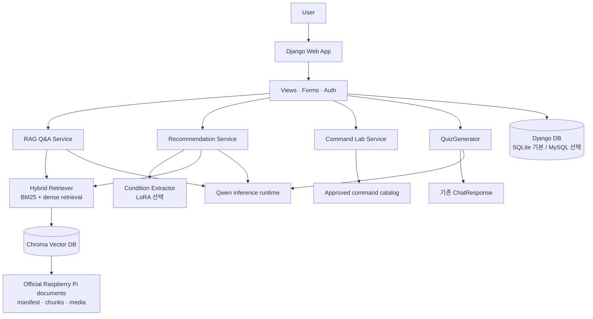

# PiCare

Raspberry Pi 공식 문서를 바탕으로 질문에 답하고, 조건에 맞는 제품과 명령어를 안내하는 Django 기반 학습·지원 웹 서비스입니다. 답변은 검색된 공식 문서 근거와 함께 제공하며, 답변을 바탕으로 복습 문제를 동적으로 만들 수 있습니다.

> 이 문서는 저장소의 현재 코드와 설정 파일을 기준으로 작성했습니다. 모델·벡터 인덱스·데이터베이스 연결이 필요한 기능은 해당 실행 환경이 준비되어야 동작합니다.

## 프로젝트 소개

PiCare는 Raspberry Pi를 처음 사용하는 사람이 제품 선택, 설정, 명령어 사용, 문서 학습을 한 곳에서 진행할 수 있도록 만든 서비스입니다.

- 공식 문서 기반 근거를 우선하는 RAG 질의응답
- 사용자 조건과 제품 카탈로그를 함께 사용하는 제품 추천
- 검수된 템플릿만 보여 주는 안전한 명령어 실험실
- 방금 받은 Q&A 답변으로 만드는 Dynamic Mini Challenge
- 회원, 커뮤니티, 서랍, 오답노트 등 사용자별 활동 저장

## 3차 프로젝트 대비 개선점

| 구분 | 4차 프로젝트에서 확장한 내용 |
| --- | --- |
| 서비스화 | Django 웹 애플리케이션, URL·View·Form·Model 구조로 기능을 통합했습니다. |
| 사용자 기능 | 회원가입·로그인, 게시글·댓글·좋아요, 명령어 서랍, 오답노트를 추가했습니다. |
| 학습 경험 | 고정 문제은행 중심의 학습과 별도로, Q&A 결과에 근거한 Dynamic Mini Challenge 경로를 추가했습니다. |
| 명령어 안내 | 승인된 카탈로그와 공식 문서 근거를 확인하는 명령어 실험실을 구현했습니다. 실제 명령을 실행하지 않습니다. |
| 실행 환경 | 기본 Django DB 설정과 Docker Compose MySQL 컨테이너, GPU/QLoRA 의존성을 분리했습니다. |

## 주요 기능

| 기능 | 현재 코드 기준 상태 | 구현 내용 |
| --- | --- | --- |
| RAG 기반 질의응답 | 완료* | Hybrid Retriever가 승인된 공식 문서 청크를 찾고, 근거·인용을 포함한 `ChatResponse`를 만듭니다. |
| Raspberry Pi 제품 추천 | 완료* | 조건 추출, 제품 카탈로그 후보 선택, 후보 범위 RAG, 근거 기반 추천 응답을 연결합니다. |
| 명령어 실험실 | 완료 | 승인된 템플릿을 분석·조합하고 입력값과 문서 근거를 검증합니다. 명령은 표시만 하며 실행하지 않습니다. |
| Dynamic Mini Challenge | 부분 구현 | Q&A의 최종 답변·실제 인용으로 1~3문항을 생성하고 Django Q&A 화면에서 제출·채점합니다. 별도 JSON API는 아직 없습니다. |
| 회원가입 / 로그인 | 완료 | Django 기본 사용자 모델을 활용한 가입, 로그인, 로그아웃과 프로필 확장 모델이 있습니다. |
| 사용자 게시판 | 완료 | 게시글, 댓글, 좋아요, 사용자별 조회를 DB 모델과 화면으로 제공합니다. |
| 질문 아카이브 | UI만 구현 | 현재는 View 안의 정적 미리보기 데이터를 목록·상세 화면에 표시합니다. Q&A 이력 DB 저장은 연결되어 있지 않습니다. |
| 사용자 저장 | 완료 | 로그인 사용자는 명령어 서랍과 선택한 오답 문항을 DB에 저장·조회·삭제할 수 있습니다. |
| MySQL / Docker | 환경 설정 필요 | Docker Compose는 MySQL 컨테이너를 제공하며, Django는 기본값으로 SQLite를 사용합니다. MySQL 사용 시 Django DB 환경 변수를 추가로 설정해야 합니다. |

`*` RAG와 추천은 문서 manifest, Chroma 인덱스, 모델 설정 등 런타임 자산이 준비된 경우에 실행됩니다.

## Dynamic Mini Challenge

### 기능 목적과 처리 흐름

고정된 주제별 문제를 꺼내는 대신 **현재 Q&A의 검증된 답변과 인용**을 재료로 문제를 만듭니다.


### Grounding과 validation

- 새 Retriever, RAG, Chroma 검색을 다시 호출하지 않습니다. Q&A의 최종 답변과 답변에 실제로 사용된 citation만 변환합니다.
- `answered` 상태이고 citation이 있는 Q&A만 문제 생성을 시도합니다. 근거가 부족하면 `insufficient_content`를 반환합니다.
- Qwen의 구조화 출력은 엄격한 JSON parser를 거치며, 파싱 실패는 기존 Q&A를 실패시키지 않고 `generation_failed`로 분리합니다.
- 문항은 1~3개이며, 선택지는 A~D 네 개, 단일 정답, 하나의 허용된 evidence와 supporting quote를 가져야 합니다.
- evidence allowlist, quote 원문 매칭, 문항 중복 제거를 통과한 문항만 `available` 응답에 포함됩니다.
- Quiz 생성기는 Q&A 서비스에 주입된 answer generator를 감싸 사용하므로 Q&A와 Quiz가 같은 Qwen runtime을 재사용합니다.
- 채점 결과는 세션에 유지되며, 로그인 사용자가 실제로 틀린 문항을 저장할 때만 `WrongNote` 레코드가 생성됩니다.

| 상태 | 의미 | 기존 Q&A에 미치는 영향 |
| --- | --- | --- |
| `available` | 검증을 통과한 문항이 1개 이상 있습니다. | Q&A와 함께 퀴즈를 표시합니다. |
| `insufficient_content` | 답변 citation 또는 검증 가능한 근거가 부족합니다. | 답변은 그대로 표시하고 퀴즈만 생략합니다. |
| `generation_failed` | 모델 출력 파싱 또는 생성 과정이 실패했습니다. | 답변은 그대로 표시하고 퀴즈 오류만 분리합니다. |

현재 Q&A 화면에는 기존 문제은행 기반 inline challenge 경로도 별도로 남아 있습니다. Dynamic Mini Challenge만 일관되게 노출하려면 화면·라우팅을 정리하는 후속 작업이 필요합니다.

## 시스템 아키텍처



## 기술 스택

| 영역 | 사용 기술 |
| --- | --- |
| Web | Python, Django, Django Templates, HTML/CSS/JavaScript |
| 데이터베이스 | Django ORM, SQLite(기본), MySQL 8.4(Compose 선택 구성) |
| 검색·RAG | ChromaDB, sentence-transformers, rank-bm25, Hybrid Retrieval |
| LLM | Qwen3-4B-Instruct-2507, Transformers, structured generation |
| 조건 추출 학습 | QLoRA, PEFT, bitsandbytes, Accelerate |
| 데이터 | Raspberry Pi 공식 문서 manifest·chunk, 제품·명령어 카탈로그 |
| 테스트·평가 | pytest, Quiz evaluation fixture, RunPod GPU smoke/evaluation |
| 배포·실행 보조 | Docker Compose, dotenv, RunPod GPU 환경 |

## 프로젝트 구조

```text
.
├── web_app/                    # Django project
│   ├── accounts/               # 회원가입·인증 관련 app
│   ├── picare_web/             # settings, root URL, ASGI/WSGI
│   ├── portal/                 # Q&A, 추천, 실험실, 퀴즈, 게시판 View·Model·Form
│   ├── templates/portal/       # Django 화면 템플릿
│   └── static/                 # 정적 자산
├── src/
│   ├── contracts/              # ChatResponse, QuizResponse 등 계약
│   ├── rag/                    # Hybrid Retriever, Chroma 설정
│   ├── services/               # RAG Q&A, 추천, 명령어, Quiz 서비스
│   ├── rag_to_llm/             # Qwen answer/quiz generator adapter
│   └── condition_extraction/   # LoRA 조건 추출
├── document_pipeline/          # 공식 문서 수집·정제·인덱싱 자산
├── data/products/              # 제품·명령어·기존 챌린지 카탈로그
├── training/                   # QLoRA 학습 스크립트·설정
├── eval/                       # Quiz fixture, 실행 스크립트, 결과
├── tests/                      # 단위·통합·Django·GPU smoke 테스트
├── docs/                       # 계약, 실행 가이드, 검증 문서
├── compose.yaml                # MySQL 컨테이너 구성
└── requirements*.txt           # 기본/GPU/학습 의존성
```

## 실행 환경

### Django 로컬 실행

Python 3.12 환경을 권장합니다. 실행 전 `.env.example`을 참고해 `.env`를 만들고, 비밀 값과 모델·인덱스 관련 설정을 채워야 합니다.

```bash
python -m venv .venv
source .venv/bin/activate
pip install -r requirements.txt

python web_app/manage.py migrate
python web_app/manage.py runserver 8001
```

기본 DB 엔진은 SQLite입니다. 이 상태에서는 `web_app/db.sqlite3`에 Django 데이터가 저장됩니다.

### Docker Compose와 MySQL

Compose는 MySQL 8.4 서비스만 제공합니다.

```bash
docker compose up -d mysql
```

MySQL을 Django DB로 사용하려면 컨테이너에 필요한 `MYSQL_*` 값과 별도로, Django가 읽는 아래 값을 `.env`에 설정해야 합니다.

```dotenv
DJANGO_DB_ENGINE=django.db.backends.mysql
DJANGO_DB_NAME=picare
DJANGO_DB_USER=picare_app
DJANGO_DB_PASSWORD=change-me
DJANGO_DB_HOST=127.0.0.1
DJANGO_DB_PORT=3306
```

설정 후 `python web_app/manage.py migrate`를 실행합니다. 팀 환경에서 사용하는 계정·비밀번호·호스트는 공유된 보안 채널에서 관리하고 저장소에 넣지 않습니다.

### RAG 및 Qwen / LoRA GPU 환경

- CPU 중심 개발·테스트 의존성: `requirements.txt`
- Qwen 4-bit 추론과 LoRA 조건 추출: `requirements-gpu.txt`
- QLoRA 학습: `requirements-training.txt`

GPU 실행에는 준비된 문서 manifest와 Chroma 인덱스, 모델 접근 권한, 환경 변수가 필요합니다.

- [RunPod Pod 설정](docs/guides/runpod-pod-setup.md)
- [RunPod Django 실행](docs/runpod-django-setup.md)
- [QLoRA 학습 가이드](docs/guides/finetuning-training.md)
- [RAG Q&A 가이드](docs/llm-rag-qa.md)

## 역할 분담

| 영역 | 담당 |
| --- | --- |
| 데이터 수집·검수 | 전체 조원 |
| 명령어 실험실 | 양원 |
| Dynamic Mini Challenge | 나은 |
| 프론트엔드 | 지흠 |
| 백엔드 | 혜리 |
| RAG·추천·실행 환경 연계 | 공동 구현 |

## 현재 구현 상태와 남은 연결 작업

| 항목 | 상태 | 코드 기준 확인 사항 |
| --- | --- | --- |
| Django Q&A → Dynamic Quiz | 부분 구현 | `ChatResponse`를 세션에 보관한 뒤 `QuizGenerator.generate_from_chat_response()`를 호출하는 서버·템플릿 흐름이 있습니다. 외부 프론트엔드용 Quiz JSON endpoint는 없습니다. |
| Dynamic Quiz → 오답노트 | 완료 | 제출한 선택지가 오답일 때 로그인 사용자가 저장할 수 있으며, 서버 세션의 퀴즈 데이터를 기준으로 DB에 기록합니다. |
| 질문 아카이브 | UI만 구현 | 정적 `QUESTION_ARCHIVE_PREVIEWS`를 사용합니다. 사용자 Q&A 이력과 연결하는 DB 모델·저장 흐름은 없습니다. |
| 명령어 서랍 | 완료 | 비로그인 사용자는 세션, 로그인 사용자는 `DrawerItem` DB에 저장하고 복원 때 카탈로그·근거를 다시 검증합니다. |
| MySQL 운영 DB | 환경 설정 필요 | Compose MySQL은 있으나 Django는 SQLite가 기본입니다. `DJANGO_DB_*` 값을 맞춘 뒤 migration이 필요합니다. |
| GPU Qwen/LoRA 추론 | 환경 설정 필요 | 코드와 requirements, RunPod 가이드는 있으나 GPU·모델·인덱스 자산을 갖춘 환경에서 실행해야 합니다. |
| 고정 문제은행 UI 정리 | 예정 | Dynamic Quiz 경로와 별도 inline challenge가 함께 존재하므로 제품 화면 정책에 맞춰 통합이 필요합니다. |

## 테스트 및 평가

### 테스트 범위

`tests/`에는 계약, RAG, 추천, 명령어 카탈로그/서비스/UI, Django 인증·웹 흐름, Dynamic Quiz parser·validation·adapter·generator, Qwen smoke 테스트가 포함되어 있습니다.

Dynamic Mini Challenge의 CPU 단위 테스트는 다음처럼 실행할 수 있습니다.

```bash
python -m pytest -q \
  tests/test_quiz_contracts.py \
  tests/test_quiz_adapters.py \
  tests/test_quiz_generator.py \
  tests/test_quiz_parser.py \
  tests/test_quiz_validation.py \
  tests/test_huggingface_quiz_text_generator.py
```

실제 Qwen 생성 smoke/evaluation은 CUDA가 가능한 RunPod 환경에서 실행합니다. 평가 자산은 `eval/quiz_generation_cases.v1.jsonl`, `eval/run_quiz_generation_evaluation.py` 및 결과 파일에 있습니다.

### Dynamic Mini Challenge 최종 평가

저장소의 [최종 평가 문서](docs/validation/mini-challenge-final-evaluation.md)는 RunPod GPU 4-bit Qwen 환경에서 고정 fixture 25건을 대상으로 한 결과입니다. 사람 검수 전의 의미적 선택지 품질은 수치로 단정하지 않습니다.

| 지표 | 최종 기록 |
| --- | ---: |
| JSON parse 성공률 | 18/20 (90.0%) |
| Parser 통과 문항의 구조·근거 검증 통과 | 18/18 (100.0%) |
| 검증된 Quiz 제공률 | 18/20 (90.0%) |
| Allowlist 위반 / quote 원문 매핑 실패 | 0 / 0 |
| Supporting quote 원문 매칭 | 18/18 (100.0%) |
| `available` 분류 F1 / 전체 정확도 | 94.7% / 92.0% |
| Warm structured generation 평균 / p95 | 10.73초 / 15.43초 |

평가 조건과 실패 사례는 반드시 [원문](docs/validation/mini-challenge-final-evaluation.md)과 함께 확인합니다. 이 평가는 positive fixture당 1문항 생성 기준이며, 다문항 품질이나 사람 검수 결과를 대신하지 않습니다.

## 문서와 계약

- [Mini Challenge 프론트엔드·백엔드 인계 계약](docs/data-contracts/mini-challenge-handoff.md)
- [QuizResponse JSON Schema](docs/schemas/quiz-response.schema.json)
- [명령어 실험실 데이터 계약](docs/data-contracts/command-lab.md)
- [Django 모델 계약](docs/data-contracts/portal-models.md)
- [문서·RAG 데이터 계약](docs/data-contracts/rag-corpus.md)
- [명령어 실험실 검증 기록](docs/validation/2026-09-11-command-lab.md)

## 향후 계획

- Dynamic Mini Challenge만 노출하도록 기존 inline challenge UI와 라우팅을 정리
- QuizResponse를 사용하는 별도 프론트엔드 연동이 필요할 경우 JSON API와 인증·오류 계약 추가
- 정적 질문 아카이브를 사용자 Q&A 이력 DB와 연결
- Django와 Compose MySQL 환경 변수 계약을 단일화하고 팀 배포 환경에서 migration 검증
- GPU 환경에서 실제 사용자 시나리오 기반 Q&A → Quiz E2E 및 다문항 평가 확대
- Quiz 문항에 대한 사람 검수 데이터를 축적해 의미적 품질 지표 추가
