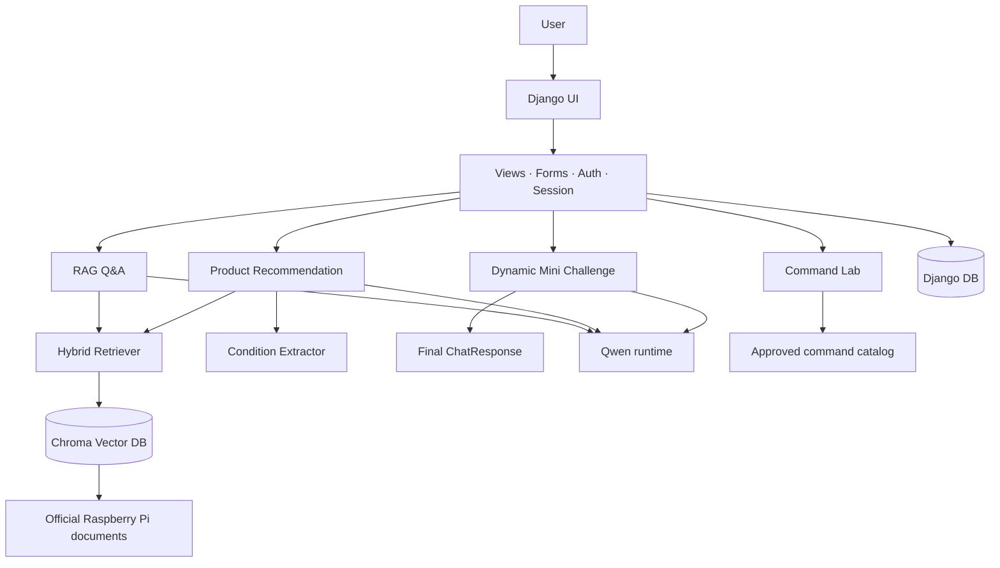

# PiCare

PiCare는 Raspberry Pi 공식 문서를 바탕으로 질문에 답하고, 제품 선택·명령어 이해·학습 복습을 돕는 Django 기반 웹 서비스입니다. 검색 근거와 사용자 활동을 연결해, 정보를 찾는 단계부터 학습과 기록까지 이어지는 경험을 목표로 합니다.

> 이 문서는 현재 저장소의 코드·계약·검증 문서를 기준으로 작성했습니다. 모델, Chroma 인덱스, 데이터베이스 같은 런타임 자산은 별도 환경 설정이 필요합니다.

## 프로젝트 소개

Raspberry Pi 입문자가 제품을 고르고 설정을 진행할 때 필요한 기능을 한 곳에 제공합니다.

- 공식 문서 근거를 인용하는 RAG 질의응답
- 사용자 목적과 조건을 반영한 Raspberry Pi 제품 추천
- 승인된 명령어를 안전하게 해설하는 Command Lab
- 방금 받은 답변을 바탕으로 복습하는 Dynamic Mini Challenge
- 회원·커뮤니티·서랍·오답노트 등 사용자 활동 관리

## 3차 프로젝트 대비 확장

| 영역 | 4차 프로젝트에서 확장한 내용 |
| --- | --- |
| 웹 서비스 | Django의 URL·View·Form·Model과 템플릿 화면으로 기능을 통합했습니다. |
| 사용자 경험 | 회원가입·로그인, 커뮤니티, 마이페이지, 명령어 서랍, 오답노트를 추가했습니다. |
| 학습·지원 | Q&A 연계형 Dynamic Mini Challenge와 승인 명령어 기반 Command Lab을 추가했습니다. |
| 추천 입력 | 최대 입력 길이를 10,000자로 확장하고, 유선 LAN·최소 연결 수 등 추천 조건을 추가했습니다. |
| 실행 환경 | SQLite 기본 개발 환경, Docker Compose MySQL, RunPod Qwen/QLoRA 실행 경로를 분리했습니다. |

## 서비스 구조



## 4개 구현 영역

### Dynamic Mini Challenge

Q&A의 최종 답변과 실제 citation을 재사용해 1~3개의 객관식 복습 문제를 만듭니다. 새 검색을 수행하지 않고, Q&A와 같은 Qwen runtime의 structured generation을 사용합니다.

```text
질문 → RAG Q&A → ChatResponse(answer + citations)
→ Quiz 생성 → parser / validation → QuizResponse → 제출·채점 → 오답노트 저장
```

- 답변 상태와 citation을 확인한 뒤에만 생성하며, 근거 부족은 `insufficient_content`, 생성 실패는 `generation_failed`로 분리합니다.
- evidence allowlist, quote 원문 매칭, 문항 구조와 중복 검증을 통과한 문항만 표시합니다.
- 채점 결과는 세션에 보관하고, 로그인 사용자가 실제로 틀린 문항을 선택할 때만 오답노트에 저장합니다.

### Command Lab

Command Lab은 명령을 실행하지 않고, 검수된 템플릿의 명령 구조·변경 가능한 입력값·공식 근거를 보여 주는 학습 기능입니다.

```text
예시 선택 또는 한 줄 명령 입력 → 승인 템플릿 매칭 → 입력·근거 검증
→ 명령 구성 요소·효과·실행 위치 표시 → 서랍 저장
```

- 승인된 카탈로그 템플릿만 분석·조합하며, 일치하지 않는 명령을 임의 해석하지 않습니다.
- 셸 연산자·줄바꿈·제어 문자를 차단하고, 템플릿에서 허용한 입력값만 형식에 맞게 변경합니다.
- evidence ID, checksum, 공식 URL을 검증하며, 로그인 사용자는 검증된 명령 스냅샷을 서랍에 저장할 수 있습니다.

### Backend

Django 백엔드는 도메인 서비스를 화면에 연결하고, 사용자 인증·세션·저장 데이터를 관리합니다.

```text
URL 요청 → View / Form 검증 → 도메인 서비스 호출 → Template 또는 JSON 응답
                                      ↓
                         User · Post · DrawerItem · WrongNote
```

- Q&A, 추천, Command Lab, Quiz 생성·제출, 커뮤니티, 프로필, 서랍, 오답노트 라우팅이 구현돼 있습니다.
- 가입·로그인·로그아웃과 DB 세션을 지원하고, 게시글·댓글·좋아요·저장 항목은 사용자 소유권 기준으로 조회·수정·삭제합니다.
- 기본 DB는 SQLite이며, Compose는 MySQL 컨테이너를 제공합니다. MySQL 사용 시 Django DB 환경 변수와 migration 설정이 필요합니다.

### Frontend

Django Templates와 static 자산으로 Q&A, 제품 추천, Command Lab, Mini Challenge, 인증, 커뮤니티, 마이페이지 화면을 구성합니다.

```text
Q&A / 추천 입력 → 답변·출처 카드 → Quiz 또는 Command Lab 연계
커뮤니티 / 마이페이지 → 사용자 활동·저장 항목 조회
```

- Q&A·추천·명령어·퀴즈 결과는 동일한 웹 흐름에서 확인할 수 있고, citation과 미디어 표시 컴포넌트를 재사용합니다.
- 회원가입·로그인, 게시글·댓글·좋아요, 프로필·서랍·오답노트 화면이 준비돼 있습니다.
- 질문 아카이브는 현재 정적 미리보기 데이터를 목록과 상세 화면에 보여 주는 단계입니다.

## 핵심 도메인 기능

### RAG Q&A와 제품 추천

RAG Q&A는 입력 길이·안전성 검사를 거친 질문을 BM25와 dense retrieval을 결합한 Hybrid Retriever로 검색합니다. 승인된 공식 문서 청크만 근거로 사용하며, 근거가 부족하면 답변을 보류합니다.

제품 추천은 자유 입력과 선택 조건을 조건 JSON으로 바꾸고, 검수된 제품 카탈로그로 후보를 먼저 고른 뒤 해당 후보의 공식 문서 범위에서 근거를 찾습니다. 추천 후보는 최대 3개이며, Wi-Fi·카메라·GPIO·모니터 외에 유선 LAN, 최소 카메라 커넥터 수, 최소 디스플레이 출력 수를 조건으로 반영합니다.

## 기능 상태

| 기능 | 상태 | 현재 구현 범위 |
| --- | --- | --- |
| RAG Q&A | 완료* | Hybrid Retrieval, 근거 기반 답변, citation·미디어 연결 |
| 제품 추천 | 완료* | 조건 추출, 카탈로그 후보 선택, 후보 범위 RAG, 추천 응답 |
| Command Lab | 완료 | 승인 템플릿 분석·조합, 안전 정책, 근거 검증, 서랍 저장 |
| Dynamic Mini Challenge | 부분 구현 | Django Q&A 화면의 생성·제출·채점·오답노트 흐름. 외부 프론트엔드용 Quiz JSON endpoint는 없음 |
| 인증·커뮤니티 | 완료 | 가입·로그인·프로필, 게시글·댓글·좋아요·마이페이지 |
| 질문 아카이브 | UI만 구현 | 정적 미리보기 목록·상세 화면 |
| MySQL / Docker | 연동 필요 | MySQL Compose는 제공되며 Django는 기본 SQLite. 환경 변수 설정 후 migration 필요 |

`*` 문서 manifest, Chroma 인덱스, 모델 환경이 준비된 경우에 실행됩니다.

## 기술 스택

| 영역 | 사용 기술 |
| --- | --- |
| Web | Python, Django, Django Templates, HTML/CSS/JavaScript |
| DB | Django ORM, SQLite, MySQL 8.4, Docker Compose |
| RAG | ChromaDB, sentence-transformers, rank-bm25, Hybrid Retrieval |
| AI | Qwen3-4B-Instruct-2507, Transformers, QLoRA, PEFT, bitsandbytes |
| Data | Raspberry Pi 공식 문서 manifest·chunk, 제품·명령어 카탈로그 |
| Quality | pytest, 계약·서비스·Django 테스트, RunPod GPU 평가 자산 |

## 프로젝트 구조

```text
.
├── web_app/
│   ├── accounts/               # 회원가입·로그인
│   ├── picare_web/             # Django settings, URL, ASGI/WSGI
│   ├── portal/                 # View, Form, Model, 서비스 연결
│   ├── templates/              # 인증·Q&A·추천·실험실·커뮤니티 화면
│   └── static/                 # CSS·JavaScript·이미지 자산
├── src/
│   ├── contracts/              # ChatResponse, QuizResponse 등 계약
│   ├── rag/                    # Retriever, Chroma, 인덱싱
│   ├── services/               # Q&A·추천·명령어·Quiz 서비스
│   ├── condition_extraction/   # 조건 추출·LoRA
│   └── rag_to_llm/             # Qwen generation adapter
├── document_pipeline/          # 공식 문서 수집·정제·인덱싱
├── data/products/              # 제품·명령어 카탈로그
├── training/                   # QLoRA 학습 설정·스크립트
├── eval/                       # Q&A·Quiz 평가 fixture와 결과
├── tests/                      # 단위·통합·Django·GPU smoke 테스트
├── docs/                       # 계약·가이드·검증 문서
├── compose.yaml                # MySQL 컨테이너
└── requirements*.txt           # 기본·GPU·학습 의존성
```

## 실행 환경

### 로컬 Django

```bash
python -m venv .venv
source .venv/bin/activate
pip install -r requirements.txt
python web_app/manage.py migrate
python web_app/manage.py runserver 8001
```

로컬 초기화 스크립트는 8001 포트를 안내합니다. Django 기본 DB는 `web_app/db.sqlite3`입니다.

### MySQL / Docker

```bash
docker compose up -d mysql
```

MySQL을 Django DB로 사용하려면 `.env`에 `DJANGO_DB_ENGINE`, `DJANGO_DB_NAME`, `DJANGO_DB_USER`, `DJANGO_DB_PASSWORD`, `DJANGO_DB_HOST`, `DJANGO_DB_PORT`를 설정한 뒤 migration을 실행합니다.

### RunPod Qwen / LoRA

- 기본 개발·테스트: `requirements.txt`
- 4-bit Qwen 추론·LoRA 조건 추출: `requirements-gpu.txt`
- QLoRA 학습: `requirements-training.txt`

RunPod에서는 모델 자동 재로딩을 피하기 위해 다음 실행 방식을 사용합니다.

```bash
python web_app/manage.py runserver 0.0.0.0:8000 --noreload
```

## 역할 분담

| 영역 | 주요 기여 |
| --- | --- |
| Mini Challenge | Q&A 연계형 동적 퀴즈, grounding·validation, 생성·채점·오답노트 흐름 |
| Command Lab | 승인 명령어 분석, 입력 안전 정책, 공식 근거 검증, 명령어 서랍 |
| Backend | Django 서비스 연결, 인증·세션, 커뮤니티·저장 모델, MySQL·Docker 실행 환경 |
| Frontend | Django UI, Q&A·추천·Command Lab·Mini Challenge·인증·아카이브·커뮤니티 화면 |
| 공동 | 공식 문서 데이터, RAG·추천·Qwen/QLoRA 실행 자산과 통합 검증 |

## 검증 기록

| 범주 | 확인된 기록 |
| --- | --- |
| 문서·RAG 확장 | 공식 문서 18→23개, 승인 RAG 청크 270→381개 |
| 입력·조건 확장 | 최대 입력 2,000→10,000자, 조건 JSON 필드 15→21개 |
| QLoRA 조건 추출 | 고정 holdout 20건에서 Exact Match 10.0%→45.0%, Macro F1 78.79%→90.61% |
| Command Lab | 23문서·381청크 기준 카탈로그 audit 및 서비스·UI 회귀 검증 기록 보유 |
| Dynamic Mini Challenge | RunPod 25 fixture 평가에서 전체 정확도 92.0%, Available F1 94.7%, quote 원문 매칭 18/18 |

평가 조건과 한계는 각 검증 문서를 함께 확인해야 합니다. 특히 제품 추천 Top-1 정확도는 평가 데이터의 정답 제품 라벨이 비어 있어 현재 산출하지 않습니다.

## 문서

- [Django 모델 계약](docs/data-contracts/portal-models.md)
- [Command Lab 계약·검증](docs/data-contracts/command-lab.md)
- [Mini Challenge 인계 계약](docs/data-contracts/mini-challenge-handoff.md)
- [RAG 데이터 계약](docs/data-contracts/rag-corpus.md)
- [RunPod Django 가이드](docs/runpod-django-setup.md)
- [Mini Challenge 최종 평가](docs/validation/mini-challenge-final-evaluation.md)
