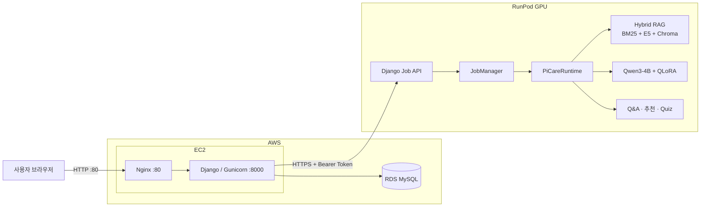

# 🍓 PiCare

Raspberry Pi 공식 문서를 바탕으로 제품 선택, 사용법 질의응답, 명령어 학습, 복습 퀴즈를 한곳에서 제공하는 AI 학습 웹 서비스입니다.

---

## 🛠️ 주요 기술


---

## 📑 목차

- [👥 팀 소개](#team)
- [📌 프로젝트 개요](#overview)
- [🏗️ 시스템 아키텍처](#architecture)
- [📊 데이터와 AI 자산](#data)
- [🗄️ 데이터베이스 설계](#database)
- [🚀 주요 기능](#features)
- [🔌 RunPod Job API](#api)
- [🧱 기술 스택과 저장소 구성](#stack)
- [⚙️ 실행 방법](#setup)
- [✅ 기능 상태와 검증 결과](#validation)
- [🚢 배포 및 운영](#deployment)
- [🖥️ 수행 화면](#screens)
- [📝 회고 및 향후 개선](#retrospective)
- [📚 주요 문서](#references)
- [👥 팀원별 회고](#team-retrospective)

---

<a id="team"></a>

## 👥 팀 소개

### 팀명

> SKN 33기 Raspberry Pi Assistant 4차 5팀

### 팀원별 역할

각 팀원의 주 담당 영역과 서비스 통합 과정에서의 기여를 함께 정리했습니다.

| 팀원 | 담당 영역 | 주요 기여 |
| --- | --- | --- |
| 최지흠 | RAG·Django 서비스 통합·프론트엔드·인프라 | 공식 문서 기반 RAG 구축, 기존 AI 기능의 Django 전환, Q&A·제품 추천 화면 연동, 회원가입·로그인·마이페이지·추천 기록 연결, Mini Challenge 비동기 작업 연동, RunPod Job API와 AWS 웹 서버 분리, Docker·CI/CD·배포 문서·Swagger 구축 |
| 김나은 | Q&A 요약·Dynamic Mini Challenge | Q&A 답변 요약과 질문 아카이브용 제목 생성, Qwen 런타임 재사용, 요약·인용 검증, Q&A evidence 기반 퀴즈 생성·파싱·검증, 퀴즈 평가셋과 정량 평가 문서 작성 |
| 이양원 | 제품 추천·QLoRA·Command Lab | 조건 추출과 제품 추천 Agent, QLoRA 학습·평가 파이프라인, 긴 입력과 선택 조건 처리, 승인 명령어 100개 카탈로그·분석·재조합 기능, 입력값 경계·근거·회귀 테스트와 인수인계 문서 작성 |
| 안정민 | 미디어·응답 계약 | 공식 이미지·영상과 citation 연결, 제품 근거 메타데이터와 미디어 검수, 공통 응답 계약·JSON Schema·평가 흐름 정비 |
| 김혜리 | 문서·제품 데이터 파이프라인 및 사용자 기능 | 공식 문서 수집·정제·의미 단위 청킹·manifest 생성, 제품 catalog와 미디어 registry 구축, Django 회원·개인화 기능 및 관련 모델·템플릿·보안 회귀 테스트 구현 |

---

<a id="overview"></a>

## 📌 프로젝트 개요

### 프로젝트명

Raspberry Pi 공식 문서 기반 AI 학습 도우미, PiCare

### 📖 프로젝트 소개

Raspberry Pi를 처음 사용하는 사용자는 제품 선택부터 OS 설치, 네트워크, SSH, 카메라, GPIO 설정까지 여러 단계에서 정보를 찾아야 합니다. 공식 문서는 신뢰할 수 있지만 문서 양이 많고, 상황에 맞는 정보를 찾는 과정이 어렵습니다.

PiCare는 Raspberry Pi 공식 문서를 검색 근거로 사용해 질문에 답하고, 사용 환경에 맞는 제품을 추천합니다. 답변 이후에는 복습 퀴즈를 제공하고, 질문·추천·명령어·오답 기록을 사용자별로 저장해 학습 흐름을 이어갈 수 있도록 구성했습니다.

웹 서비스와 사용자 데이터는 AWS에서 운영하며, GPU가 필요한 Qwen·QLoRA·Hybrid RAG 추론은 RunPod에서 처리합니다.

---

### 🎯 프로젝트 필요성

- Raspberry Pi 초보자는 제품 선택과 초기 설정에 필요한 정보를 여러 문서에서 직접 찾아야 합니다.
- 일반 검색 결과에는 공식 문서가 아닌 정보가 섞일 수 있어 출처 확인이 필요합니다.
- 사용자의 목적에 따라 필요한 성능, 카메라, GPIO, 네트워크 조건이 달라 단순 제품 목록만으로는 선택이 어렵습니다.
- 질문에 답을 얻은 뒤에도 학습 내용을 복습하고 기록하는 흐름이 부족합니다.
- 명령어는 실행 전에 의미와 옵션을 이해해야 하지만, 초보자가 안전하게 학습할 수 있는 안내가 필요합니다.

PiCare는 공식 문서의 근거와 사용자별 학습 기록을 연결해, 정보 탐색부터 제품 선택·문제 해결·복습까지 이어지는 경험을 목표로 합니다.

---

### 🚀 프로젝트 목표

#### 1. 공식 문서 기반 질의응답

- 한국어 질문으로 Raspberry Pi 공식 문서 검색
- BM25와 Dense Retrieval을 결합한 Hybrid RAG
- 답변과 함께 문서 제목, 원문 URL, 인용 근거 제공
- 근거가 부족한 질문에는 추측 대신 응답 보류

#### 2. 사용 환경 기반 제품 추천

- 자연어 설명과 선택 조건을 함께 입력
- QLoRA 조건 추출로 요구사항을 구조화
- 검수된 제품 카탈로그에서 후보 선택
- 공식 사양과 검색 근거를 바탕으로 추천 이유와 주의점 제공

#### 3. 질문 이후 학습 연결

- Q&A 답변과 citation을 바탕으로 객관식 Mini Challenge 생성
- 채점 결과와 해설 제공
- 오답을 오답노트에 저장해 다시 확인

#### 4. 안전한 명령어 학습

- 승인된 Raspberry Pi 명령어 템플릿 제공
- 명령어를 실행하지 않고 구성 요소와 옵션을 설명
- 위험한 셸 연산자와 제어문자 입력 차단
- 공식 문서 근거와 함께 명령어 학습 자료 제공

#### 5. 사용자 기록과 커뮤니티

- 회원가입·로그인·프로필 관리
- 질문 아카이브와 추천 결과 저장
- 명령어 서랍과 오답노트 제공
- 게시글·댓글·좋아요 기반 커뮤니티 제공

---

### 3차 프로젝트 대비 확장

이 저장소는 [3차 PiCare 프로젝트](https://github.com/skn-33-Raspberry-Pi-Assistant/skn_33_3rd_5team)의 **공식 문서 기반 RAG Q&A**와 **QLoRA 조건 추출 기반 제품 추천**을 계승해, Django 기반 사용자 서비스와 학습·기록 기능으로 확장한 4차 프로젝트입니다.

| 영역 | 4차 프로젝트 확장 내용 |
| --- | --- |
| 웹 서비스 | AI 기능을 Django URL·View·Form·Model·Template 구조로 통합 |
| 사용자 기능 | 회원가입·로그인·프로필·커뮤니티·마이페이지 추가 |
| 사용자 기록 | 질문·추천·명령어·오답 기록을 사용자 단위로 저장 |
| Q&A 학습 | Q&A 결과를 Dynamic Mini Challenge로 연결 |
| 명령어 학습 | 승인 카탈로그 기반 Command Lab 추가 |
| 검색 근거 | 공식 문서와 승인 RAG 청크 범위 확대 |
| 추천 입력 | 최대 입력 길이와 추천 조건 필드 확장 |
| 운영 구조 | AWS 웹 서비스와 RunPod GPU 추론 서버 분리 |
| 비동기 처리 | AI 작업 생성·상태 조회·취소·실패 처리를 `AiJob`으로 관리 |

---

### 핵심 기능 한눈에

- **공식 문서 기반 RAG Q&A**
  - Raspberry Pi 공식 문서만 검색 근거로 사용
  - BM25 + Dense Hybrid Retrieval
  - 답변·citation·공식 이미지/영상 연결
  - 근거 부족 시 `insufficient_evidence`로 응답 보류

- **QLoRA 조건 추출 기반 제품 추천**
  - 사용자의 자연어 요구를 구조화된 조건 JSON으로 변환
  - 검수된 Raspberry Pi 제품 카탈로그를 기준으로 후보 선택
  - 후보 범위의 공식 문서를 다시 검색해 추천 이유와 주의점 생성
  - LLM이 제품 사양·URL·이미지를 임의 생성하지 않도록 서버에서 검증된 데이터 조합

- **Dynamic Mini Challenge**
  - 직전에 받은 Q&A의 최종 답변과 citation을 재사용
  - 별도 검색 없이 1~3개의 객관식 복습 문제 생성
  - 근거 검증·quote 매칭·문항 구조 검증 후 노출
  - 오답은 로그인 사용자의 오답노트에 저장

- **Command Lab**
  - 승인된 명령어 템플릿만 분석
  - 명령 실행 없이 구조·옵션·효과·실행 위치를 학습용으로 설명
  - 위험한 셸 연산자·제어문자 차단
  - 공식 근거와 checksum을 검증한 명령만 제공

- **Django 사용자 서비스**
  - 회원가입·로그인·로그아웃
  - 질문 기록 및 공개 질문 아카이브
  - 추천 결과 저장
  - 커뮤니티 게시글·댓글·좋아요
  - 명령어 서랍
  - 오답노트
  - 마이페이지

- **AWS ↔ RunPod 분리 운영 구조**
  - AWS Django: 화면·인증·세션·MySQL·사용자 기록·AI 작업 상태
  - RunPod: GPU 모델·Qwen·QLoRA·RAG 추론
  - 비동기 Job API를 통해 상태 조회·취소·실패 처리

---

<a id="architecture"></a>

## 🏗️ 시스템 아키텍처

AWS 웹 계층과 RunPod GPU 추론 계층을 분리하고, RDS에 사용자·학습 기록을 저장합니다. 아래 그림은 서비스 요청, 오프라인 데이터 준비, CI/CD 배포 경로를 함께 보여줍니다.


[시스템 아키텍처 원본 확대](image/시스템타키텍쳐.png)

### 운영 환경

<details>
<summary>운영 요청 흐름 도식 펼치기</summary>



</details>

Django는 RunPod에 작업을 제출하고 상태를 조회합니다. RunPod가 AWS로 결과를 보내는 콜백 방식은 사용하지 않습니다.

| 영역 | 주요 책임 |
| --- | --- |
| AWS EC2 | Nginx, Django/Gunicorn, 화면 렌더링, 인증·세션, AiJob 관리 |
| AWS RDS MySQL | 사용자·커뮤니티·질문·추천·오답·AI 작업 기록 저장 |
| RunPod GPU | Qwen, QLoRA, Hybrid RAG, 제품 추천, Quiz 생성 |
| GitHub Actions + ECR | 웹 이미지 테스트·빌드·EC2 배포 |

> 현재 사용자의 웹 접속은 HTTP 80 포트를 사용합니다. AWS Django와 RunPod 사이의 AI Job API는 HTTPS와 Bearer Token으로 연결합니다.

### AI 작업 흐름

```text
사용자 질문 또는 추천 조건 입력
  → AWS Django가 AiJob 생성
  → RunPod에 작업 요청
  → RunPod GPU에서 RAG·모델 추론
  → 브라우저가 AWS 작업 상태 API를 조회
  → AWS Django가 RunPod 상태·결과를 반영
  → 결과와 학습 기록을 사용자에게 표시·저장
```

### 로컬 개발·통합 테스트 환경

운영 환경과 별도로 루트 `compose.yaml`은 다음 서비스를 실행합니다.

```text
Docker Compose
├─ MySQL 8.4
├─ Redis 7.4
├─ Django Web
└─ Celery Quiz Worker
```

이 구성은 로컬 개발과 통합 테스트용이며, AWS 운영 구성은 EC2의 Nginx·Django와 외부 RDS·RunPod으로 분리되어 있습니다.

---

<a id="data"></a>

## 📊 데이터와 AI 자산

### 공식 문서 RAG 데이터

| 항목 | 구성 |
| --- | ---: |
| 검수된 Raspberry Pi 공식 문서 | 23개 |
| 승인 manifest 청크 | 381개 |
| Chroma 색인 청크 | 381개 |
| 검수된 제품 카탈로그 | 5개 |
| 승인 Command Lab 템플릿 | 100개 |

위 수치는 [2026-09-18 AWS–RunPod 통합 검증](validation/2026-09-18-aws-runpod-integration.md) 기준입니다. 운영 시점의 실제 모델·색인 준비 상태와는 구분해 읽어야 합니다.

공식 문서 원문을 수집·정제한 뒤 의미 단위로 청킹하여 manifest를 생성하고, E5 임베딩과 Chroma를 이용해 검색합니다. 답변 화면에는 검색된 근거와 연결된 공식 이미지·영상만 표시합니다.

### 주요 데이터 파일

| 파일 | 역할 |
| --- | --- |
| `document_pipeline/data/manifest_v3.json` | 승인된 공식 문서 RAG 청크 |
| `data/products/catalog.json` | 검수된 Raspberry Pi 제품 정보 |
| `data/products/command_catalog.json` | Command Lab 승인 명령어 템플릿 |
| `document_pipeline/data/media_manifest_v3.json` | citation과 연결되는 공식 미디어 메타데이터 |

---

<a id="database"></a>

## 🗄️ 데이터베이스 설계

PiCare는 Django ORM과 MySQL을 사용해 사용자 서비스 데이터를 저장합니다.

| 도메인 | 주요 저장 정보 |
| --- | --- |
| 계정 | 사용자, 프로필, 권한 |
| 커뮤니티 | 게시글, 댓글, 좋아요 |
| 학습 기록 | 질문 기록, 추천 기록, 명령어 서랍, 오답노트 |
| AI 작업 | AiJob 요청, 상태, 결과 보존 정보 |

### 논리 ERD

계정·권한, 커뮤니티, 개인 저장·AI 기록을 업무 개념과 관계 중심으로 표현했습니다. 사용자 프로필은 사용자 개념에 통합하고, Q&A 제목·요약 및 AI 작업의 선택적 연결 관계를 반영했습니다.


[논리 ERD 원본 확대](image/PiCare_논리_ERD_수정본.png)

### 물리 ERD

Django 모델의 MySQL 매핑을 기준으로 테이블, 컬럼 자료형, NULL 허용 여부, PK·FK·UNIQUE 제약을 정리했습니다. Django 인증 연결 테이블과 세션·관리자 로그·마이그레이션 테이블도 포함합니다.


[물리 ERD 원본 확대](image/PiCare_물리_ERD_수정본.png)

두 ERD의 작성 기준일은 **2026-09-23**입니다. 물리 ERD는 모델 기준이며, 운영 DB에 해당 마이그레이션이 적용되었는지는 배포 환경에서 별도로 확인합니다. 이미지의 점선 참조 상자는 같은 엔티티를 다시 표시한 것으로, 별도 테이블을 의미하지 않습니다.

### 주요 Django 모델

| 모델 | 역할 |
| --- | --- |
| `UserProfile` | 사용자 확장 정보 |
| `Post` | 커뮤니티 게시글 |
| `Comment` | 댓글 |
| `PostLike` | 좋아요 |
| `DrawerItem` | Command Lab 저장 항목 |
| `WrongNote` | Mini Challenge 오답 |
| `RecommendationRecord` | 추천 입력·응답 스냅샷 |
| `QuestionRecord` | Q&A 응답·요약·공개 기록 |
| `AiJob` | 원격 AI 작업 상태 |

AI 응답은 citation, media, 조건, 경고, 선택지처럼 구조가 변할 수 있기 때문에 일부 결과는 `JSONField` 스냅샷으로 저장합니다.

사용자 소유 데이터는 owner/session 기준으로 접근을 제한합니다.

---

<a id="features"></a>

## 🚀 주요 기능

### 💬 공식 문서 기반 RAG Q&A

Raspberry Pi 공식 문서를 검색해 근거가 확인된 내용만 답변에 사용합니다.

```text
사용자 질문
  → 입력 길이 / 안전성 검사
  → BM25 + Dense Hybrid Retrieval
  → Top-k 공식 문서 청크
  → Qwen 답변 생성
  → citation 검증
  → 공식 이미지·영상 연결
  → ChatResponse 반환
```

주요 특징:

- 한국어 질문으로 영어 Raspberry Pi 공식 문서를 검색
- 제품 선택, OS 설치, SSH, 네트워크, 카메라, GPIO, 기본 문제 해결 질문 지원
- 문서 제목·섹션·원문 URL·실제 citation 청크 제공
- citation에 연결된 공식 미디어만 표시
- 충분한 근거가 없으면 임의 추측 대신 `insufficient_evidence` 반환

관련 구현:

```text
src/rag/
src/rag_to_llm/
src/services/rag_qa_service.py
src/services/rag_qa_cli.py
src/media/
```

---

### 🧩 맞춤형 제품 추천

자연어 입력과 선택형 조건을 결합해 제품 추천 조건을 추출하고, 검수된 제품 카탈로그에서 후보를 선정합니다.

```text
자유 입력 / 선택 조건
  → QLoRA 조건 JSON
  → Schema 검증
  → 명시적 UI 조건 우선 적용
  → Product Catalog 하드 필터 / 점수화
  → 후보 범위 Hybrid RAG
  → Qwen 추천 설명
  → 검증된 제품 카드·출처 조합
```

반영 조건 예시:

- 사용 목적 / 세부 작업
- 사용자 숙련도
- 성능 우선순위
- Wi-Fi
- 유선 LAN
- 카메라
- GPIO
- 모니터 보유 여부
- 원격 접속 필요 여부
- 최소 연결 수 등 확장 조건

정책:

- 사용자가 말하지 않은 조건은 `null` 유지
- 명시적으로 선택한 화면 조건은 모델 추출값보다 우선
- 제품 사양·URL·이미지는 LLM이 직접 생성하지 않음
- 서버가 검증된 `catalog.json`과 RAG metadata를 기준으로 조합

관련 구현:

```text
src/condition_extraction/
src/recommendation/
src/services/recommendation_rag_service.py
src/services/recommendation_agent.py
data/products/catalog.json
```

---

### 🧠 Dynamic Mini Challenge

Q&A 결과를 학습용 퀴즈로 연결합니다.

```text
RAG Q&A
  → ChatResponse(answer + citations)
  → Quiz Generation
  → Parser
  → Evidence / Quote / Structure Validation
  → QuizResponse
  → 사용자 제출
  → 서버 채점
  → 오답노트 저장
```

특징:

- 새로운 검색을 수행하지 않고 직전 Q&A 결과를 재사용
- 최종 답변과 citation이 충분한 경우에만 Quiz 생성
- 최대 3문항 생성
- supporting quote가 실제 evidence 원문과 일치하는지 검증
- 로그인 사용자가 실제로 틀린 문제만 오답노트에 저장
- 생성 실패와 근거 부족 상태를 분리 관리
- 로컬 Celery 또는 RunPod 원격 Job 방식 모두 지원

관련 구현:

```text
src/services/quiz_generator.py
src/services/quiz_validation.py
src/services/quiz_parser.py
web_app/portal/ai_jobs.py
web_app/portal/tasks.py
web_app/templates/portal/quiz_panel.html
```

---

### ⌨️ Command Lab

승인된 명령어를 안전하게 분석·학습하는 기능입니다.

```text
예시 선택 / 한 줄 명령 입력
  → 승인 템플릿 매칭
  → 입력값 검증
  → evidence / checksum 검증
  → 명령 구성 요소·효과·실행 위치 표시
  → 서랍 저장
```

정책:

- 승인된 카탈로그 템플릿만 분석
- 일치하지 않는 명령을 임의 해석하지 않음
- 셸 연산자, 줄바꿈, 제어문자 차단
- 허용된 입력값만 형식에 맞게 변경
- `execution_policy=display_only`
- 실제 shell 실행 기능 없음

현재 검증된 명령어 카탈로그:

```text
total=100
approved=100
draft=0
```

관련 구현:

```text
src/services/command_lab_service.py
src/services/command_review.py
data/products/command_catalog.json
data/products/command_review_ledger.json
```

---

### Django 웹 서비스와 화면

#### Backend

Django 백엔드는 AI 도메인 서비스를 웹 요청과 사용자 데이터에 연결합니다.

```text
URL Request
  → View / Form Validation
  → Local AI Service 또는 Remote AiJob 생성
  → 결과 검증
  → Session / ORM 저장
  → Template 또는 JSON Response
```

주요 기능:

- Q&A
- 제품 추천
- Command Lab
- Mini Challenge 생성·조회·취소·제출
- 회원가입·로그인·로그아웃
- 질문 기록
- 추천 기록
- 커뮤니티
- 프로필
- 명령어 서랍
- 오답노트
- 마이페이지

#### Frontend

Django Templates와 static 자산으로 화면을 구성합니다.

```text
web_app/templates/
web_app/static/
```

Q&A·추천·Command Lab·Mini Challenge·인증·커뮤니티·마이페이지 화면이 동일한 서비스 안에서 연결됩니다.

---

### 질문 아카이브

질문 아카이브는 `QuestionRecord`에 저장된 Q&A 기록을 조회하는 기능입니다.

로그인 사용자가 Q&A를 수행하면 응답·citation·media·요약 등을 `QuestionRecord`로 저장할 수 있으며, 공개 상태로 설정된 질문은 질문 아카이브의 목록과 상세 페이지에서 조회할 수 있습니다.

주요 저장 구조:

```text
QuestionRecord
├── owner / request_id / title
├── question / answer / status
├── response_payload              # citation·미디어 등을 담은 응답 JSON
├── question_title / question_title_status
├── answer_summary / answer_summary_status
├── is_public / published_at
└── created_at / updated_at
```

인용 근거와 미디어는 독립 컬럼이 아니라 `response_payload`에 보관합니다. 질문 제목과 답변 요약은 별도 컬럼으로 저장하며, 생성 상태도 함께 관리합니다.

관련 화면:

```text
web_app/templates/portal/questions.html
web_app/templates/portal/question_detail.html
web_app/templates/portal/mypage_questions.html
```

---

<a id="api"></a>

## 🔌 RunPod Job API

RunPod 측 HTTP API는 Django 기반으로 구성되어 있습니다.

```text
GET  /health/live
GET  /health/ready
POST /v1/jobs
GET  /v1/jobs/{job_id}
POST /v1/jobs/{job_id}/cancel
```

특징:

- Bearer Token 인증
- 작업 생성 / 조회 / 취소
- 중복 Job ID 검사
- 성공 / 실패 / 취소 상태 관리
- 완료 결과를 기존 `ChatResponse`, `QuizResponse` 계약으로 재검증
- GPU 모델 중복 적재를 피하기 위해 단일 worker 기준 운영

관련 구현:

```text
src/runpod_api/
web_app/portal/remote_ai.py
web_app/portal/ai_jobs.py
```

---

<a id="stack"></a>

## 🧱 기술 스택과 저장소 구성

### 기술 스택 상세

| 영역 | 사용 기술 |
| --- | --- |
| Language | Python |
| Web | Django, Django Templates, HTML, CSS, JavaScript |
| WSGI | Gunicorn |
| DB | Django ORM, MySQL 8.4 |
| Async | 운영: RunPod Job API / 로컬 통합: Celery·Redis |
| RAG | ChromaDB, sentence-transformers, rank-bm25, Hybrid Retrieval |
| LLM | Qwen3-4B-Instruct-2507 |
| Fine-tuning | QLoRA, PEFT, bitsandbytes |
| Data | Raspberry Pi 공식 문서 manifest·chunk, 제품·명령어 카탈로그 |
| Infra | Docker, Docker Compose, AWS, RunPod |
| CI/CD | GitHub Actions |
| Quality | pytest, Django TestCase, 계약·서비스·배포 검증 |

### 프로젝트 구조

```text
.
├── web_app/
│   ├── accounts/                    # 회원가입·로그인
│   ├── picare_web/                  # Django settings / URL / WSGI / ASGI / Celery
│   ├── portal/                      # View / Form / Model / AI 연동 / Job 상태
│   ├── templates/                   # Django Templates
│   └── static/                      # CSS / JavaScript / 정적 자산
│
├── src/
│   ├── contracts/                   # ChatResponse, QuizResponse 등 계약
│   ├── condition_extraction/        # QLoRA 조건 추출
│   ├── rag/                         # Retriever / Chroma / Indexing
│   ├── rag_to_llm/                  # Qwen generation adapter
│   ├── recommendation/              # 제품 추천 엔진 / catalog 검증
│   ├── services/                    # Q&A / 추천 / Command Lab / Quiz 서비스
│   ├── runpod_api/                  # RunPod 원격 AI Job API
│   ├── media/                       # citation ↔ media 연결
│   ├── evaluation/                  # 평가 로직
│   ├── presentation/                # citation 표시 데이터
│   └── lang/                        # Prompt / Safety 정책
│
├── document_pipeline/               # 공식 문서 수집·정제·manifest 생성
├── data/products/                   # 제품·명령어 catalog
├── training/                        # QLoRA 학습 설정·스크립트
├── eval/                            # Q&A·Quiz 평가 fixture와 결과
├── tests/                           # 단위·통합·Django·GPU smoke 테스트
│
├── deploy/                          # AWS 배포 스크립트·Compose·Nginx 설정
├── .github/workflows/               # CI/CD
├── docs/                            # 계약·가이드·검증 문서
├── compose.yaml                     # MySQL·Redis·Django·Worker 구성
├── Dockerfile
├── Dockerfile.aws
├── Dockerfile.runpod
└── requirements*.txt
```

---

<a id="setup"></a>

## ⚙️ 실행 방법

### 환경별 의존성

프로젝트 실행 목적에 따라 필요한 requirements 파일이 다릅니다.

| 환경 | 설치 파일 | 용도 |
| --- | --- | --- |
| 로컬 개발·Django·RAG·테스트 | `requirements.txt` | CPU 기반 기본 개발 환경 |
| RunPod GPU 추론 | `requirements-gpu.txt` | Qwen 답변 생성·LoRA 조건 추출 |
| QLoRA 학습 | `requirements-training.txt` | `training/` 학습 스크립트 실행 |
| AWS 웹 서버 | `requirements-web.txt` | GPU·로컬 AI 패키지를 제외한 웹 전용 이미지 |

`requirements-gpu.txt`는 `requirements.txt`를 포함하고, `requirements-training.txt`는 `requirements-gpu.txt`를 포함합니다. 일반적인 로컬 Django 실행에는 `requirements.txt`만 설치합니다.

### 로컬 Django + MySQL

Python 3.12와 Docker Compose가 설치된 환경에서 시작합니다. 아래 명령은 모두 저장소 루트에서 실행합니다.

처음 설정할 때 `.env.example`을 `.env`로 복사합니다. 기존 `.env`가 있으면 해당 파일을 사용합니다.

```bash
# macOS / Linux
cp .env.example .env
```

```powershell
# Windows PowerShell
Copy-Item .env.example .env
```

**MySQL을 실행하기 전에** `.env`에서 다음 항목의 주석을 해제하고 값을 설정합니다.

| 항목 | 설정 내용 |
| --- | --- |
| `MYSQL_PASSWORD` | 애플리케이션 DB 계정 비밀번호 |
| `MYSQL_ROOT_PASSWORD` | Docker MySQL 관리자 비밀번호 |
| `DJANGO_SECRET_KEY` | 로컬 개발용으로 생성한 임의의 긴 문자열 |
| `DJANGO_DEBUG` | 로컬 화면·정적 파일 확인 시 `true` |
| `HF_HOME` | 로컬에서 모델을 사용하는 경우 쓰기 가능한 캐시 경로, 예: `.hf-cache` |

macOS / Linux:

```bash
docker compose up -d --wait mysql
python3 -m venv .venv
source .venv/bin/activate
python -m pip install -r requirements.txt
python web_app/manage.py migrate
python web_app/manage.py runserver 127.0.0.1:8001
```

Windows PowerShell:

```powershell
docker compose up -d --wait mysql
py -3.12 -m venv .venv
.\.venv\Scripts\python.exe -m pip install -r requirements.txt
.\.venv\Scripts\python.exe web_app/manage.py migrate
.\.venv\Scripts\python.exe web_app/manage.py runserver 127.0.0.1:8001
```

서버가 실행되면 [로컬 PiCare](http://127.0.0.1:8001/)에 접속합니다. 실행 터미널은 열어 둡니다.

위 절차는 웹 서버와 DB를 준비합니다. 실제 Qwen·QLoRA 추론에는 GPU 환경과 모델 자산이 필요합니다. 원격 AI를 사용하려면 `PICARE_AI_BACKEND=remote`, `AI_API_URL`, `AI_API_TOKEN`을 별도로 설정하고 RunPod API를 실행해야 합니다.

자세한 초기 설정은 다음 문서를 참고합니다.

- [Django 실행 가이드](README_django_실행법.md)

초기 설정 자동화:

```bash
python scripts/init.py
```

`scripts/init.py`는 로컬용 `.env` 생성, Python 가상환경 생성, `requirements.txt` 설치, Docker MySQL 실행, Django migration을 순서대로 수행합니다. 실행 후 관리자 화면이나 Swagger를 확인하려면 다음 명령으로 관리자 계정을 생성합니다.

```bash
source .venv/bin/activate
python web_app/manage.py createsuperuser
```

---

### 전체 Docker Compose 실행

```bash
docker compose up --build
```

Compose 구성에서는 MySQL·Redis·Django·비동기 Worker를 함께 실행하며, 웹 포트는 `8000`입니다.

현재 `web`과 `quiz-worker`에는 `gpus: all`이 설정되어 있어 NVIDIA GPU와 NVIDIA Container Toolkit을 사용할 수 있는 환경이 필요합니다. macOS 등 이 조건을 충족하지 않는 환경에서는 앞의 로컬 Django + MySQL 절차를 사용합니다.

Q&A web과 Quiz worker가 각각 모델을 적재하므로 두 프로세스의 GPU 메모리 사용량을 합산해 확보해야 합니다.

---

### GPU 환경에서 Django 직접 실행

```bash
python web_app/manage.py runserver 0.0.0.0:8000 --noreload
```

이 방식은 Django 자체 실행 경로를 확인하는 용도이며, 원격 RunPod 비동기 Job 또는 별도 worker가 필요한 기능은 환경 설정에 따라 추가 구성이 필요합니다.

---

### RunPod API 실행

```bash
python -m src.runpod_api
```

기본 포트:

```text
8000
```

운영 환경에서는 HTTPS 프록시를 통해 AWS Django에서 호출합니다.

저장소 루트에서 GPU용 가상환경을 활성화한 뒤 실행합니다. `AI_API_TOKEN`은 32자 이상으로 설정하고 AWS의 호출 토큰과 일치시켜야 합니다. Qwen 모델·LoRA adapter·Chroma index·공식 문서 manifest도 RunPod 환경에 준비되어 있어야 합니다.

새 터미널에서 준비 상태를 확인할 수 있습니다.

```bash
curl -fsS http://127.0.0.1:8000/health/ready
```

응답 본문의 `ready`와 `message`를 함께 확인합니다. 전체 설치·재시작 절차는 [CI/CD 실행·설정·API 명세서](deployment/CI-CD-실행-설정-API-명세서.md)를 따릅니다.

---

### Swagger API 문서

Django 관리자 계정으로 로그인하면 웹 API를 Swagger UI에서 확인하고 테스트할 수 있습니다.

```text
Swagger UI:  http://127.0.0.1:8001/api/docs/
OpenAPI YAML: http://127.0.0.1:8001/api/schema/
```

두 경로 모두 활성 상태(`is_active=True`)이면서 관리자 권한(`is_staff=True`)이 있는 Django 계정만 접근할 수 있습니다. 로그인하지 않았다면 관리자 로그인 페이지로 이동합니다. POST 요청을 Swagger UI에서 실행할 때는 Django 세션과 CSRF 쿠키가 필요합니다.

`/api/schema/`는 OpenAPI YAML 원문을 제공하므로 브라우저에 따라 파일로 다운로드될 수 있습니다. 문서 화면은 `/api/docs/`에서 확인합니다. 배포 환경에서는 `127.0.0.1:8001`을 실제 웹 서비스 주소로 바꿉니다.

자세한 내용은 [Swagger 실행·운영 가이드](api/Swagger-실행-가이드.md)를 참고합니다.

---

### 주요 환경 변수

| 영역 | 예시 |
| --- | --- |
| Django | `DJANGO_SECRET_KEY`, `DJANGO_ALLOWED_HOSTS` |
| MySQL | `DJANGO_DB_*`, `MYSQL_*` |
| AI Backend | `PICARE_AI_BACKEND=local|remote` |
| RunPod | `AI_API_URL`, `AI_API_TOKEN` |
| Timeout | `AI_HTTP_TIMEOUT`, `AI_JOB_TIMEOUT` |
| Model | `ANSWER_MODEL_ID`, `ANSWER_MAX_NEW_TOKENS`, `LORA_ADAPTER_PATH`, `HF_HOME` |
| Data | `DOCUMENT_MANIFEST`, `CHROMA_PATH`, `PRODUCT_CATALOG`, `COMMAND_CATALOG` |

주의:

- 실제 Secret, Token, DB 비밀번호는 Git에 저장하지 않습니다.
- 운영 RunPod URL은 HTTPS만 허용합니다.
- 로컬 MySQL은 `MYSQL_*` 값을 공유합니다. `DJANGO_DB_*`를 별도로 지정하면 Django 접속 설정에서 우선하므로 실제 DB 계정 정보와 일치시켜야 합니다.
- `.env.example`은 설정 예시입니다. 이를 수정하거나 Git에서 내려받아도 기존 서버의 `.env` 값은 자동으로 바뀌지 않습니다. 실제 설정을 변경한 뒤에는 해당 서버 프로세스를 재시작합니다.

---

<a id="validation"></a>

## ✅ 기능 상태와 검증 결과

### 기능 상태

| 기능 | 상태 | 구현 범위 |
| --- | --- | --- |
| RAG Q&A | 구현 완료* | Hybrid Retrieval, 근거 기반 답변, citation·media |
| 제품 추천 | 구현 완료* | 조건 추출, catalog 후보 선택, 후보 범위 RAG, 추천 응답 |
| Command Lab | 구현 완료 | 승인 템플릿 100개, 안전 정책, 근거 검증, 서랍 저장 |
| Dynamic Mini Challenge | 구현 완료* | Q&A 연계 Quiz, 비동기 작업, 취소, 채점, 오답노트 |
| 인증·커뮤니티 | 구현 완료 | 가입·로그인·프로필·게시글·댓글·좋아요 |
| 질문 아카이브 | 구현 완료 | `QuestionRecord` 저장, 공개 목록·상세 조회 |
| 추천 기록 | 구현 완료 | 사용자별 추천 결과 저장·마이페이지 조회 |
| MySQL / Docker | 구현 완료 | Compose MySQL 및 Django migration |
| AWS ↔ RunPod 계약 | 로컬 통합 검증 완료 | Job 생성·조회·취소·오류·응답 계약 검증 |
| 실제 GPU / AWS 운영 상태 | 배포 환경에서 확인 | 현재 배포 커밋·모델 준비 상태·기능별 요청 결과 확인 필요 |

`*` 문서 manifest, Chroma index, Qwen/LoRA 모델 자산이 준비되어야 실제 추론이 가능합니다.

아래 테스트 수치는 각 링크의 검증 시점에 기록된 결과입니다. 현재 서비스 가동 여부나 최신 커밋의 테스트 결과를 의미하지 않습니다.

### 검증 결과

#### 1. 공식 문서 / RAG 자산

2026-09-18 배포 자산 검증 기준:

| 항목 | 결과 |
| --- | ---: |
| 공식 문서 | **23개** |
| 승인 manifest chunk | **381개** |
| Chroma index chunk | **381개** |
| 제품 catalog | **5개** |
| 승인 Command Lab template | **100개** |

관련 문서:

- [AWS–RunPod 통합 검증](validation/2026-09-18-aws-runpod-integration.md)

---

#### 2. 3차 대비 데이터·입력 범위

| 항목 | 3차 | 4차 | 변화 |
| --- | ---: | ---: | ---: |
| 공식 문서 | 18 | 23 | +27.8% |
| 승인 RAG chunk | 270 | 381 | +41.1% |
| 사용자 최대 입력 길이 | 2,000자 | 10,000자 | 5배 |
| 추천 조건 필드 | 15 | 21 | +40.0% |

> 3차의 18개 문서 / 270개 chunk 검증 자산은 `docs/document-cards/raspberry-pi-official-v3.md`와 2026-08-31 검증 기록에서 확인할 수 있습니다. 4차 최신 자산은 2026-09-18 배포 검증 문서를 기준으로 합니다.

---

#### 3. Dynamic Mini Challenge

Qwen3-4B 4-bit 환경의 고정 fixture 25건 기준:

| 평가 지표 | 결과 |
| --- | ---: |
| 상태 정확도 | **92.0% (23/25)** |
| Available F1 | **94.7%** |
| 인용 원문 매칭률 | **100% (18/18)** |
| 근거 부족 판단 | **100% (5/5)** |

`generation_failed` 2건은 상태 정확도와 Available F1 계산에서 실패로 포함했습니다.

인용 원문 매칭률 100%는 최종 문항의 supporting quote가 연결 evidence 원문과 일치한다는 의미이며, 생성 답변 전체의 의미적 품질이 100%라는 뜻은 아닙니다.

관련 문서:

- [Mini Challenge 최종 평가](validation/mini-challenge-final-evaluation.md)

---

#### 4. Command Lab

최종 승인 상태:

```text
Command Lab audit
  total=100
  approved=100
  draft=0
  errors=[]
```

2026-09-16 검증 기록:

- Command Lab catalog/service/review ledger: **40 passed**
- Django portal test runner: **42 passed**
- Django API 직접 테스트: **12 passed**
- 관련 전체 회귀 범위: **423 passed, 1 skipped, 3 deselected**

관련 문서:

- [Command Lab 100개 전체 공개 검증](validation/2026-09-16-command-lab-full-catalog.md)

---

#### 5. AWS–RunPod 통합 검증

2026-09-18 로컬 통합 검증:

- Django 인증·화면 회귀: **80 tests passed**
- RunPod 작업·배포 자산·기존 AI 서비스 회귀: **58 passed**
- AWS client ↔ mock RunPod HTTP 계약: **8 passed**
- `git diff --check`: 통과
- Django `check`: 통과
- `makemigrations --check`: 통과

이 기록은 2026-09-18의 로컬 검증 범위입니다. 실제 배포의 성공 여부는 해당 GitHub Actions 실행 결과와 배포된 서버의 준비 상태·기능별 요청 결과를 함께 확인합니다.

---

### QLoRA 평가 수치를 읽을 때

조건 추출 QLoRA는 평가 시점·데이터셋·스키마 버전에 따라 서로 다른 결과가 기록되어 있습니다.

예를 들어 2026-08-31 A40 검증에서는 Dev 40건 기준:

| 지표 | 결과 |
| --- | ---: |
| JSON Schema 준수 | 97.5% (39/40) |
| 전체 조건 Exact Match | 57.5% (23/40) |
| 필드별 Macro F1 평균 | 67.60% |
| 정답이 null인 필드에 값을 생성한 비율 | 0.68% |

해당 문서에서는 이전 holdout의 Exact Match / Macro F1 결과와 현재 dev 결과를 **직접 비교하지 말 것**을 명시합니다.

따라서 QLoRA 성능을 발표·문서화할 때는 반드시 다음을 함께 명시해야 합니다.

```text
평가 데이터셋
평가 샘플 수
Condition Schema 버전
Base Model / LoRA Adapter revision
평가 날짜
평가 스크립트
```

관련 문서:

- [A40 최종 재실행 검증](validation/2026-08-31-final-a40-defca71.md)
- [Fine-tuning 계약](data-contracts/finetuning.md)
- [Fine-tuning 학습 가이드](guides/finetuning-training.md)

---

### 테스트 명령

전체 테스트:

```bash
pytest -q
```

Django 검사:

```bash
python web_app/manage.py check
python web_app/manage.py test portal accounts
```

배포 자산 검사:

```bash
python scripts/verify_deployment_assets.py --target all --skip-adapter
```

실제 RunPod adapter 포함 검사:

```bash
python scripts/verify_deployment_assets.py \
  --target runpod \
  --adapter-path /workspace/models/picare-qwen3-4b-qlora
```

---

<a id="deployment"></a>

## 🚢 배포 및 운영

### AWS

관련 자산:

```text
Dockerfile.aws
deploy/aws-entrypoint.sh
deploy/compose.aws.yaml
deploy/nginx.aws.conf
deploy/aws-build-push.sh
deploy/aws-release.sh
```

AWS Django image는 웹 전용 의존성을 설치하고 GPU 모델 파일을 포함하지 않는 구조입니다.

### RunPod

관련 자산:

```text
Dockerfile.runpod
src/runpod_api/
requirements-gpu.txt
```

RunPod는 GPU 모델과 추론 자산을 담당합니다.

### CI/CD

```text
.github/workflows/aws-cicd.yml
```

현재 워크플로의 실행 조건은 다음과 같습니다.

| 실행 계기 | 수행 내용 |
| --- | --- |
| `main` 대상 Pull Request | Django 설정·마이그레이션 확인, 테스트, 웹 이미지 빌드 검증 |
| `main`에 Push | 검증 통과 후 ECR 이미지 게시 및 EC2 배포 |
| `workflow_dispatch` 수동 실행 | 선택한 ref의 검증 통과 후 운영 배포 작업 실행 |

```text
GitHub Actions
  → Django 검사·테스트·이미지 빌드 검증
  → sha-<커밋 SHA> 태그로 웹 이미지 빌드
  → ECR 게시
  → SSM으로 EC2 릴리스 명령 실행
  → 컨테이너 교체·마이그레이션
  → 웹 페이지와 /health/ 확인
```

PR 테스트 통과는 운영 배포 완료와 구분합니다. 배포 실행에서는 `Publish and release to EC2` 작업의 성공 여부까지 확인합니다. 현재 릴리스 스크립트는 `/health/`의 `ready=true`도 요구하므로 RunPod가 준비되지 않으면 배포 후 검증이 실패할 수 있습니다.

이 워크플로의 자동 배포 대상은 AWS 웹 이미지입니다. RunPod 코드와 모델 자산은 Pod에서 별도로 갱신하고 API를 재시작해야 합니다. 모델·색인은 Git pull만으로 준비되지 않으며, 변경된 환경 변수도 서버의 실제 `.env`에 반영해야 합니다.

설정 탭, GitHub Secrets·Variables, IAM·SSM 권한, 수동 배포·롤백 절차는 [CI/CD 실행·설정·API 명세서](deployment/CI-CD-실행-설정-API-명세서.md)에 정리되어 있습니다.

---

<a id="screens"></a>

## 🖥️ 수행 화면

서비스의 주요 화면과 확인할 기능을 정리했습니다. 화면 캡처는 최종 배포 버전과 맞춰 첨부합니다.

| 화면 | 확인할 기능 |
| --- | --- |
| 메인 | PiCare 서비스 소개와 핵심 기능 진입 화면 |
| 제품 추천 | 사용 환경 입력과 추천 결과 |
| Q&A | 답변, citation, 공식 미디어 |
| Command Lab | 승인 명령어 탐색·분석 화면 |
| Mini Challenge | 문제 생성, 채점, 해설 화면 |
| 마이페이지·커뮤니티 | 사용자 기록과 게시글 화면 |

---

<a id="retrospective"></a>

## 📝 회고 및 향후 개선

### 👍 구현한 점

- 기존 AI 기능을 Django 기반 사용자 서비스로 통합했습니다.
- 공식 문서 기반 RAG와 citation 검증으로 답변 근거를 제공했습니다.
- 제품 추천, 명령어 학습, 퀴즈, 사용자 기록을 하나의 학습 흐름으로 연결했습니다.
- AWS 웹 서버와 RunPod GPU 런타임을 분리해 웹 기능과 AI 추론의 책임을 나눴습니다.
- GitHub Actions, ECR, EC2 배포 흐름을 구성해 웹 이미지 배포를 자동화했습니다.

### 🔥 향후 개선 방향

- 도메인과 HTTPS를 적용해 공개 웹 서비스 보안을 강화합니다.
- AWS와 RunPod의 모니터링·알림 체계를 추가합니다.
- RAG 인덱스와 제품 카탈로그의 갱신 절차를 자동화합니다.
- 사용자의 학습 기록을 바탕으로 개인화된 복습 문제와 학습 경로를 제공합니다.
- 운영 트래픽에 맞춰 RDS 백업, 웹 서버 다중화, 캐시 전략을 확장합니다.

---

### 현재 한계

- 저장소만 clone해도 운영용 Qwen/LoRA weight와 Chroma index가 자동으로 준비되는 것은 아닙니다.
- 실제 RunPod GPU 추론은 Pod 모델 자산과 adapter 경로가 필요합니다.
- 실제 AWS 운영 검증에는 EC2·RDS·RunPod 접근 권한과 실행 중인 서비스가 필요합니다. 도메인·웹 HTTPS 적용은 현재 HTTP 구성의 후속 개선 항목입니다.
- 가격·재고처럼 실시간 외부 정보는 현재 RAG 범위가 아닙니다.
- RAG citation 형식 검증과 답변의 의미적 정확성은 별도 문제이므로 지속적인 수동·자동 평가가 필요합니다.
- QLoRA 성능 수치는 평가셋과 schema 버전을 함께 확인해야 하며 서로 다른 평가 결과를 단순 비교하면 안 됩니다.

---

### 프로젝트 방향

PiCare는 다음 구성 요소를 하나의 검증 가능한 학습 흐름으로 연결합니다.

```text
공식 문서
  + 검증된 제품 / 명령 데이터
  + Hybrid RAG
  + QLoRA 조건 추출
  + Django 사용자 서비스
  + 학습 기록
```

사용자가 질문을 하고 답을 받는 데서 끝나는 것이 아니라, **근거를 확인하고 → 제품을 선택하고 → 명령을 이해하고 → 복습하고 → 자신의 기록을 다시 활용하는 서비스**를 목표로 합니다.

---

<a id="references"></a>

## 📚 주요 문서

### Architecture / Deployment

- [CI/CD 실행·설정·API 명세서](deployment/CI-CD-실행-설정-API-명세서.md)
- [AWS 인프라 스펙](deployment/AWS-인프라-스펙-발표용.md)
- [RunPod 단일 서버 개발·레거시 구성](runpod-django-setup.md)
- [Swagger 실행·운영 가이드](api/Swagger-실행-가이드.md)
- [Web API OpenAPI 명세](openapi/web-api.yaml)

### Data Contract

- [Django 모델 계약](data-contracts/portal-models.md)
- [RAG 데이터 계약](data-contracts/rag-corpus.md)
- [Product Catalog 계약](data-contracts/product-catalog.md)
- [Command Lab 계약](data-contracts/command-lab.md)
- [Mini Challenge 계약](data-contracts/mini-challenge-handoff.md)
- [Fine-tuning 계약](data-contracts/finetuning.md)

### Validation

- [AWS–RunPod 통합 검증](validation/2026-09-18-aws-runpod-integration.md)
- [Command Lab 100개 검증](validation/2026-09-16-command-lab-full-catalog.md)
- [Mini Challenge 최종 평가](validation/mini-challenge-final-evaluation.md)
- [A40 Qwen / QLoRA 검증](validation/2026-08-31-final-a40-defca71.md)

### Project Notes

- [4차 프로젝트 개인 작업 발표 정리](../4차프로젝트_개인작업_발표정리.md)

---

<a id="team-retrospective"></a>

## 👥 팀원별 회고

각 조원이 자신의 작업 경험과 회고를 작성하고, 개인 작업 정리 문서나 결과물 링크를 추가합니다.

| 팀원 | 회고 | 작업물 |
| --- | --- | --- |
| 최지흠 | [내용 입력] | [작업물](../4차프로젝트_개인작업_발표정리.md) |
| 김나은 | [내용 입력] | [작업물 링크 입력] |
| 이양원 | [내용 입력] | [작업물 링크 입력] |
| 안정민 | [내용 입력] | [작업물 링크 입력] |
| 김혜리 | [내용 입력] | [작업물 링크 입력] |
