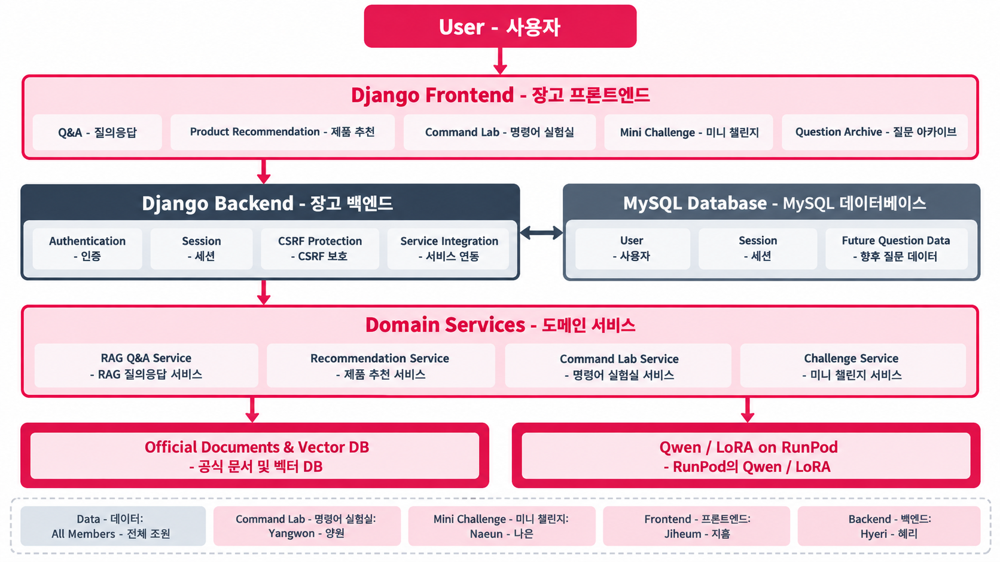
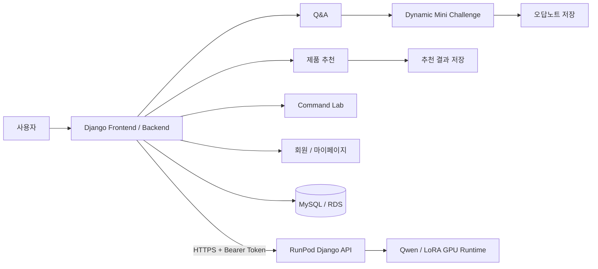
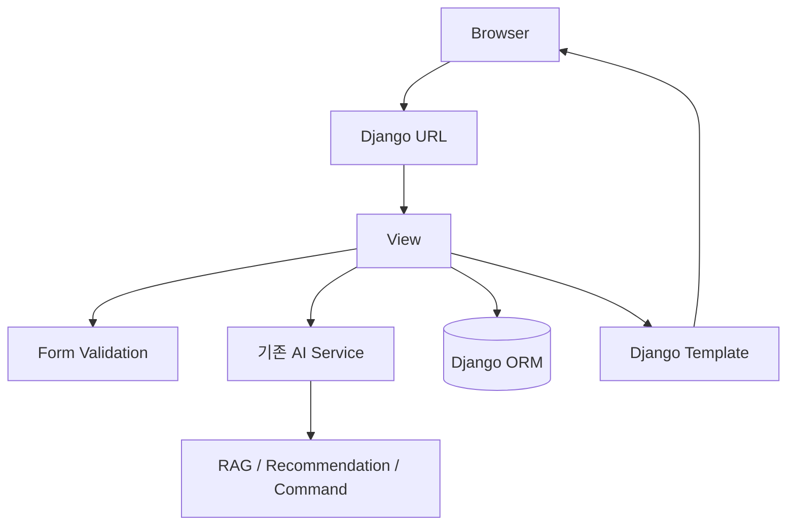
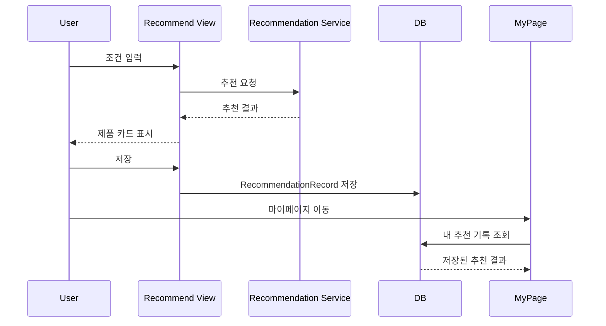
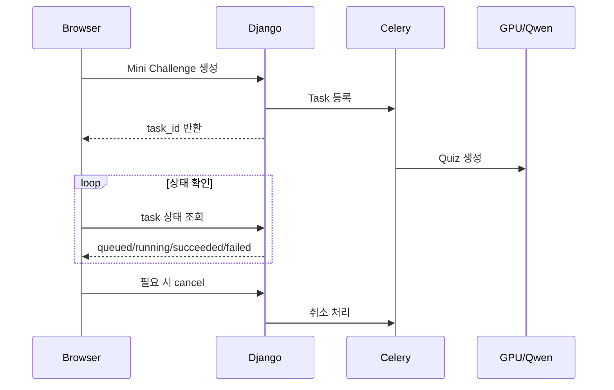
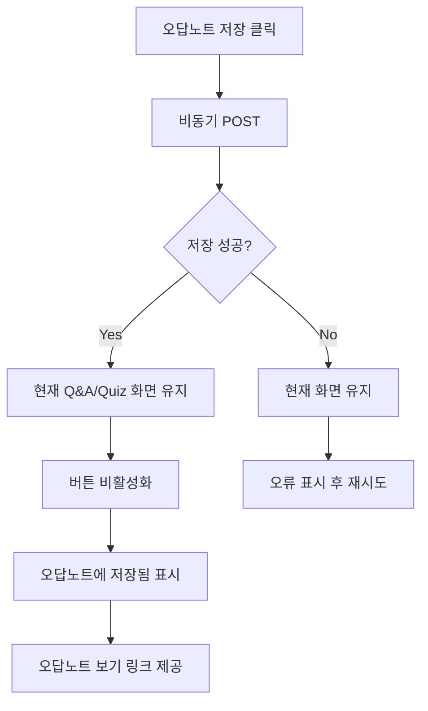
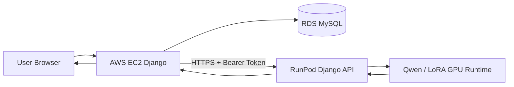

# 최지흠 작업 정리 — PiCare 4차 프로젝트

> 작성 기준: 현재 저장소의 Git 이력과 실제 코드 구조를 기준으로 정리했습니다.  
> 팀원이 원개발한 기능은 개인 작업으로 과장하지 않고, 직접 구현·통합·수정한 범위를 중심으로 기술합니다.

---

## 1. 한눈에 보는 담당 범위

4차 프로젝트에서는 기존 AI 기능을 실제 사용 가능한 Django 웹 서비스로 연결하는 작업을 중심으로 담당했습니다.

- Streamlit 중심 구조를 Django 웹 구조로 전환
- Q&A / 제품 추천 / Command Lab / Mini Challenge 화면 연결
- 회원가입·로그인·마이페이지 등 사용자 화면 구현
- 제품 추천 결과 저장 및 조회 기능 연결
- Mini Challenge 비동기 생성·상태 조회·취소 UI 연결
- 오답노트 저장 UX 개선
- RunPod API의 FastAPI 의존성을 제거하고 Django HTTP View로 전환
- AWS Django와 RunPod GPU 서버 사이의 원격 AI 호출 구조 정리



아키텍처상 직접 담당 축은 `Django Frontend`이며, 실제 구현 과정에서는 Frontend와 Backend 사이의 서비스 연결부까지 함께 작업했습니다.

---

## 2. 전체 작업 흐름



4차 프로젝트에서는 **기존 AI 기능 → Django 웹 화면 → 사용자 저장 기능 → 비동기 작업 → 원격 GPU 서버 연결**까지 실제 서비스 흐름을 연결한 것이 작업의 핵심입니다.

---

## 3. Streamlit에서 Django 웹 서비스로 전환

대표 커밋:

- `055cdaa` — 기존 Streamlit → Django 변경 및 환경 맞춤
- `7ec7c75` — 회원가입 추가 및 전체 프론트 구현

주요 파일:

- `web_app/manage.py`
- `web_app/picare_web/settings.py`
- `web_app/picare_web/urls.py`
- `web_app/portal/forms.py`
- `web_app/portal/services.py`
- `web_app/portal/views.py`
- `web_app/templates/portal/*.html`
- `web_app/static/portal/css/picare.css`

### 3.1 Django 프로젝트 골격 구성

기존 Streamlit UI는 빠른 AI 데모에는 적합하지만 다음 기능을 붙이기 어려웠습니다.

- 사용자 로그인 상태
- URL별 독립 화면
- DB 기반 사용자 기록
- 게시판·마이페이지
- 세션과 CSRF 보호
- 일반 웹 폼과 비동기 API의 혼합

그래서 AI 서비스 코드를 그대로 버리지 않고, Django View와 서비스 어댑터가 기존 도메인 서비스를 호출하는 형태로 전환했습니다.



### 3.2 단순 UI 재작성보다 중요한 부분

기존 AI 코드가 Django에 직접 종속되지 않도록 `portal/services.py`와 View 계층에서 연결했습니다.

즉,

```text
기존 Python 도메인 서비스
        ↑
Django Adapter / Service
        ↑
View + Form
        ↑
Template
```

형태를 유지해 AI 로직과 웹 프레임워크의 책임을 분리했습니다.

---

## 4. 전체 웹 프론트 구현 및 통합

`7ec7c75` 커밋에서 Django 웹 화면과 사용자 인증 영역을 크게 확장했습니다.

구현·연결한 주요 화면은 다음과 같습니다.

| 화면 | 경로 | 주요 역할 |
| --- | --- | --- |
| 서비스 소개 | `/` | PiCare 기능 안내 |
| 제품 추천 | `/recommend/` | 추천 조건 입력 및 결과 표시 |
| Q&A | `/qa/` | RAG 질문·답변·citation 표시 |
| 질문 아카이브 | `/questions/` | 질문 목록 UI |
| 질문 상세 | `/questions/<id>/` | 질문/답변 상세 UI |
| Command Lab | `/lab/` | 명령어 분석 및 안전한 입력 |
| 회원가입 | `/accounts/signup/` | 사용자 생성 |
| 로그인 | `/accounts/login/` | 세션 인증 |
| 마이페이지 | `/mypage/` | 사용자 활동 통합 |

### Frontend에서 처리한 핵심 문제

- AI 응답이 길어져도 읽기 쉬운 답변 영역 구성
- Citation과 출처 카드 표시
- 제품 추천 결과 카드 렌더링
- 로그인 여부에 따라 저장 기능 노출
- 비동기 AI 작업의 로딩/취소/실패 상태 표시
- 공통 Navbar와 전체 레이아웃 정리

### 웹 화면에서 사용하는 제품 이미지 예시


제품 이미지·URL·사양은 LLM이 임의 생성하는 값이 아니라 프로젝트의 검증된 제품 데이터와 연결해 웹에서 표시하도록 설계했습니다.

---

## 5. 회원가입·로그인 및 사용자 영역

대표 커밋:

- `7ec7c75` — 회원가입 및 전체 Frontend
- `11f1eaf` — 회원가입 시 인증 관련 작업 및 추천 상세 흐름 확장

주요 파일:

- `web_app/accounts/forms.py`
- `web_app/accounts/views.py`
- `web_app/accounts/urls.py`
- `web_app/templates/accounts/login.html`
- `web_app/templates/accounts/signup.html`
- `web_app/templates/portal/mypage.html`

### 구현 흐름

```text
회원가입 Form
→ Django Form Validation
→ User 생성
→ Login Session
→ 사용자별 저장 데이터 조회
```

Django 인증 시스템을 활용해 Q&A·추천·오답노트·커뮤니티 등 이후 기능에서 사용자별 데이터를 구분할 수 있는 기반을 연결했습니다.

---

## 6. 제품 추천 결과 저장 및 마이페이지 연동

대표 커밋:

- `9bfe48a` — 공통 결과 Frontend 연동 및 제품 추천 기록 모델 추가
- `11f1eaf` — 추천 목록·상세 화면 및 사용자 흐름 확장

주요 파일:

- `web_app/portal/models.py`
- `web_app/portal/views.py`
- `web_app/portal/result_service.py`
- `web_app/templates/portal/recommend.html`
- `web_app/templates/portal/mypage_recommendations.html`
- `web_app/templates/portal/recommendation_detail.html`
- `web_app/templates/portal/recommendation_products.html`

### 문제

추천 결과가 한 번 화면에 출력되고 끝나면 사용자가 나중에 어떤 조건으로 어떤 제품을 추천받았는지 확인할 수 없습니다.

### 개선

추천 결과를 사용자 계정과 연결해 저장하도록 모델과 화면을 추가했습니다.



테스트도 별도 추가해 사용자별 목록·상세·삭제 흐름을 검증했습니다.

---

## 7. Q&A 기반 Dynamic Mini Challenge 웹 연동

대표 커밋:

- `6b2eba2` — Q&A 기반 취소 가능한 동적 Mini Challenge 연동

> Mini Challenge의 모델 생성/검증 도메인 자체는 팀원 담당 영역입니다.  
> 여기서는 **Q&A 화면에서 이를 실제 사용 가능한 비동기 웹 기능으로 연결한 작업**을 중심으로 정리합니다.

주요 파일:

- `web_app/portal/tasks.py`
- `web_app/portal/views.py`
- `web_app/portal/urls.py`
- `web_app/templates/portal/qa.html`
- `web_app/templates/portal/quiz_panel.html`
- `web_app/picare_web/celery.py`
- `compose.yaml`

### 7.1 기존 문제

Qwen으로 Quiz를 생성하면 시간이 걸릴 수 있기 때문에 일반 Django 요청 한 번으로 끝날 때까지 기다리게 하면 다음 문제가 생깁니다.

- 요청 시간이 길어짐
- 사용자가 취소하기 어려움
- 브라우저가 멈춘 것처럼 보임
- GPU 작업 상태를 화면에서 알 수 없음

### 7.2 비동기 작업으로 전환



웹 사용자는 Q&A 답변을 읽으면서 Quiz 생성 상태를 확인할 수 있고, 필요하면 생성 작업을 취소할 수 있도록 연결했습니다.

---

## 8. Mini Challenge 로딩 스피너 버그 수정

대표 커밋:

- `f58c803` — 미니 챌린지 로딩 스피너 숨김 처리 수정

주요 파일:

- `web_app/templates/portal/quiz_panel.html`
- `web_app/portal/tests.py`

### 원인

HTML의 `hidden` 속성으로 로딩 요소를 숨기고 있었지만 같은 요소에 Bootstrap의 `d-flex`가 함께 적용돼 있었습니다.

Bootstrap의 `d-flex`는 다음과 같이 `display`를 강제로 적용합니다.

```css
display: flex !important;
```

따라서 JavaScript에서 다음처럼 처리해도:

```javascript
loading.hidden = true;
```

`d-flex`의 `!important` 때문에 스피너가 계속 보일 수 있었습니다.

### 수정 방식

`hidden`의 대상이 되는 바깥 요소와 Flex Layout을 담당하는 내부 요소를 분리했습니다.

```text
Before
[hidden 제어 + d-flex]

After
[hidden 제어]
  └─ [d-flex 레이아웃]
```

JavaScript 로직을 복잡하게 바꾸지 않고 HTML 구조만 최소 변경해 성공·취소·실패 상태에서 로딩 표시가 정상적으로 사라지게 했습니다.

---

## 9. 오답노트 저장 후 문제 화면 유지

대표 커밋:

- `a2677d9` — 오답노트 저장 후 문제 풀이 화면 유지

주요 파일:

- `web_app/portal/views.py`
- `web_app/templates/portal/qa.html`
- `web_app/portal/tests.py`

### 기존 문제

오답노트 저장 버튼이 일반 HTML Form Submit으로 동작했습니다.

```text
오답 문제 확인
→ "오답노트에 저장"
→ POST
→ 서버 Redirect
→ 오답노트 상세 페이지 이동
```

이 때문에 한 문제만 저장해도 현재 풀고 있던 다른 Mini Challenge 문제가 화면에서 사라졌습니다.

### 개선 구조

일반 Form 요청의 기존 Redirect 동작은 유지하면서, JavaScript 요청일 때는 JSON 응답을 주도록 확장했습니다.



### 호환성 유지

같은 URL을 사용하면서 두 사용 방식을 모두 지원합니다.

```text
일반 Form POST  → 기존처럼 상세 페이지 Redirect
JavaScript POST → JSON 성공/실패 응답, 화면 유지
```

즉, 기존 서버 인터페이스를 깨지 않고 UX만 개선했습니다.

---

## 10. RunPod API에서 FastAPI 제거 후 Django로 통일

대표 커밋:

- `51447bf` — FastAPI → Django 전환

주요 파일:

- `src/runpod_api/app.py`
- `src/runpod_api/urls.py`
- `src/runpod_api/__main__.py`
- `src/runpod_api/jobs.py`
- `src/runpod_api/runtime.py`
- `web_app/portal/remote_ai.py`
- `Dockerfile.runpod`

### 변경 배경

웹 애플리케이션은 Django를 사용하고 있었는데 RunPod AI API만 FastAPI를 사용하면 다음 부담이 생깁니다.

- 웹 프레임워크가 2개로 증가
- 별도의 FastAPI lifecycle과 인증 방식을 이해해야 함
- 의존성 증가
- 팀에서 배우지 않은 프레임워크가 운영 코드에 포함됨

기존 API 계약 자체는 필요했기 때문에 API를 없애는 대신 Django View로 같은 역할을 구현했습니다.

### 기존 구조

```text
AWS Django
   ↓ requests
RunPod FastAPI
   ↓
Job Manager
   ↓
Qwen Runtime
```

### 변경 구조

```text
AWS Django
   ↓ requests
RunPod Django HTTP Views
   ↓
Job Manager
   ↓
Qwen Runtime
```

### 유지한 API 기능

- `GET /health/live`
- `GET /health/ready`
- `POST /v1/jobs`
- `GET /v1/jobs/<job_id>`
- `POST /v1/jobs/<job_id>/cancel`
- Bearer Token 인증
- Queue Full / Not Found / Conflict 상태 처리

즉, AWS 쪽 `requests` 호출 계약을 유지하면서 RunPod 서버 프레임워크만 Django로 통일했습니다.

### 인증 처리

RunPod API에서는 Authorization Header의 Bearer Token을 서버 설정과 비교합니다.

```text
Authorization: Bearer <AI_API_TOKEN>
```

토큰은 URL이나 코드에 포함하지 않고 환경 변수로 전달하도록 구성했습니다.

---

## 11. AWS ↔ RunPod 연동에서 맡은 연결 지점

AWS 배포 작업은 현재 진행 중인 영역이며, 저장소에는 이미 원격 AI 호출을 위한 경계가 존재합니다.

관련 파일:

- `Dockerfile.aws`
- `deploy/aws-entrypoint.sh`
- `deploy/aws.env.example`
- `web_app/portal/remote_ai.py`
- `src/runpod_api/*`

직접 수정한 핵심 연결부는 `web_app/portal/remote_ai.py`와 Django로 전환한 `src/runpod_api/*`입니다.



### AWS 서버가 담당할 영역

- Django UI
- 사용자 인증·세션
- 사용자 DB 기록
- RDS 접근
- RunPod 작업 요청 및 상태 조회

### RunPod가 담당할 영역

- GPU 모델 로딩
- Qwen 추론
- LoRA/QLoRA 관련 모델 실행
- AI Job Queue
- 생성 작업 취소

GPU 라이브러리를 AWS 웹 서버에 올리지 않고 AI 실행 책임을 RunPod 쪽으로 분리하는 구조입니다.

---

## 12. 테스트와 검증 작업

기능 구현뿐 아니라 각 변경에 테스트를 함께 추가했습니다.

대표 테스트 파일:

- `tests/test_django_web.py`
- `tests/test_django_auth.py`
- `web_app/portal/tests.py`
- `web_app/portal/test_recommendation_models.py`
- `web_app/portal/test_recommendation_views.py`

### 검증한 주요 시나리오

#### Django

- URL/View 응답
- 회원가입·로그인
- 사용자별 추천 기록
- Mini Challenge 작업 상태
- 취소·실패 처리
- 오답노트 비동기 저장

UI 버그 수정에도 회귀 테스트를 추가해 같은 문제가 재발하지 않도록 했습니다.

---

## 13. 주요 Git 작업 이력

아래는 작업의 흐름을 파악하기 좋은 대표 커밋입니다.

| 날짜 | Commit | 내용 |
| --- | --- | --- |
| 09-11 | `055cdaa` | Streamlit → Django 전환 |
| 09-14 | `7ec7c75` | 전체 Frontend·회원가입 구현 |
| 09-17 | `6b2eba2` | 비동기 Mini Challenge 웹 연동 |
| 09-17 | `9bfe48a` | 추천 결과 저장·Frontend 연동 |
| 09-17 | `11f1eaf` | 추천 상세·사용자 인증 흐름 보완 |
| 09-18 | `51447bf` | RunPod FastAPI → Django 전환 |
| 09-18 | `f58c803` | 로딩 스피너 버그 수정 |
| 09-18 | `a2677d9` | 오답노트 저장 UX 수정 |

> 일부 Git 커밋은 팀 작업을 main에 통합하는 과정에서 현재 Git author가 동일하게 기록돼 있습니다.  
> 커밋 메시지에 다른 팀원 이름이 명시된 통합 커밋은 이 문서의 개인 원개발 성과로 포함하지 않았습니다.

---

## 14. 문제 해결 관점에서 본 기여

### 문제 1. Streamlit만으로 사용자 서비스 기능을 확장하기 어렵다

**해결:** AI 서비스는 유지하고 Django URL/View/Form/Template 구조로 웹 계층 전환.

### 문제 2. GPU Quiz 생성이 오래 걸려 웹 요청을 잡고 있다

**해결:** Celery 기반 비동기 작업과 상태 조회·취소 UI 연결.

### 문제 3. Bootstrap 때문에 `hidden`이 정상 작동하지 않는다

**해결:** 상태 제어 요소와 `d-flex` 레이아웃 요소 분리.

### 문제 4. 오답노트 저장 시 현재 문제 풀이 화면이 사라진다

**해결:** 비동기 JSON 저장을 추가하면서 기존 Form Redirect도 유지.

### 문제 5. 팀이 사용하지 않은 FastAPI가 RunPod 운영 코드에 남아 있다

**해결:** API 계약은 유지하고 Django HTTP View로 전환해 프레임워크 일원화.

---

## 15. 이 작업에서 드러나는 기술 역량

### Backend / Web

- Django URL / View / Form / Template
- Django ORM
- Authentication / Session
- JSON API와 일반 Form 요청 병행
- 비동기 작업 상태 UI
- MySQL 연동

### AI 서비스 통합

- 기존 Q&A·추천·Quiz 기능의 Django 웹 연결
- Celery 기반 AI 작업 상태 조회·취소
- AWS 웹 서버와 RunPod GPU 실행 환경 분리
- HTTP API 계약 및 Bearer Token 인증

### Infra / Integration

- Docker / Docker Compose
- RunPod GPU 환경
- AWS Django 배포 구조
- 원격 AI API
- Bearer Token 인증

### Quality

- pytest 기반 단위·통합 테스트
- UI 회귀 테스트
- 데이터 계약 검증
- 환경별 requirements 분리

---

## 16. 포트폴리오용 요약

### 한 문장

> 기존 AI 기능을 Django 웹 서비스로 전환하고, 사용자 인증·추천 기록·비동기 Mini Challenge·오답노트 UX와 AWS–RunPod 원격 AI 연동 구조를 구현했습니다.

### 짧은 버전

> PiCare 4차 프로젝트에서 기존 Streamlit 중심 기능을 Django 웹 서비스로 전환했습니다. Q&A와 제품 추천을 웹 화면에 연결하고 회원가입·로그인·마이페이지·추천 기록을 구현했으며, 팀원이 만든 Mini Challenge 생성 기능은 비동기 실행·상태 조회·취소가 가능한 UI로 통합했습니다. 이후 AWS Django와 RunPod GPU 서버를 분리하는 원격 API 구조를 정리하고 RunPod API의 FastAPI 의존성을 제거해 Django 기반으로 통일했습니다.

### 면접 설명용

> 4차 프로젝트에서는 기존 AI 기능을 실제 사용 가능한 Django 서비스로 만드는 작업을 중심으로 담당했습니다. Streamlit 중심 화면을 Django URL/View/Form/Template 구조로 전환하고 Q&A, 제품 추천, 회원가입, 로그인, 마이페이지와 추천 기록을 연결했습니다. Mini Challenge는 팀원이 만든 생성 로직을 웹에서 비동기로 실행하고 상태를 확인하거나 취소할 수 있도록 통합했으며, 로딩 스피너와 오답노트 저장 과정에서 발생한 UX 문제도 수정했습니다. AWS 배포 구조를 정리하는 과정에서는 웹 서버와 RunPod GPU 서버 사이의 원격 API 경계를 구성하고, RunPod API의 FastAPI 의존성을 Django View 기반으로 전환했습니다.

---

## 17. 코드 위치 빠른 색인

| 작업 | 핵심 위치 |
| --- | --- |
| Django 설정 | `web_app/picare_web/settings.py` |
| Web View | `web_app/portal/views.py` |
| Form | `web_app/portal/forms.py` |
| 사용자 Model | `web_app/portal/models.py` |
| Q&A 화면 | `web_app/templates/portal/qa.html` |
| Quiz 패널 | `web_app/templates/portal/quiz_panel.html` |
| 제품 추천 화면 | `web_app/templates/portal/recommend.html` |
| 인증 화면 | `web_app/templates/accounts/` |
| RunPod Django API | `src/runpod_api/` |
| AWS → RunPod Client | `web_app/portal/remote_ai.py` |
| AWS Container | `Dockerfile.aws` |
| AWS Entry Point | `deploy/aws-entrypoint.sh` |

---

## 18. 최종 정리

최지흠의 4차 프로젝트 작업은 크게 세 가지 가치로 요약할 수 있습니다.

1. **AI 데모를 사용자 서비스로 바꾸는 작업**
   Streamlit 중심의 기능을 Django로 옮기고 인증·DB·마이페이지·비동기 UI까지 연결했습니다.

2. **기존 AI 기능을 웹에서 안정적으로 사용하는 연결 작업**
   팀원이 구현한 AI 도메인 기능을 웹 화면, Celery 작업, 저장 기능과 연결하고 AWS–RunPod 원격 호출 경계를 정리했습니다.

3. **사용 중 발견되는 문제를 구조적으로 수정하는 작업**
   로딩 상태 충돌, 오답노트 Redirect, 불필요한 FastAPI 의존성처럼 실제 사용과 유지보수 과정에서 발견된 문제를 원인 단위로 수정했습니다.

결과적으로 4차 프로젝트 작업 범위는 단순 화면 구현에 그치지 않고 **Django 서비스화 → 사용자 기능 → 비동기 AI UX → 원격 GPU 인프라 연결**까지 이어지는 웹 서비스 통합 경험으로 정리할 수 있습니다.
