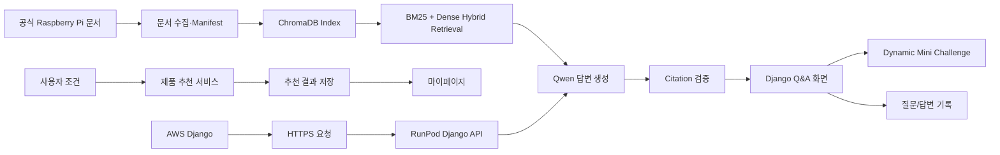
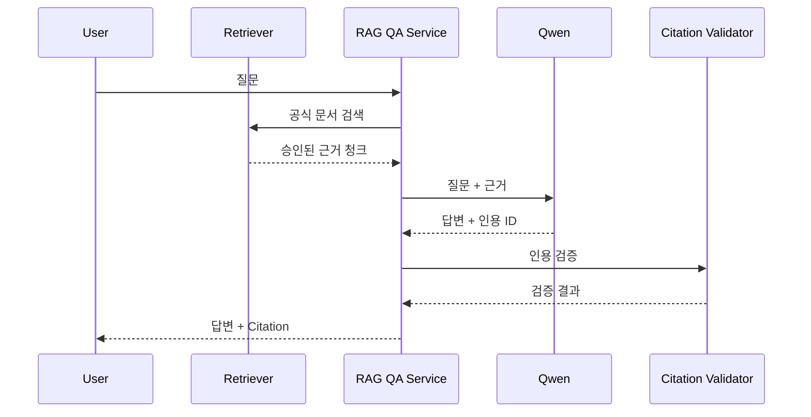
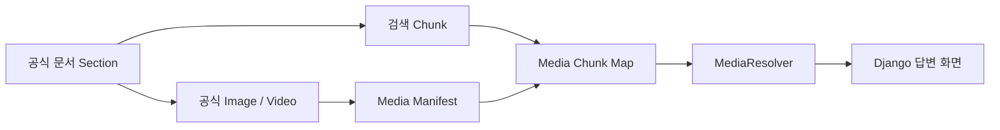
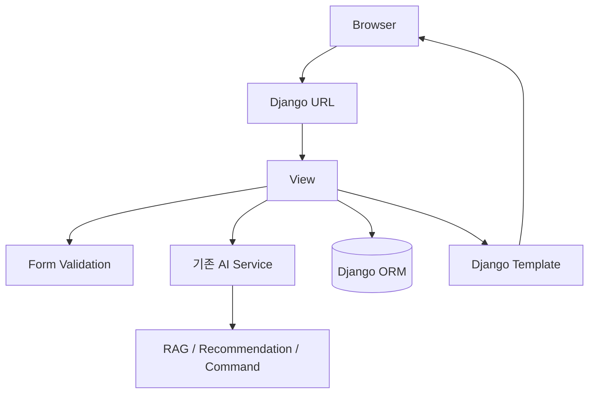
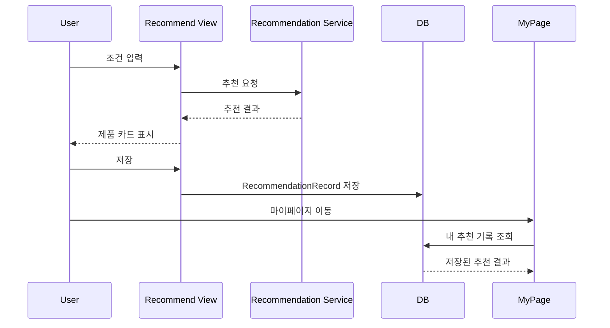
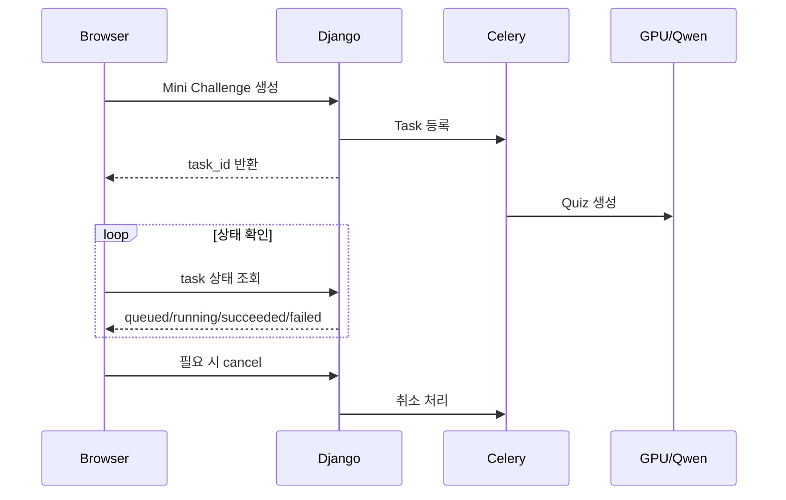
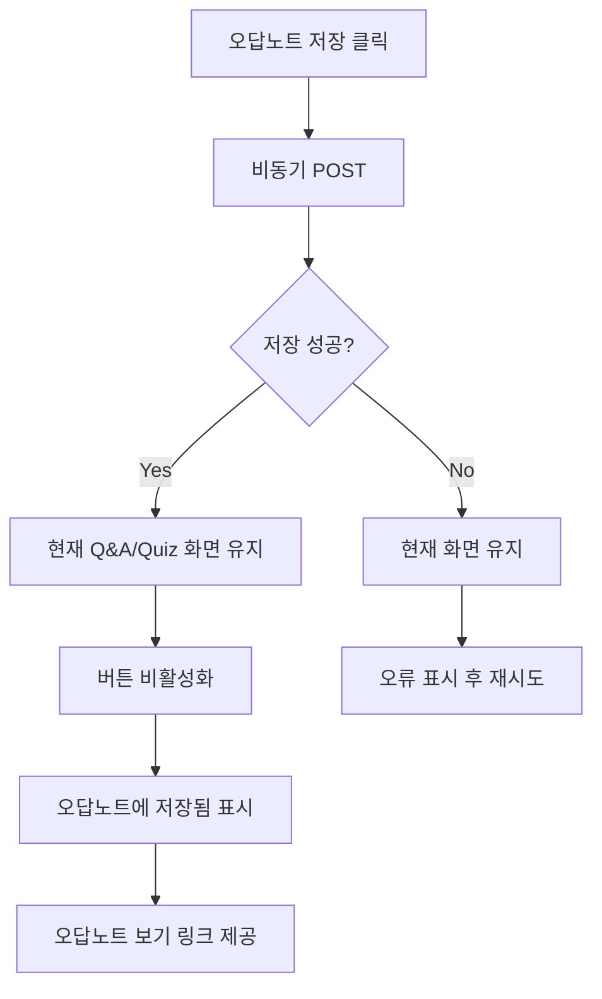
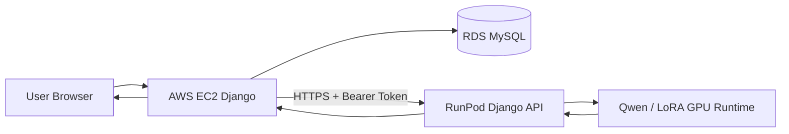

# 최지흠 작업 정리 — PiCare 3차 RAG 기반부터 4차 Django 웹 통합까지

> 작성 기준: 현재 저장소의 Git 이력과 실제 코드 구조를 기준으로 정리했습니다.  
> 팀원이 원개발한 기능은 개인 작업으로 과장하지 않고, 직접 구현·통합·수정한 범위를 중심으로 기술합니다.

---

## 1. 한눈에 보는 담당 범위

최지흠의 작업은 크게 두 시기로 나눌 수 있습니다.

1. **RAG·문서 파이프라인 기반 구축 및 안정화**
   - ChromaDB 기반 Vector DB 색인
   - BM25 + Dense Hybrid Retrieval
   - 문서 Manifest 계약 연동
   - Qwen 답변 생성과 citation 검증
   - 공식 문서 미디어와 RAG 청크 연결
   - RunPod에서 사용할 실행 환경 분리

2. **4차 프로젝트 Django 웹 전환 및 서비스 통합**
   - Streamlit 중심 구조를 Django 웹 구조로 전환
   - Q&A / 제품 추천 / Command Lab / Mini Challenge 화면 연결
   - 회원가입·로그인·마이페이지 등 사용자 화면 구현
   - 추천 결과 저장 및 조회 기능 연결
   - Mini Challenge 비동기 생성·취소 UI 연결
   - 오답노트 저장 UX 개선
   - RunPod API의 FastAPI 의존성을 제거하고 Django HTTP View로 전환

현재 4차 프로젝트 역할표에서는 **Frontend 담당**으로 표시되어 있지만, Git 이력을 보면 이전 단계에서 RAG 및 문서 파이프라인의 핵심 기반 작업도 직접 수행했습니다.


위 아키텍처에서 4차 프로젝트의 직접 담당 축은 `Django Frontend`이며, 실제 구현 과정에서는 Frontend와 Backend 사이의 서비스 연결부까지 함께 작업했습니다.

---

## 2. 전체 작업 흐름



개별 기능만 구현한 것이 아니라, **데이터 → 검색 → 생성 → 검증 → 웹 화면 → 저장 → 원격 AI 서버 연결**까지 여러 계층을 연결한 것이 작업의 특징입니다.

---

## 3. RAG 기본 구조 구축

### 3.1 최초 RAG 모듈 구성

대표 커밋:

- `597fd96` — RAG 기본 커밋
- `f49697f` — ChromaDB 설정 및 색인 기능 추가
- `a3fae0a` — Hybrid 검색 필터 및 검증 기능 추가
- `4b4a3eb` — Hybrid 검색 데모 및 사용 가이드

주요 파일:

- `src/rag/models.py`
- `src/rag/indexer.py`
- `src/rag/retriever.py`
- `src/rag/settings.py`
- `src/rag/chroma_metadata.py`
- `tests/test_rag.py`

초기 단계에서는 단순히 Vector DB에서 가까운 문장을 가져오는 수준이 아니라, 이후 서비스 코드가 재사용할 수 있도록 RAG 계층을 별도 모듈로 분리했습니다.

### 핵심 역할

```text
문서 청크
  ↓
Embedding
  ↓
ChromaDB 저장
  ↓
질문 입력
  ↓
Dense 검색 + BM25 검색
  ↓
점수 결합 및 필터링
  ↓
근거 청크 반환
```

### 구현 포인트

#### ChromaDB 설정 분리

Vector DB 경로와 컬렉션 설정을 코드에 직접 박아두지 않고 설정 계층으로 분리해 로컬·RunPod 등 환경별로 변경할 수 있도록 했습니다.

#### Hybrid Retrieval

Dense 검색만 사용할 경우 표현이 비슷하지만 실제 명령어나 제품명이 다른 문서를 가져올 수 있습니다. 이를 보완하기 위해 BM25의 키워드 일치도와 Dense Embedding의 의미 유사도를 함께 사용했습니다.

예를 들면 다음과 같은 질문에서 두 방식의 장점을 동시에 활용합니다.

```text
"모니터 없이 Raspberry Pi에 SSH로 접속하려면?"
```

- Dense: `headless`, `remote access`, `SSH`와 의미상 가까운 문서 탐색
- BM25: `SSH`, `Raspberry Pi` 등 정확한 키워드 반영

### 검색 결과 검증

검색 결과를 그대로 LLM에 전달하는 대신, 허용된 문서·메타데이터·필터 조건을 확인하는 단계를 추가했습니다.

이 구조는 이후 Q&A와 제품 추천이 동일한 검색 기반을 공유할 수 있게 만드는 기반이 됐습니다.

---

## 4. RAG와 Qwen LLM 연결

대표 커밋:

- `3066275` — RAG 기반 LLM 연결 테스트
- `cb44e3c` — Qwen 근거 인용 검증 및 1회 형식 수정 재생성 추가
- `228703c` — Qwen citation 응답 방식 대응
- `f2331e7` — Hugging Face 모델 로컬 실행 대응

주요 파일:

- `src/rag_to_llm/answer_generator.py`
- `src/rag_to_llm/settings.py`
- `src/services/rag_qa_service.py`
- `src/services/grounded_generation.py`
- `src/services/rag_qa_cli.py`
- `tests/test_rag_qa_service.py`

### 4.1 검색과 생성을 분리

RAG Retriever가 찾은 근거와 Qwen의 답변 생성 책임을 분리했습니다.



LLM이 답을 만들었다는 이유만으로 사용자에게 바로 노출하지 않고, 실제 검색 근거와 응답의 citation을 대조하도록 구성했습니다.

### 4.2 근거 기반 응답 검증

`grounded_generation.py`를 통해 다음을 확인하는 구조를 추가했습니다.

- 모델이 허용되지 않은 citation ID를 생성하지 않는지
- 답변이 요구된 응답 형식을 지키는지
- 검색된 근거 범위 안에서 답변하는지
- 형식 오류가 있으면 제한적으로 재생성할지

핵심 목적은 **LLM의 자유 생성 범위를 줄이고, 공식 문서 근거를 서버 코드가 다시 검증하는 것**입니다.

---

## 5. 공식 문서 Manifest 및 문서 파이프라인 확장

대표 커밋:

- `2a4e247` — 원본 문서와 RAG 적용 데이터 분리 및 Manifest 파이프라인 확장
- `dfab65b` — Manifest 1.1 v3 corpus 생성 계약 보완
- `2a29925` — Manifest 검증 및 Chroma 색인 안정화
- `80b01ef` — 문서 수집부터 Chroma 재색인까지 단일 파이프라인 연결

주요 파일:

- `document_pipeline/ingestion/fetch.py`
- `document_pipeline/ingestion/build_manifest.py`
- `document_pipeline/ingestion/run_pipeline.py`
- `document_pipeline/ingestion/validate_foundation.py`
- `document_pipeline/data/source_registry_v2.csv`
- `src/rag/adapters.py`

### 5.1 원본과 가공 데이터를 분리

공식 문서 원본과 RAG에서 실제 사용하는 데이터를 분리했습니다.

```text
Official Document
      ↓
raw 원문
      ↓
파싱된 section
      ↓
검증된 chunk
      ↓
manifest.json
      ↓
ChromaDB
```

이 구조의 장점은 다음과 같습니다.

- 원문과 가공 결과의 경계를 명확히 유지
- 어떤 공식 문서 버전으로 RAG를 만들었는지 추적 가능
- 재색인 시 같은 입력으로 결과를 재현하기 쉬움
- 품질 검증에 실패한 문서를 검색 대상에서 제외 가능

### 5.2 단일 실행 파이프라인

`run_pipeline` 한 번으로 다음 작업이 연결되도록 개선했습니다.

```text
공식 문서 수집
→ 파싱·청킹
→ document manifest
→ media manifest
→ media ↔ chunk 연결
→ Chroma 전체 재색인
```

팀원이 각각의 생성 스크립트를 순서대로 실행하다 빠뜨리는 문제를 줄이고, 데이터 재생성 절차를 단순화했습니다.

---

## 6. 미디어 RAG 연결

대표 커밋:

- `80b01ef` — media manifest와 Chroma 파이프라인 통합
- `48d082a` — `media_chunk_map_v3` 실제 적용
- `cb74f45` — `MediaResolver` 적용 누락 수정

관련 파일:

- `assets/media/`
- `src/services/media_lookup.py`
- `document_pipeline/ingestion/run_pipeline.py`
- `tests/test_media_lookup.py`

텍스트 답변에 단순 이미지를 임의로 붙이는 것이 아니라, **공식 문서의 이미지가 어떤 검색 청크와 연결되는지 미리 매핑**하도록 구성했습니다.

### 실제 웹에 표시 가능한 프로젝트 미디어 예시

#### Raspberry Pi Imager 설정 화면


이 이미지는 사용자가 Raspberry Pi OS 설치 방법을 질문했을 때 관련 공식 문서 근거와 함께 노출할 수 있는 미디어 자산입니다.

#### SSH 설정 화면


#### GPIO Pinout


### 미디어 연결 흐름



이를 통해 검색 결과와 무관한 이미지가 답변에 붙는 것을 줄이고, **검색 근거와 같은 문서·섹션에 속한 미디어**만 연결할 수 있도록 했습니다.

---

## 7. Streamlit에서 Django 웹 서비스로 전환

대표 커밋:

- `055cdaa` — 기존 Streamlit → Django 변경 및 환경 맞춤
- `7ec7c75` — 회원가입 추가 및 전체 프론트 구현

주요 파일:

- `web_app/manage.py`
- `web_app/picare_web/settings.py`
- `web_app/picare_web/urls.py`
- `web_app/portal/forms.py`
- `web_app/portal/services.py`
- `web_app/portal/views.py`
- `web_app/templates/portal/*.html`
- `web_app/static/portal/css/picare.css`

### 7.1 Django 프로젝트 골격 구성

기존 Streamlit UI는 빠른 AI 데모에는 적합하지만 다음 기능을 붙이기 어려웠습니다.

- 사용자 로그인 상태
- URL별 독립 화면
- DB 기반 사용자 기록
- 게시판·마이페이지
- 세션과 CSRF 보호
- 일반 웹 폼과 비동기 API의 혼합

그래서 AI 서비스 코드를 그대로 버리지 않고, Django View와 서비스 어댑터가 기존 도메인 서비스를 호출하는 형태로 전환했습니다.



### 7.2 단순 UI 재작성보다 중요한 부분

기존 AI 코드가 Django에 직접 종속되지 않도록 `portal/services.py`와 View 계층에서 연결했습니다.

즉,

```text
기존 Python 도메인 서비스
        ↑
Django Adapter / Service
        ↑
View + Form
        ↑
Template
```

형태를 유지해 AI 로직과 웹 프레임워크의 책임을 분리했습니다.

---

## 8. 전체 웹 프론트 구현 및 통합

`7ec7c75` 커밋에서 Django 웹 화면과 사용자 인증 영역을 크게 확장했습니다.

구현·연결한 주요 화면은 다음과 같습니다.

| 화면 | 경로 | 주요 역할 |
| --- | --- | --- |
| 서비스 소개 | `/` | PiCare 기능 안내 |
| 제품 추천 | `/recommend/` | 추천 조건 입력 및 결과 표시 |
| Q&A | `/qa/` | RAG 질문·답변·citation 표시 |
| 질문 아카이브 | `/questions/` | 질문 목록 UI |
| 질문 상세 | `/questions/<id>/` | 질문/답변 상세 UI |
| Command Lab | `/lab/` | 명령어 분석 및 안전한 입력 |
| 회원가입 | `/accounts/signup/` | 사용자 생성 |
| 로그인 | `/accounts/login/` | 세션 인증 |
| 마이페이지 | `/mypage/` | 사용자 활동 통합 |

### Frontend에서 처리한 핵심 문제

- AI 응답이 길어져도 읽기 쉬운 답변 영역 구성
- Citation과 출처 카드 표시
- 제품 추천 결과 카드 렌더링
- 로그인 여부에 따라 저장 기능 노출
- 비동기 AI 작업의 로딩/취소/실패 상태 표시
- 공통 Navbar와 전체 레이아웃 정리

### 웹 화면에서 사용하는 제품 이미지 예시


제품 이미지·URL·사양은 LLM이 임의 생성하는 값이 아니라 프로젝트의 검증된 제품 데이터와 연결해 웹에서 표시하도록 설계했습니다.

---

## 9. 회원가입·로그인 및 사용자 영역

대표 커밋:

- `7ec7c75` — 회원가입 및 전체 Frontend
- `11f1eaf` — 회원가입 시 인증 관련 작업 및 추천 상세 흐름 확장

주요 파일:

- `web_app/accounts/forms.py`
- `web_app/accounts/views.py`
- `web_app/accounts/urls.py`
- `web_app/templates/accounts/login.html`
- `web_app/templates/accounts/signup.html`
- `web_app/templates/portal/mypage.html`

### 구현 흐름

```text
회원가입 Form
→ Django Form Validation
→ User 생성
→ Login Session
→ 사용자별 저장 데이터 조회
```

Django 인증 시스템을 활용해 Q&A·추천·오답노트·커뮤니티 등 이후 기능에서 사용자별 데이터를 구분할 수 있는 기반을 연결했습니다.

---

## 10. 제품 추천 결과 저장 및 마이페이지 연동

대표 커밋:

- `9bfe48a` — 공통 결과 Frontend 연동 및 제품 추천 기록 모델 추가
- `11f1eaf` — 추천 목록·상세 화면 및 사용자 흐름 확장

주요 파일:

- `web_app/portal/models.py`
- `web_app/portal/views.py`
- `web_app/portal/result_service.py`
- `web_app/templates/portal/recommend.html`
- `web_app/templates/portal/mypage_recommendations.html`
- `web_app/templates/portal/recommendation_detail.html`
- `web_app/templates/portal/recommendation_products.html`

### 문제

추천 결과가 한 번 화면에 출력되고 끝나면 사용자가 나중에 어떤 조건으로 어떤 제품을 추천받았는지 확인할 수 없습니다.

### 개선

추천 결과를 사용자 계정과 연결해 저장하도록 모델과 화면을 추가했습니다.



테스트도 별도 추가해 사용자별 목록·상세·삭제 흐름을 검증했습니다.

---

## 11. Q&A 기반 Dynamic Mini Challenge 웹 연동

대표 커밋:

- `6b2eba2` — Q&A 기반 취소 가능한 동적 Mini Challenge 연동

> Mini Challenge의 모델 생성/검증 도메인 자체는 팀원 담당 영역입니다.  
> 여기서는 **Q&A 화면에서 이를 실제 사용 가능한 비동기 웹 기능으로 연결한 작업**을 중심으로 정리합니다.

주요 파일:

- `web_app/portal/tasks.py`
- `web_app/portal/views.py`
- `web_app/portal/urls.py`
- `web_app/templates/portal/qa.html`
- `web_app/templates/portal/quiz_panel.html`
- `web_app/picare_web/celery.py`
- `compose.yaml`

### 11.1 기존 문제

Qwen으로 Quiz를 생성하면 시간이 걸릴 수 있기 때문에 일반 Django 요청 한 번으로 끝날 때까지 기다리게 하면 다음 문제가 생깁니다.

- 요청 시간이 길어짐
- 사용자가 취소하기 어려움
- 브라우저가 멈춘 것처럼 보임
- GPU 작업 상태를 화면에서 알 수 없음

### 11.2 비동기 작업으로 전환



웹 사용자는 Q&A 답변을 읽으면서 Quiz 생성 상태를 확인할 수 있고, 필요하면 생성 작업을 취소할 수 있도록 연결했습니다.

---

## 12. Mini Challenge 로딩 스피너 버그 수정

대표 커밋:

- `f58c803` — 미니 챌린지 로딩 스피너 숨김 처리 수정

주요 파일:

- `web_app/templates/portal/quiz_panel.html`
- `web_app/portal/tests.py`

### 원인

HTML의 `hidden` 속성으로 로딩 요소를 숨기고 있었지만 같은 요소에 Bootstrap의 `d-flex`가 함께 적용돼 있었습니다.

Bootstrap의 `d-flex`는 다음과 같이 `display`를 강제로 적용합니다.

```css
display: flex !important;
```

따라서 JavaScript에서 다음처럼 처리해도:

```javascript
loading.hidden = true;
```

`d-flex`의 `!important` 때문에 스피너가 계속 보일 수 있었습니다.

### 수정 방식

`hidden`의 대상이 되는 바깥 요소와 Flex Layout을 담당하는 내부 요소를 분리했습니다.

```text
Before
[hidden 제어 + d-flex]

After
[hidden 제어]
  └─ [d-flex 레이아웃]
```

JavaScript 로직을 복잡하게 바꾸지 않고 HTML 구조만 최소 변경해 성공·취소·실패 상태에서 로딩 표시가 정상적으로 사라지게 했습니다.

---

## 13. 오답노트 저장 후 문제 화면 유지

대표 커밋:

- `a2677d9` — 오답노트 저장 후 문제 풀이 화면 유지

주요 파일:

- `web_app/portal/views.py`
- `web_app/templates/portal/qa.html`
- `web_app/portal/tests.py`

### 기존 문제

오답노트 저장 버튼이 일반 HTML Form Submit으로 동작했습니다.

```text
오답 문제 확인
→ "오답노트에 저장"
→ POST
→ 서버 Redirect
→ 오답노트 상세 페이지 이동
```

이 때문에 한 문제만 저장해도 현재 풀고 있던 다른 Mini Challenge 문제가 화면에서 사라졌습니다.

### 개선 구조

일반 Form 요청의 기존 Redirect 동작은 유지하면서, JavaScript 요청일 때는 JSON 응답을 주도록 확장했습니다.



### 호환성 유지

같은 URL을 사용하면서 두 사용 방식을 모두 지원합니다.

```text
일반 Form POST  → 기존처럼 상세 페이지 Redirect
JavaScript POST → JSON 성공/실패 응답, 화면 유지
```

즉, 기존 서버 인터페이스를 깨지 않고 UX만 개선했습니다.

---

## 14. RunPod API에서 FastAPI 제거 후 Django로 통일

대표 커밋:

- `51447bf` — FastAPI → Django 전환

주요 파일:

- `src/runpod_api/app.py`
- `src/runpod_api/urls.py`
- `src/runpod_api/__main__.py`
- `src/runpod_api/jobs.py`
- `src/runpod_api/runtime.py`
- `web_app/portal/remote_ai.py`
- `Dockerfile.runpod`

### 변경 배경

웹 애플리케이션은 Django를 사용하고 있었는데 RunPod AI API만 FastAPI를 사용하면 다음 부담이 생깁니다.

- 웹 프레임워크가 2개로 증가
- 별도의 FastAPI lifecycle과 인증 방식을 이해해야 함
- 의존성 증가
- 팀에서 배우지 않은 프레임워크가 운영 코드에 포함됨

기존 API 계약 자체는 필요했기 때문에 API를 없애는 대신 Django View로 같은 역할을 구현했습니다.

### 기존 구조

```text
AWS Django
   ↓ requests
RunPod FastAPI
   ↓
Job Manager
   ↓
Qwen Runtime
```

### 변경 구조

```text
AWS Django
   ↓ requests
RunPod Django HTTP Views
   ↓
Job Manager
   ↓
Qwen Runtime
```

### 유지한 API 기능

- `GET /health/live`
- `GET /health/ready`
- `POST /v1/jobs`
- `GET /v1/jobs/<job_id>`
- `POST /v1/jobs/<job_id>/cancel`
- Bearer Token 인증
- Queue Full / Not Found / Conflict 상태 처리

즉, AWS 쪽 `requests` 호출 계약을 유지하면서 RunPod 서버 프레임워크만 Django로 통일했습니다.

### 인증 처리

RunPod API에서는 Authorization Header의 Bearer Token을 서버 설정과 비교합니다.

```text
Authorization: Bearer <AI_API_TOKEN>
```

토큰은 URL이나 코드에 포함하지 않고 환경 변수로 전달하도록 구성했습니다.

---

## 15. AWS ↔ RunPod 연동에서 맡은 연결 지점

AWS 배포 작업은 현재 진행 중인 영역이며, 저장소에는 이미 원격 AI 호출을 위한 경계가 존재합니다.

관련 파일:

- `Dockerfile.aws`
- `deploy/aws-entrypoint.sh`
- `deploy/aws.env.example`
- `web_app/portal/remote_ai.py`
- `src/runpod_api/*`

직접 수정한 핵심 연결부는 `web_app/portal/remote_ai.py`와 Django로 전환한 `src/runpod_api/*`입니다.



### AWS 서버가 담당할 영역

- Django UI
- 사용자 인증·세션
- 사용자 DB 기록
- RDS 접근
- RunPod 작업 요청 및 상태 조회

### RunPod가 담당할 영역

- GPU 모델 로딩
- Qwen 추론
- LoRA/QLoRA 관련 모델 실행
- AI Job Queue
- 생성 작업 취소

GPU 라이브러리를 AWS 웹 서버에 올리지 않고 AI 실행 책임을 RunPod 쪽으로 분리하는 구조입니다.

---

## 16. 테스트와 검증 작업

기능 구현뿐 아니라 각 변경에 테스트를 함께 추가했습니다.

대표 테스트 파일:

- `tests/test_rag.py`
- `tests/test_rag_qa_service.py`
- `tests/test_document_pipeline.py`
- `tests/test_django_web.py`
- `tests/test_django_auth.py`
- `web_app/portal/tests.py`
- `web_app/portal/test_recommendation_models.py`
- `web_app/portal/test_recommendation_views.py`

### 검증한 주요 시나리오

#### RAG

- 검색 결과 필터링
- Chroma metadata 정합성
- Hybrid retrieval 동작
- Manifest 기반 색인

#### Qwen / Citation

- 허용된 근거 ID만 사용하는지
- 잘못된 citation을 걸러내는지
- 모델 출력 형식이 깨졌을 때 처리되는지

#### Django

- URL/View 응답
- 회원가입·로그인
- 사용자별 추천 기록
- Mini Challenge 작업 상태
- 취소·실패 처리
- 오답노트 비동기 저장

UI 버그 수정에도 회귀 테스트를 추가해 같은 문제가 재발하지 않도록 했습니다.

---

## 17. 주요 Git 작업 이력

아래는 작업의 흐름을 파악하기 좋은 대표 커밋입니다.

| 날짜 | Commit | 내용 |
| --- | --- | --- |
| 08-27 | `597fd96` | RAG 기본 구조 |
| 08-28 | `f49697f` | ChromaDB 설정·색인 |
| 08-28 | `a3fae0a` | Hybrid 검색·검증 |
| 08-28 | `3066275` | RAG ↔ Qwen 연결 |
| 08-29 | `2a4e247` | Manifest 파이프라인 확장 |
| 08-31 | `2a29925` | Manifest 검증·색인 안정화 |
| 08-31 | `cb44e3c` | Citation 검증 강화 |
| 09-01 | `80b01ef` | 문서→미디어→Chroma 단일 파이프라인 |
| 09-11 | `055cdaa` | Streamlit → Django 전환 |
| 09-14 | `7ec7c75` | 전체 Frontend·회원가입 구현 |
| 09-17 | `6b2eba2` | 비동기 Mini Challenge 웹 연동 |
| 09-17 | `9bfe48a` | 추천 결과 저장·Frontend 연동 |
| 09-17 | `11f1eaf` | 추천 상세·사용자 인증 흐름 보완 |
| 09-18 | `51447bf` | RunPod FastAPI → Django 전환 |
| 09-18 | `f58c803` | 로딩 스피너 버그 수정 |
| 09-18 | `a2677d9` | 오답노트 저장 UX 수정 |

> 일부 Git 커밋은 팀 작업을 main에 통합하는 과정에서 현재 Git author가 동일하게 기록돼 있습니다.  
> 커밋 메시지에 다른 팀원 이름이 명시된 통합 커밋은 이 문서의 개인 원개발 성과로 포함하지 않았습니다.

---

## 18. 문제 해결 관점에서 본 기여

### 문제 1. 검색은 되지만 답변 근거를 신뢰하기 어렵다

**해결:** Hybrid Retrieval + citation 검증 + grounded generation 구조로 개선.

### 문제 2. 공식 문서가 바뀌면 어떤 데이터로 색인했는지 추적하기 어렵다

**해결:** 원본/가공 데이터 분리, Manifest 계약, 고정된 문서 버전과 checksum 기반 파이프라인 구축.

### 문제 3. 검색 근거와 이미지가 서로 무관하게 표시될 수 있다

**해결:** media manifest와 chunk map을 사용해 공식 문서 Section 단위로 미디어 연결.

### 문제 4. Streamlit만으로 사용자 서비스 기능을 확장하기 어렵다

**해결:** AI 서비스는 유지하고 Django URL/View/Form/Template 구조로 웹 계층 전환.

### 문제 5. GPU Quiz 생성이 오래 걸려 웹 요청을 잡고 있다

**해결:** Celery 기반 비동기 작업과 상태 조회·취소 UI 연결.

### 문제 6. Bootstrap 때문에 `hidden`이 정상 작동하지 않는다

**해결:** 상태 제어 요소와 `d-flex` 레이아웃 요소 분리.

### 문제 7. 오답노트 저장 시 현재 문제 풀이 화면이 사라진다

**해결:** 비동기 JSON 저장을 추가하면서 기존 Form Redirect도 유지.

### 문제 8. 팀이 사용하지 않은 FastAPI가 RunPod 운영 코드에 남아 있다

**해결:** API 계약은 유지하고 Django HTTP View로 전환해 프레임워크 일원화.

---

## 19. 이 작업에서 드러나는 기술 역량

### Backend / Web

- Django URL / View / Form / Template
- Django ORM
- Authentication / Session
- JSON API와 일반 Form 요청 병행
- 비동기 작업 상태 UI
- MySQL 연동

### AI / RAG

- ChromaDB
- Dense Embedding
- BM25
- Hybrid Retrieval
- 공식 문서 기반 Grounding
- Citation 검증
- Hugging Face / Qwen Runtime

### Data Pipeline

- 공식 문서 수집
- 문서 파싱·청킹
- Manifest 계약
- Vector DB 재색인
- 미디어-청크 연결

### Infra / Integration

- Docker / Docker Compose
- RunPod GPU 환경
- AWS Django 배포 구조
- 원격 AI API
- Bearer Token 인증

### Quality

- pytest 기반 단위·통합 테스트
- UI 회귀 테스트
- 데이터 계약 검증
- 환경별 requirements 분리

---

## 20. 포트폴리오용 요약

### 한 문장

> Raspberry Pi 공식 문서 기반 Hybrid RAG를 구축·안정화하고, 이를 Django 웹 서비스로 전환해 사용자 인증, 제품 추천 기록, 비동기 Mini Challenge, 오답노트 및 RunPod 원격 AI 실행까지 연결했습니다.

### 짧은 버전

> PiCare 프로젝트에서 ChromaDB/BM25 기반 Hybrid RAG와 Qwen citation 검증 파이프라인을 구현했습니다. 이후 기존 Streamlit 서비스를 Django로 전환하고 Q&A, 제품 추천, 회원 시스템, Mini Challenge와 사용자 기록 기능을 웹으로 통합했습니다. 최근에는 AWS Django와 RunPod GPU 서버를 분리하기 위한 원격 API 구조를 정리하고 FastAPI 의존성을 제거해 Django 기반으로 통일했습니다.

### 면접 설명용

> 처음에는 공식 Raspberry Pi 문서를 정확하게 검색하는 RAG 영역을 담당했습니다. Dense 검색만 사용하지 않고 BM25를 함께 사용하는 Hybrid Retrieval을 구성했고, 검색 결과가 실제 공식 문서인지 확인할 수 있도록 Manifest와 citation 검증을 연결했습니다. 이후 이 기능을 실제 사용자 서비스로 만들기 위해 Streamlit 구조를 Django로 전환했습니다. Q&A와 추천 결과를 Template에 연결하고 회원가입, 로그인, 마이페이지, 추천 기록을 붙였습니다. Mini Challenge는 팀원이 만든 생성 로직을 웹에서 비동기로 실행하고 취소할 수 있도록 연결했으며, 오답노트를 저장해도 현재 문제 화면이 유지되도록 UX를 개선했습니다. 마지막으로 AWS 웹 서버와 RunPod GPU 서버를 분리하는 과정에서 RunPod API의 FastAPI 의존성을 제거하고 Django View 기반 API로 통일했습니다.

---

## 21. 코드 위치 빠른 색인

| 작업 | 핵심 위치 |
| --- | --- |
| RAG Index | `src/rag/indexer.py` |
| Hybrid Retriever | `src/rag/retriever.py` |
| RAG 설정 | `src/rag/settings.py` |
| Qwen 생성 | `src/rag_to_llm/answer_generator.py` |
| Grounding 검증 | `src/services/grounded_generation.py` |
| RAG Q&A Service | `src/services/rag_qa_service.py` |
| 문서 파이프라인 | `document_pipeline/ingestion/` |
| 전체 파이프라인 실행 | `document_pipeline/ingestion/run_pipeline.py` |
| Django 설정 | `web_app/picare_web/settings.py` |
| Web View | `web_app/portal/views.py` |
| Form | `web_app/portal/forms.py` |
| 사용자 Model | `web_app/portal/models.py` |
| Q&A 화면 | `web_app/templates/portal/qa.html` |
| Quiz 패널 | `web_app/templates/portal/quiz_panel.html` |
| 제품 추천 화면 | `web_app/templates/portal/recommend.html` |
| 인증 화면 | `web_app/templates/accounts/` |
| RunPod Django API | `src/runpod_api/` |
| AWS → RunPod Client | `web_app/portal/remote_ai.py` |
| AWS Container | `Dockerfile.aws` |
| AWS Entry Point | `deploy/aws-entrypoint.sh` |

---

## 22. 최종 정리

최지흠의 작업은 크게 세 가지 가치로 요약할 수 있습니다.

1. **AI 결과를 실제 근거와 연결하는 작업**  
   Hybrid RAG, Manifest, citation 검증, media mapping을 통해 단순 생성형 답변보다 추적 가능한 결과를 만드는 데 집중했습니다.

2. **AI 데모를 사용자 서비스로 바꾸는 작업**  
   Streamlit 중심의 기능을 Django로 옮기고 인증·DB·마이페이지·비동기 UI까지 연결했습니다.

3. **사용 중 발견되는 문제를 구조적으로 수정하는 작업**  
   로딩 상태 충돌, 오답노트 Redirect, 불필요한 FastAPI 의존성처럼 실제 사용과 유지보수 과정에서 발견된 문제를 원인 단위로 수정했습니다.

결과적으로 이 작업 범위는 단순 Frontend 구현에 그치지 않고 **RAG 데이터 기반 구축 → LLM 연결 → Django 서비스화 → 사용자 UX → 원격 GPU 인프라 연결**까지 이어지는 End-to-End 통합 경험으로 정리할 수 있습니다.
