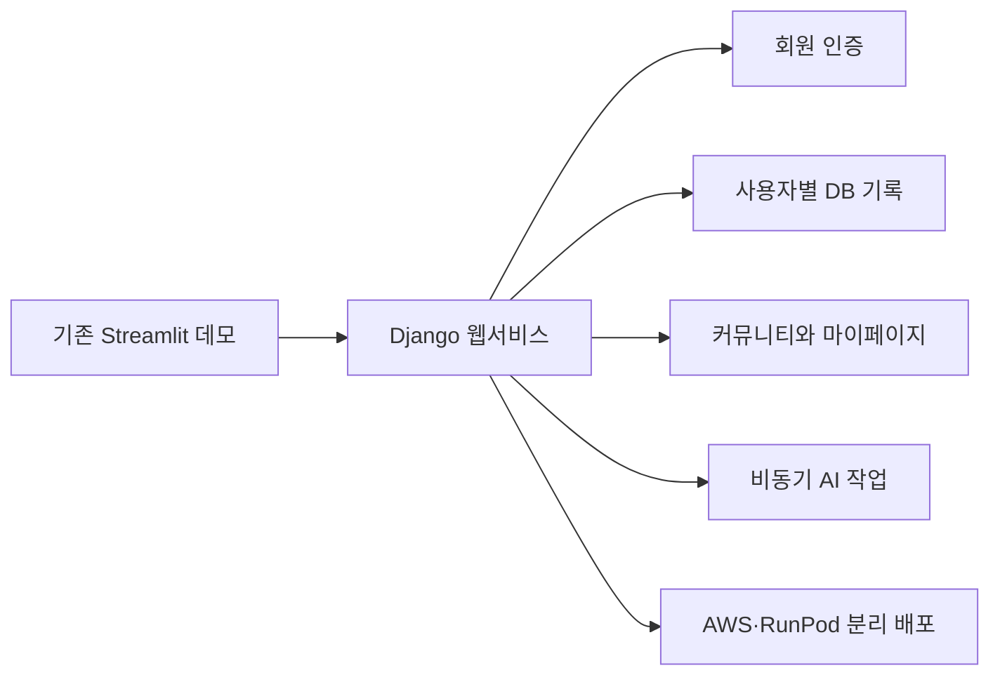
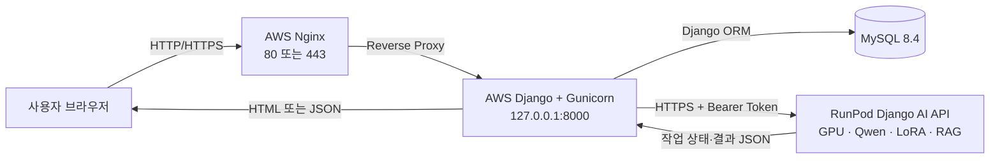
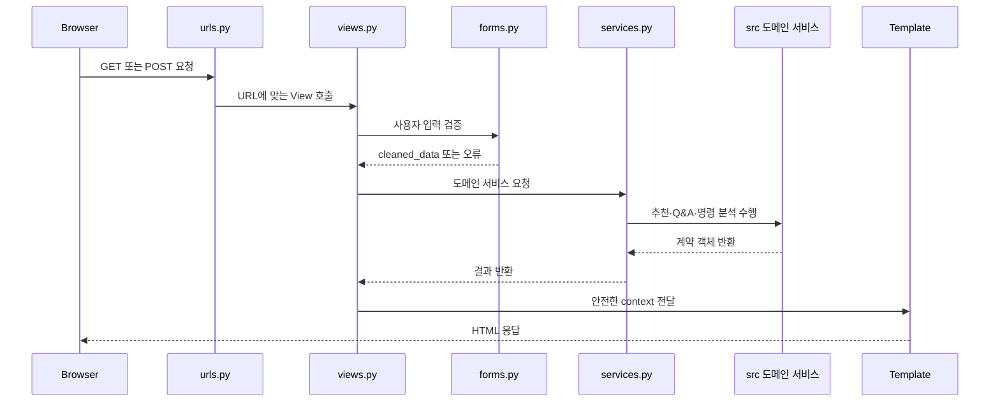
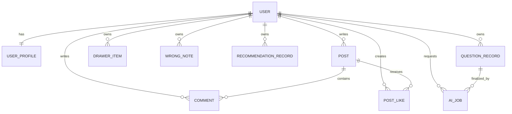
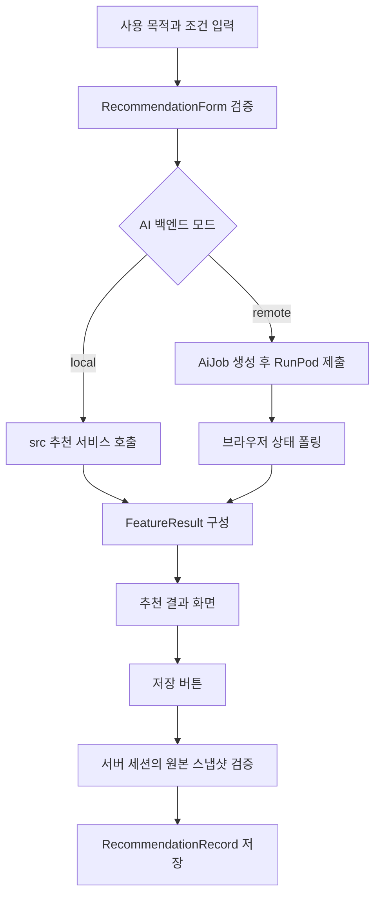
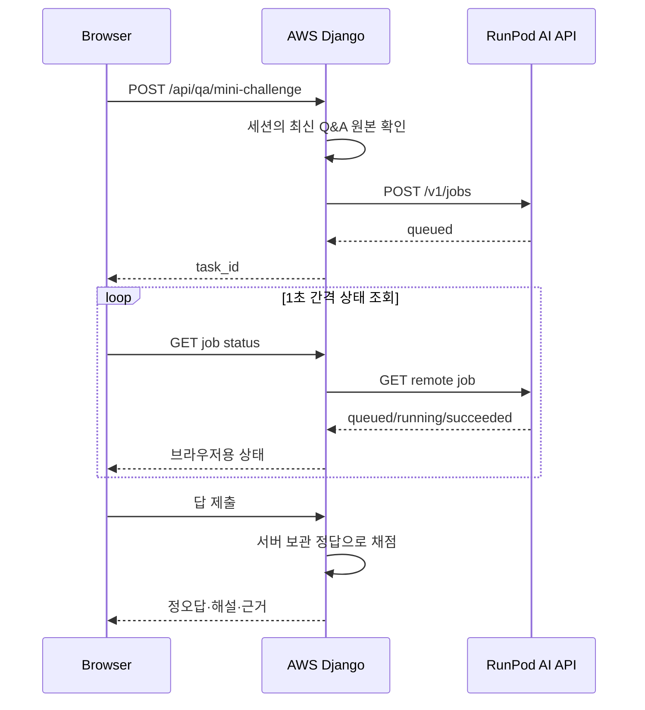

# PiCare Django 웹서비스 발표 자료

> 기준 저장소: `skn_33_4th_5team`  
> 기준 브랜치: `main`  
> 문서 목적: 발표 슬라이드 제작, 시연 준비, 기술 질의응답 대비

---

## 0. 발표에서 먼저 명확히 할 범위

PiCare의 Django 작업은 단순히 화면을 하나 만든 작업이 아니다.

기존 AI·RAG 기능을 사용자가 실제로 이용할 수 있도록 다음 영역을 하나의 웹서비스로 연결했다.

- Streamlit 중심 화면을 Django 기반 웹서비스로 전환
- 회원가입·로그인·로그아웃과 사용자별 데이터 분리
- 제품 추천과 Q&A 결과의 저장·조회·삭제
- Q&A 결과를 이용한 비동기 미니 챌린지
- 오답노트, 질문 아카이브, 마이페이지, 커뮤니티
- AWS의 Django와 RunPod의 GPU AI 서버 간 인증 통신
- MySQL, Gunicorn, Nginx, Docker를 이용한 배포 구조
- CSRF, 소유권 검사, 안전한 리다이렉트, 서버 스냅샷 검증

### 역할 경계

발표에서는 팀 작업의 경계를 정확히 설명해야 한다.

- **AI·RAG 도메인 로직**: `src/`에 있는 검색, 생성, 추천, 퀴즈 생성 기능
- **Django 웹서비스 작업**: `web_app/`에서 도메인 기능을 사용자 요청, 세션, DB, 화면과 연결
- **RunPod 연동 작업**: AWS가 GPU 라이브러리를 직접 불러오지 않고 HTTPS API로 작업을 위임하도록 구성

따라서 가장 정확한 표현은 다음과 같다.

> 팀이 만든 AI 기능을 Django 웹서비스로 통합하고, 사용자 인증·데이터 저장·비동기 작업·배포 경계를 구현했다.

---

## 1. 프로젝트 개요

### 1.1 서비스 한 줄 소개

PiCare는 Raspberry Pi 공식 문서를 기반으로 제품 추천, 사용법 Q&A, 명령어 안내와 학습용 미니 챌린지를 제공하는 웹서비스다.

### 1.2 Django를 선택한 이유

Streamlit은 빠른 AI 데모에는 적합하지만 다음 요구사항을 구현하려면 제약이 있었다.

| 요구사항 | Django에서 해결한 방법 |
|---|---|
| 회원가입과 로그인 | Django 기본 인증 시스템 사용 |
| 사용자별 기록 | ORM 모델과 ForeignKey로 소유자 연결 |
| 게시판과 댓글 | URL·View·Form·Template 구조로 CRUD 구현 |
| 비동기 AI 작업 | 작업 생성 API와 상태 조회 API 분리 |
| 관리자 페이지 | Django Admin 사용 |
| 입력 검증 | Django Form과 Pydantic 계약을 함께 사용 |
| 보안 | CSRF, 세션, HTTP 메서드 제한, 소유권 검사 |
| 배포 | Gunicorn, Nginx, MySQL, Docker와 연결 |

### 1.3 전환 전후



핵심 변화는 AI 기능의 존재 여부가 아니라, AI 결과를 여러 사용자가 안전하고 지속적으로 이용할 수 있는 서비스 형태로 바꾼 것이다.

---

## 2. 전체 시스템 구조

### 2.1 운영 아키텍처



### 2.2 서버 역할 분리

| 실행 위치 | 담당 역할 | 포함하지 않는 것 |
|---|---|---|
| AWS EC2 | Django 화면, 인증, 세션, DB, API 중계 | GPU 모델 로딩 |
| RunPod | Qwen·LoRA·RAG 추론, AI 작업 큐 | 사용자 화면과 계정 DB |
| MySQL | 회원별 기록과 서비스 데이터 영속화 | AI 추론 |
| 브라우저 | 폼 입력, 상태 폴링, 결과 표시 | 정답 판정과 소유권 판단 |

이 분리를 통해 AWS의 작은 CPU 인스턴스가 대형 GPU 모델을 직접 실행하지 않도록 했다.

---

## 3. Django 프로젝트 구조

```text
web_app/
├── manage.py                     # Django 관리 명령 진입점
├── picare_web/
│   ├── settings.py               # 환경변수, DB, 보안, AI 백엔드 설정
│   ├── urls.py                   # 최상위 URL 연결
│   ├── wsgi.py                   # Gunicorn 운영 진입점
│   ├── asgi.py                   # ASGI 진입점
│   └── celery.py                 # 로컬 비동기 작업 설정
├── accounts/
│   ├── forms.py                  # 로그인·회원가입 폼
│   ├── views.py                  # 인증 요청 처리
│   └── urls.py                   # 인증 URL
├── portal/
│   ├── models.py                 # 서비스 데이터 모델
│   ├── forms.py                  # 기능별 입력 검증
│   ├── views.py                  # 페이지·JSON API 처리
│   ├── urls.py                   # 기능 URL 50개
│   ├── services.py               # src 도메인 서비스 연결
│   ├── result_service.py         # 기능별 결과 형식 통일
│   ├── remote_ai.py              # AWS → RunPod HTTP 클라이언트
│   ├── ai_jobs.py                # 원격 작업 상태 관리
│   ├── tasks.py                  # Celery 미니 챌린지 작업
│   ├── admin.py                  # 관리자 페이지 등록
│   ├── tests.py                  # 통합·보안·화면 회귀 테스트
│   └── migrations/               # DB 변경 이력
├── templates/
│   ├── accounts/                 # 로그인·회원가입 화면
│   └── portal/                   # 주요 서비스 화면 30개
└── static/portal/css/picare.css  # 공통 UI 스타일
```

현재 코드 기준으로 `portal` 앱에는 URL 패턴 50개, 영속 모델 9개, 전체 Django 테스트 67개가 있다.

---

## 4. 주요 스크립트와 역할

### 4.1 프로젝트 설정과 실행

| 스크립트명 | 주요 역할 | 동작 방법 |
|---|---|---|
| `web_app/manage.py` | Django 관리 명령 실행 | 설정 모듈을 불러와 migrate, test, runserver 등을 실행 |
| `web_app/picare_web/settings.py` | 전체 환경 설정 | 루트 `.env`를 읽고 DB·세션·보안·정적 파일·AI 설정 구성 |
| `web_app/picare_web/urls.py` | 최상위 라우팅 | `/admin/`, `/accounts/`, `portal` URL을 연결 |
| `web_app/picare_web/wsgi.py` | 운영 서버 진입점 | Gunicorn이 Django 애플리케이션을 로딩할 때 사용 |
| `web_app/picare_web/asgi.py` | ASGI 진입점 | ASGI 서버로 확장할 때 사용하는 표준 진입점 |
| `web_app/picare_web/celery.py` | Celery 앱 생성 | Django 설정의 `CELERY_` 환경값을 읽고 작업 모듈 자동 탐색 |

### 4.2 회원 인증

| 스크립트명 | 핵심 클래스·함수 | 역할 |
|---|---|---|
| `web_app/accounts/forms.py` | `LoginForm` | Django 인증 폼에 한국어 문구와 스타일 적용 |
|  | `SignupForm` | 아이디·이메일·비밀번호 검증, 이메일 중복 방지 |
| `web_app/accounts/views.py` | `_safe_next()` | 외부 사이트로 이동하는 악성 `next` 주소 차단 |
|  | `signup()` | 사용자 생성 후 자동 로그인 |
|  | `login_view()` | 인증 성공 후 DB 세션 생성 |
|  | `logout_view()` | CSRF가 적용된 POST 요청으로 로그아웃 |
| `web_app/accounts/urls.py` | `signup`, `login`, `logout` | 인증 URL 연결 |

### 4.3 데이터 모델

| 스크립트명 | 핵심 클래스 | 역할 |
|---|---|---|
| `web_app/portal/models.py` | `TimestampedModel` | 생성·수정 시간을 공통 제공하는 추상 모델 |
|  | `UserProfile` | Django User의 확장 지점 |
|  | `Post`, `Comment`, `PostLike` | 커뮤니티 게시글·댓글·좋아요 |
|  | `DrawerItem` | 사용자가 저장한 명령어 실험실 결과 |
|  | `WrongNote` | 미니 챌린지 오답과 근거 스냅샷 |
|  | `RecommendationRecord` | 제품 추천 입력·응답 저장 |
|  | `QuestionRecord` | Q&A 원문·요약·공개 상태 저장 |
|  | `AiJob` | 원격 AI 작업의 상태·기한·결과·취소 여부 저장 |
| `web_app/portal/admin.py` | ModelAdmin 클래스 | 주요 모델을 관리자 화면에서 검색·필터·조회 |
| `web_app/portal/migrations/` | `0001`~`0005` | 모델 구조 변경을 순서대로 DB에 반영 |

### 4.4 입력과 결과 경계

| 스크립트명 | 핵심 클래스·함수 | 역할 |
|---|---|---|
| `web_app/portal/forms.py` | `ProfileUpdateForm` | 사용자명·이메일 수정과 이메일 중복 검사 |
|  | `PostForm`, `CommentForm` | 게시글 10,000자, 댓글 2,000자 제한 |
|  | `RecommendationForm` | 사용 목적과 선택 조건을 도메인 요청 형태로 변환 |
|  | `QuestionForm` | Q&A 질문 길이와 공백 규칙 검증 |
|  | `CommandAnalyzeForm`, `CommandInputForm` | 명령어 입력 검증, 실제 명령은 실행하지 않음 |
| `web_app/portal/result_service.py` | `FeatureResult` | 서로 다른 도메인 응답을 공통 결과 구조로 통일 |
|  | `get_qa_result()` | Q&A 서비스 호출 결과 구성 |
|  | `get_recommendation_result()` | 추천 서비스 호출 결과 구성 |
|  | `get_command_lab_result()` | 명령어 분석 결과 구성 |
|  | `get_challenge_result()` | 퀴즈 결과 구성 |

### 4.5 도메인 서비스 연결

| 스크립트명 | 핵심 함수 | 역할 |
|---|---|---|
| `web_app/portal/services.py` | `get_runtime_readiness()` | RAG 런타임 준비 여부 확인 |
|  | `get_qa_service()` | `src/`의 Q&A 서비스를 지연 생성하고 재사용 |
|  | `get_recommendation_service()` | 제품 추천 서비스를 지연 생성하고 재사용 |
|  | `get_citation_presenter()` | 인용 근거를 화면용 데이터로 변환 |
|  | `get_command_lab_service()` | 명령어 분석 서비스를 연결 |

`@lru_cache(maxsize=1)`를 사용해 무거운 서비스 객체를 요청마다 다시 만들지 않는다.

### 4.6 비동기 AI 연동

| 스크립트명 | 핵심 함수 | 역할 |
|---|---|---|
| `web_app/portal/remote_ai.py` | `RunPodClient` | AWS Django가 RunPod API를 호출하는 전용 클라이언트 |
|  | `_request()` | Bearer 인증, 타임아웃, 상태 코드, JSON 형식 검증 |
|  | `submit()` | 새 AI 작업 등록 |
|  | `status()` | 원격 작업 상태 조회 |
|  | `cancel()` | 원격 작업 취소 요청 |
|  | `readiness()` | RunPod 모델 준비 상태 조회 |
| `web_app/portal/ai_jobs.py` | `session_hash()` | 원본 세션 키를 저장하지 않고 SHA-256 해시 사용 |
|  | `owned_job()` | 현재 세션과 사용자에게 속한 작업만 조회 |
|  | `create_job()` | 기존 작업 정리 후 새 원격 작업 생성 |
|  | `refresh_job()` | 원격 상태를 로컬 `AiJob`에 반영 |
|  | `cancel_job()` | 취소 의사를 DB에 먼저 기록하고 원격 취소 요청 |
| `web_app/portal/tasks.py` | `generate_dynamic_quiz()` | 로컬 구성에서 Celery가 미니 챌린지를 비동기 생성 |

### 4.7 화면과 API

| 스크립트명 | 역할 |
|---|---|
| `web_app/portal/views.py` | 페이지 렌더링, JSON API, 세션, DB 저장, 권한 검사를 담당하는 중심 모듈 |
| `web_app/portal/urls.py` | 사용자 페이지와 API 엔드포인트 50개 연결 |
| `web_app/templates/portal/base.html` | 내비게이션, 메시지, 공통 레이아웃 |
| `web_app/templates/portal/qa.html` | Q&A 입력·답변·인용 근거·미니 챌린지 연결 |
| `web_app/templates/portal/ai_job_panel.html` | 원격 AI 작업 상태 폴링·취소·재시도 |
| `web_app/templates/portal/quiz_panel.html` | 퀴즈 생성·채점·오답노트 비동기 저장 |
| `web_app/templates/portal/recommend.html` | 추천 입력·결과·비동기 기록 저장 |
| `web_app/static/portal/css/picare.css` | 반응형 레이아웃과 PiCare 공통 디자인 |

---

## 5. Django 요청 처리 방식

### 5.1 일반 페이지 요청



### 5.2 URL → View → Template 예시

| 기능 | URL | View 함수 | Template |
|---|---|---|---|
| 메인 | `/` | `about()` | `portal/about.html` |
| 제품 추천 | `/recommend/` | `recommend()` | `portal/recommend.html` |
| Q&A | `/qa/` | `qa()` | `portal/qa.html` |
| 질문 아카이브 | `/questions/` | `questions()` | `portal/questions.html` |
| 명령어 실험실 | `/lab/` | `lab()` | `portal/lab.html` |
| 마이페이지 | `/mypage/` | `mypage()` | `portal/mypage.html` |
| 커뮤니티 | `/community/` | `community_list()` | `portal/community_list.html` |
| 오답노트 | `/wrong-notes/` | `wrong_note_list()` | `portal/wrong_note_list.html` |

---

## 6. 데이터베이스 설계

### 6.1 모델 관계



### 6.2 영속 모델 9개

| 모델 | 핵심 데이터 | 설계 의도 |
|---|---|---|
| `UserProfile` | User 1:1 연결 | 기본 User를 복제하지 않고 확장 |
| `Post` | 작성자, 제목, 내용 | 커뮤니티 게시글 |
| `Comment` | 게시글, 작성자, 내용 | 게시글별 댓글 |
| `PostLike` | 게시글, 사용자 | `(post, user)` 유일 제약으로 중복 좋아요 방지 |
| `DrawerItem` | 소유자, 종류, JSON 결과 | 서버가 만든 명령어 결과 저장 |
| `WrongNote` | 문제, 선택, 정답, 해설, 근거 | 틀린 문제의 시점별 스냅샷 보관 |
| `RecommendationRecord` | 입력과 응답 JSON | 추천 결과를 나중에도 동일하게 조회 |
| `QuestionRecord` | 질문, 답변, 요약, 공개 여부 | 개인 기록과 공개 질문 아카이브 지원 |
| `AiJob` | 작업 종류, 상태, 결과, 기한, 취소 | AWS와 RunPod 사이의 비동기 상태 보존 |

### 6.3 JSONField를 사용한 이유

AI 결과는 추천 제품, 인용 근거, 상태, 요약 등 구조가 복합적이다. 필요한 일부 항목은 일반 컬럼으로 검색 가능하게 저장하고, 원본 응답 전체는 `JSONField`로 함께 보관했다.

이 방식의 장점은 다음과 같다.

- 화면을 다시 열어도 당시 결과를 복원할 수 있음
- 클라이언트가 보낸 조작된 결과가 아니라 서버가 받은 원본을 저장할 수 있음
- AI 응답 계약에 필드가 추가되어도 기본 스냅샷을 유지할 수 있음

### 6.4 마이그레이션 순서

| 파일 | 변경 내용 |
|---|---|
| `0001_initial.py` | 프로필, 게시글, 댓글, 좋아요, 서랍, 오답노트 |
| `0002_questionrecord.py` | Q&A 기록 추가 |
| `0003_recommendationrecord.py` | 제품 추천 기록 추가 |
| `0004_aijob.py` | 원격 비동기 AI 작업 추가 |
| `0005_questionrecord_summary_fields.py` | 질문 제목·답변 요약 필드 추가 |

---

## 7. 기능별 상세 동작

### 7.1 회원가입·로그인·로그아웃

1. 브라우저가 `accounts` URL로 GET 요청을 보낸다.
2. Django Form이 입력 필드와 오류 메시지를 렌더링한다.
3. POST 시 아이디, 이메일, 비밀번호를 서버에서 검증한다.
4. 회원가입 성공 시 Django User를 생성하고 즉시 로그인한다.
5. 로그인 성공 시 DB 기반 세션을 발급한다.
6. 로그아웃은 GET이 아니라 CSRF 보호가 적용된 POST만 허용한다.

주요 보안 포인트:

- 비밀번호는 Django 해시 정책으로 저장
- 이메일은 소문자로 정규화하고 중복 검사
- `next` 파라미터가 외부 주소면 무시해 오픈 리다이렉트 방지
- 사용자 데이터 화면에는 `@login_required` 적용

### 7.2 제품 추천



중요한 점은 브라우저가 보내는 추천 결과 본문을 그대로 믿지 않는다는 것이다. 서버 세션에 보관한 저장 토큰과 원본 응답을 검증한 뒤 DB에 저장한다.

### 7.3 Q&A와 인용 근거

1. `QuestionForm`이 질문 길이와 공백 정책을 검증한다.
2. 로컬 또는 RunPod Q&A 서비스가 공식 문서 기반 답변을 생성한다.
3. 응답을 Pydantic `ChatResponse` 계약으로 검증한다.
4. 답변, 상태, 인용 근거, 미디어를 템플릿에 전달한다.
5. 로그인 사용자의 결과는 `QuestionRecord`로 자동 저장한다.
6. 제목과 답변 요약을 생성해 마이페이지 목록의 가독성을 높인다.
7. 사용자가 공개를 선택하면 질문 아카이브에 게시된다.

요약 생성이 실패해도 원래 Q&A 답변은 버리지 않는다. 부가 기능 실패가 핵심 기능을 막지 않도록 예외를 분리했다.

### 7.4 비동기 미니 챌린지

미니 챌린지는 방금 생성된 Q&A 답변과 공식 인용 근거만 사용한다.



보안상 정답은 문제 생성 직후 브라우저에 보내지 않는다. `_public_quiz_payload()`가 문제와 보기만 전달하고, 제출 시 서버가 세션에 보관한 원본 정답으로 채점한다.

지원 상태:

- `pending` 또는 `queued`: 대기 중
- `running`: 생성 중
- `available` 또는 `succeeded`: 사용 가능
- `insufficient_content`: 근거 부족
- `cancelled`: 사용자 취소
- `failed`: 생성 실패

### 7.5 오답노트

오답 제출 후 로그인 사용자에게만 저장 버튼을 표시한다.

저장 시 서버는 다음을 다시 확인한다.

- 현재 사용자의 세션에 해당 퀴즈가 존재하는가
- 해당 문제를 실제로 제출했는가
- 선택한 답이 실제로 오답인가
- 문제·정답·해설·근거가 서버 원본과 일치하는가

비동기 요청이면 JSON을 반환해 현재 문제 화면을 유지하고, 일반 HTML 폼 요청이면 기존처럼 상세 페이지로 이동한다.

### 7.6 명령어 실험실

명령어 실험실은 사용자가 입력한 셸 명령을 서버에서 실행하는 기능이 아니다.

- 검수된 명령어 카탈로그에서 일치 항목을 검색
- 명령의 구성 요소와 용도를 설명
- 허용된 템플릿으로 명령어를 조립
- 결과를 서랍에 저장

저장 시 클라이언트가 보낸 명령 스냅샷을 그대로 신뢰하지 않고, 서버가 검수된 템플릿과 입력값으로 결과를 다시 구성한다.

### 7.7 커뮤니티

- 목록과 상세는 공개 조회
- 작성·수정·삭제·댓글·좋아요는 로그인 필요
- 수정과 삭제는 작성자만 가능
- 좋아요는 DB 유일 제약으로 중복 방지
- `select_related`, `prefetch_related`, 집계 annotation을 이용해 불필요한 쿼리 감소

### 7.8 마이페이지

마이페이지는 사용자 소유 데이터만 조회한다.

- 작성 글
- 작성 댓글
- 좋아요한 글
- Q&A 기록
- 추천 기록
- 명령어 서랍
- 오답노트

메인 화면은 최근 항목과 개수를 요약하고, 각 상세 목록은 페이지당 10개로 나눈다.

---

## 8. 원격 AI 작업 설계

### 8.1 FastAPI 대신 Django API를 사용한 이유

현재 RunPod API 경계도 Django View로 구성되어 있다. 새로운 웹 프레임워크를 추가하지 않고 팀이 사용한 Django 기술 안에서 API를 통일하기 위한 선택이다.

AWS의 `remote_ai.py`는 프레임워크가 아니라 일반 `requests` HTTP 클라이언트다. 이 클라이언트가 RunPod의 Django API에 요청을 보낸다.

### 8.2 `AiJob`이 필요한 이유

GPU 추론은 일반 페이지 요청보다 오래 걸릴 수 있다. 요청 하나를 계속 붙잡고 있으면 다음 문제가 생긴다.

- 프록시나 웹서버 타임아웃
- 사용자가 진행 상태를 알 수 없음
- 취소와 재시도 구현이 어려움
- 결과 저장 시점이 불명확함

그래서 작업 생성과 결과 조회를 분리했다.

```text
1. AWS가 AiJob을 DB에 생성
2. RunPod에 작업 제출
3. 브라우저에 job_id 반환
4. 브라우저가 상태 API를 주기적으로 조회
5. 완료되면 AWS가 결과를 검증하고 한 번만 확정
6. 화면에 결과 표시
```

### 8.3 중복과 경합 방지

- DB 트랜잭션과 `select_for_update()`로 같은 작업의 동시 갱신 방지
- `finalized_at`으로 완료 후 부수 효과를 한 번만 실행
- 새 작업 생성 시 같은 세션·기능의 이전 작업을 더 이상 현재 작업이 아니도록 처리
- `deadline_at`, `expires_at`으로 무한 대기와 오래된 작업 정리
- 연결 결과가 불확실할 때 `submission_unknown`으로 기록해 중복 제출 방지

### 8.4 AWS와 RunPod 인증

두 서버에 같은 `AI_API_TOKEN`을 비밀값으로 설정한다.

```http
Authorization: Bearer <AI_API_TOKEN>
```

`RunPodClient`는 다음을 검증한다.

- 운영 주소는 HTTPS인지
- URL 안에 아이디나 비밀번호가 포함되지 않았는지
- 401·403·404·429·5xx 상태를 서비스 오류 코드로 변환하는지
- 응답이 JSON 객체인지
- `job_id`, `kind`, `status`가 요청과 일치하는지
- 성공 작업에 결과 객체가 존재하는지

---

## 9. 화면 구현

### 9.1 템플릿 구성

현재 템플릿은 총 32개다.

- 계정 템플릿 2개
- 포털 템플릿 30개
- `base.html`을 상속해 내비게이션과 공통 레이아웃 재사용
- 결과 상세, 출처 카드, 페이지네이션 등을 부분 템플릿으로 분리

### 9.2 JavaScript의 역할

프론트 JavaScript는 다음 사용자 경험을 담당한다.

- 오래 걸리는 AI 작업 상태 폴링
- 생성 중 로딩 표시
- 작업 취소와 재시도
- 퀴즈 문제 동적 렌더링
- 답안 제출 후 결과 표시
- 오답노트 비동기 저장
- 추천 결과 비동기 저장

권한과 정답 판정은 JavaScript가 아니라 Django 서버가 담당한다.

### 9.3 Bootstrap과 사용자 정의 CSS

- Bootstrap 5.3으로 기본 그리드·버튼·폼·알림 구성
- `picare.css`로 브랜드 색상, 카드, 반응형 간격, 상태 UI를 정의
- 모바일 내비게이션과 화면 크기별 배치를 지원

---

## 10. 실제로 해결한 UI 문제

### 10.1 취소·실패 후 스피너가 사라지지 않던 문제

원인:

- JavaScript는 요소에 `hidden`을 설정함
- 같은 요소의 Bootstrap `d-flex`가 `display: flex !important`를 적용함
- 결과적으로 `hidden`의 `display: none`이 덮어써짐

수정:

- `hidden` 제어 대상 바깥 요소에서 `d-flex` 제거
- 내부 자식 요소로 flex 클래스를 이동
- 기존 JavaScript 로직은 그대로 유지

결과:

- 생성 중에만 스피너 표시
- 성공·취소·실패·생성 불가 시 정상적으로 숨김
- 취소·실패 시 재시도 영역 표시

### 10.2 오답노트 저장 후 문제 화면이 사라지던 문제

원인:

- 동적으로 만든 저장 버튼이 일반 폼 제출을 수행함
- 저장 View가 오답노트 상세 페이지로 redirect함
- 페이지 이동으로 아직 풀지 않은 다른 문제가 사라짐

수정:

- JavaScript 요청에는 JSON 응답 반환
- 저장 성공 시 현재 화면을 유지
- 버튼을 비활성화하고 `오답노트에 저장됨` 표시
- 사용자가 원할 때 이동할 수 있는 상세 링크 제공
- 일반 폼 제출의 기존 redirect 동작은 유지

결과:

- 저장과 페이지 이동을 분리
- 다른 문제를 계속 풀 수 있음
- 실패 시 현재 화면에서 재시도 가능

---

## 11. 보안 설계

| 위협 | 대응 방법 |
|---|---|
| 외부 URL로 강제 이동 | `_safe_next()`로 같은 호스트만 허용 |
| CSRF 공격 | Django CSRF 미들웨어와 POST 폼 토큰 사용 |
| 타 사용자 데이터 접근 | 모든 상세·삭제 QuerySet에 `owner=request.user` 적용 |
| 타 세션 AI 작업 조회 | 세션 해시와 사용자 ID를 함께 검사 |
| 정답 유출 | 제출 전 공개 퀴즈 JSON에서 정답·해설 제외 |
| 클라이언트 결과 조작 | 서버 세션의 원본 스냅샷으로 저장 데이터 재구성 |
| 중복 좋아요 | DB UniqueConstraint 사용 |
| 잘못된 HTTP 메서드 | `require_GET`, `require_POST`, `require_http_methods` 사용 |
| RunPod 무단 호출 | Bearer Token 인증 |
| 운영 비밀 노출 | `.env`와 RunPod Secret 사용, Git에는 올리지 않음 |
| 운영 HTTP 노출 | Nginx와 HTTPS 확장 구조, 보안 쿠키 환경변수 지원 |

운영 환경에서 중요한 값:

- `DJANGO_SECRET_KEY`
- `MYSQL_PASSWORD`
- `MYSQL_ROOT_PASSWORD`
- `AI_API_TOKEN`
- 외부 서비스 API 키

발표 자료와 저장소에는 실제 값을 표시하지 않는다.

---

## 12. 배포 스크립트

### 12.1 `Dockerfile.aws`

AWS 웹 계층 전용 이미지다.

1. `python:3.12-slim` 사용
2. Python 캐시와 출력 버퍼 비활성화
3. 기본 AI 백엔드를 `remote`로 설정
4. `requirements-web.txt`만 설치
5. 소스 복사
6. `collectstatic` 실행
7. 8000 포트 노출
8. `deploy/aws-entrypoint.sh` 실행

GPU용 PyTorch나 Transformers를 AWS 이미지에 설치하지 않아 이미지와 메모리 사용량을 줄였다.

### 12.2 `deploy/aws-entrypoint.sh`

컨테이너 시작 시 다음 순서로 동작한다.

```text
1. Django migration 적용
2. Gunicorn 실행
3. 기본 0.0.0.0:8000에서 요청 수신
4. 워커 수와 타임아웃은 환경변수로 조정
```

### 12.3 `requirements-web.txt`

| 패키지 | 용도 |
|---|---|
| Django | 웹 프레임워크 |
| gunicorn | 운영 WSGI 서버 |
| whitenoise | 정적 파일 제공 |
| PyMySQL | MySQL 연결 |
| pydantic | AI 응답 계약 검증 |
| python-dotenv | `.env` 로딩 |
| requests | RunPod HTTP 호출 |
| celery[redis] | 로컬 비동기 작업 구성 |
| rank-bm25, PyYAML | 경량 검색·설정 데이터 지원 |

### 12.4 포트 흐름

```text
외부 사용자
  → AWS 보안 그룹 80/443
  → Nginx 80/443
  → 127.0.0.1:8000
  → picare-web 컨테이너의 Gunicorn 8000
```

Docker의 `8000:8000`은 컨테이너와 호스트 사이의 연결이고, 사용자가 최종 접속하는 공개 포트는 Nginx의 80 또는 443이다.

---

## 13. 주요 환경변수

### 13.1 Django

| 변수 | 의미 |
|---|---|
| `DJANGO_SECRET_KEY` | Django 서명용 비밀키 |
| `DJANGO_DEBUG` | 상세 오류 화면 사용 여부, 운영은 `false` |
| `DJANGO_ALLOWED_HOSTS` | 접속을 허용할 도메인·IP |
| `DJANGO_CSRF_TRUSTED_ORIGINS` | 신뢰할 HTTPS 출처 |
| `DJANGO_SESSION_COOKIE_SECURE` | HTTPS에서만 세션 쿠키 전송 |
| `DJANGO_CSRF_COOKIE_SECURE` | HTTPS에서만 CSRF 쿠키 전송 |

### 13.2 MySQL

| 변수 | 의미 |
|---|---|
| `MYSQL_DATABASE` | 생성할 DB 이름 |
| `MYSQL_USER` | 앱 DB 계정 |
| `MYSQL_PASSWORD` | 앱 DB 비밀번호 |
| `MYSQL_ROOT_PASSWORD` | MySQL root 비밀번호 |
| `DJANGO_DB_HOST` | Django가 연결할 DB 호스트 |
| `DJANGO_DB_PORT` | Django가 연결할 DB 포트 |

`DJANGO_DB_*` 값이 있으면 우선 사용하고, 없으면 공유 `MYSQL_*` 값을 사용한다.

### 13.3 RunPod 연동

| 변수 | 의미 |
|---|---|
| `PICARE_AI_BACKEND=remote` | AI 작업을 RunPod로 위임 |
| `AI_API_URL` | RunPod 8000 HTTP 서비스 URL |
| `AI_API_TOKEN` | AWS와 RunPod가 공유하는 내부 인증 토큰 |
| `AI_HTTP_TIMEOUT` | 단일 HTTP 요청 제한 시간 |
| `AI_JOB_TIMEOUT` | 전체 AI 작업 제한 시간 |

---

## 14. 실행 방법

### 14.1 로컬 개발 실행

```bash
cd /path/to/skn_33_4th_5team
source .venv/bin/activate
python web_app/manage.py migrate
python web_app/manage.py runserver
```

브라우저 접속:

```text
http://127.0.0.1:8000/
```

### 14.2 Django 관리 명령

| 명령 | 역할 |
|---|---|
| `python web_app/manage.py check` | 설정과 앱 구성 검사 |
| `python web_app/manage.py makemigrations` | 모델 변경을 마이그레이션 파일로 생성 |
| `python web_app/manage.py migrate` | DB 스키마 반영 |
| `python web_app/manage.py createsuperuser` | 관리자 계정 생성 |
| `python web_app/manage.py collectstatic` | 운영 정적 파일 수집 |
| `python web_app/manage.py test` | Django 테스트 실행 |

### 14.3 AWS 이미지 실행

```bash
docker build -f Dockerfile.aws -t picare-web:aws .
```

컨테이너는 AWS 배포 가이드에 따라 MySQL과 같은 Docker 네트워크에서 실행한다.

자세한 절차:

- [초기설정가이드-AWS](deployment/초기설정가이드-AWS.md)
- [초기설정가이드-RUNPOD](deployment/초기설정가이드-RUNPOD.md)

---

## 15. 테스트와 검증

### 15.1 현재 테스트 결과

2026-09-19 현재 로컬 AI 백엔드와 SQLite 테스트 DB 조건에서 다음 결과를 확인했다.

```text
Ran 67 tests in 7.698s
OK
System check identified no issues
```

재현 명령:

```bash
PICARE_AI_BACKEND=local \
DJANGO_DB_ENGINE=django.db.backends.sqlite3 \
DJANGO_SQLITE_PATH=/tmp/picare-presentation-test.sqlite3 \
.venv/bin/python web_app/manage.py test accounts portal --noinput
```

`PICARE_AI_BACKEND=local`을 명시하는 이유는 원격 운영 모드가 켜진 `.env`의 영향을 차단하고, 단위 테스트가 준비한 가짜 도메인 서비스를 사용하기 위해서다.

### 15.2 주요 테스트 범위

- 회원가입·로그인·로그아웃
- 외부 `next` URL 차단
- 사용자별 데이터 소유권
- 제품 추천 저장 토큰과 중복 저장
- Q&A 기록과 요약 실패 격리
- AI 작업 생성·조회·취소·완료 확정
- 퀴즈 생성, 정답 비공개, 서버 채점
- 오답만 오답노트에 저장
- 비동기 오답노트 JSON 응답
- 커뮤니티 작성자 권한
- 명령어 실험실 입력과 저장 검증
- 런타임 미준비 상태의 안전한 안내

### 15.3 수동 검증 항목

- 모바일과 데스크톱 화면
- 생성 중 스피너 표시
- 성공·취소·실패 후 스피너 숨김
- 미니 챌린지 재시도
- 오답노트 저장 후 다른 문제 유지
- AWS `/health/` 응답
- RunPod `/health/live`, `/health/ready` 응답

---

## 16. 주요 작업 이력

| 커밋 | 작업 내용 |
|---|---|
| `055cdaa` | Streamlit에서 Django로 전환 |
| `7ec7c75` | 프론트엔드와 회원가입 구현 |
| `6b2eba2` | 취소 가능한 비동기 미니 챌린지 연동 |
| `9bfe48a` | 공통 결과 화면과 추천 기록 모델 추가 |
| `11f1eaf` | 회원가입·인증 흐름 보완 |
| `51447bf` | FastAPI 경계를 Django API로 전환 |
| `f58c803` | 미니 챌린지 로딩 스피너 숨김 수정 |
| `a2677d9` | 오답노트 저장 후 문제 화면 유지 |
| `1a0e245` | 프론트·백엔드 독스트링과 설명 보강 |

커밋은 “기능 구현 → 통합 → 운영 안정화 → 사용성 개선” 순으로 발전한 과정을 보여준다.

---

## 17. 발표 슬라이드 권장 구성

### 슬라이드 1. 프로젝트 소개

- 제목: Raspberry Pi 공식 문서 기반 AI 도우미 PiCare
- 문제: 입문자가 제품 선택, 설치, 명령어, 문제 해결 정보를 찾기 어려움
- 해결: 추천·Q&A·명령어 안내·학습 퀴즈를 하나의 웹서비스로 제공

발표 멘트:

> PiCare는 공식 Raspberry Pi 문서를 기반으로 사용자의 제품 선택부터 문제 해결과 학습까지 지원하는 서비스입니다.

### 슬라이드 2. 기존 구조의 한계

- Streamlit은 AI 데모에는 적합
- 회원 관리와 사용자별 기록 확장이 어려움
- 커뮤니티와 운영 배포 구조 필요

발표 멘트:

> 모델 결과를 보여주는 데모를 넘어 실제 사용자가 기록을 남기고 다시 찾을 수 있는 서비스가 필요했습니다.

### 슬라이드 3. Django 전환 목표

- 인증
- 영속 데이터
- 다중 기능 라우팅
- 비동기 작업
- 배포와 보안

### 슬라이드 4. 전체 아키텍처

- 브라우저 → AWS Nginx → Django/Gunicorn → MySQL
- Django → RunPod Django AI API
- AWS와 GPU 서버 역할 분리 강조

### 슬라이드 5. Django 프로젝트 구조

- `accounts`: 인증
- `portal`: 핵심 서비스
- `templates/static`: 화면
- `picare_web`: 설정과 실행

### 슬라이드 6. 데이터 모델

- User 중심 관계도 표시
- 질문·추천·오답·명령어·커뮤니티 기록 설명
- `AiJob`으로 비동기 작업 상태 보존

### 슬라이드 7. Q&A 동작

- 입력 검증
- 공식 문서 기반 답변
- 인용 근거 표시
- 로그인 사용자 자동 저장
- 공개 질문 아카이브

### 슬라이드 8. 비동기 미니 챌린지

- 작업 생성과 상태 조회 분리
- 취소·재시도 가능
- 정답은 서버에만 보관
- 오답노트 연결

### 슬라이드 9. 제품 추천과 저장

- 조건 입력
- 추천 결과 생성
- 서버 원본 검증 후 저장
- 마이페이지에서 재조회

### 슬라이드 10. 사용자 기능

- 회원가입·로그인
- 마이페이지
- 커뮤니티
- 질문 아카이브
- 서랍과 오답노트

### 슬라이드 11. 보안 설계

- CSRF와 POST 제한
- 소유권 필터
- 안전한 redirect
- 서버 원본 검증
- Bearer Token
- 비밀값 환경변수 관리

### 슬라이드 12. 배포 구조

- AWS: Django, MySQL, Nginx
- RunPod: Qwen, LoRA, RAG
- Docker 이미지 분리
- 외부 80/443, 내부 8000

### 슬라이드 13. 문제 해결 사례

- Bootstrap `d-flex !important`와 `hidden` 충돌
- 오답노트 redirect로 문제 화면 소실
- 원인 → 수정 → 결과 순서로 시각화

### 슬라이드 14. 검증 결과

- Django 테스트 67개 통과
- System check 이상 없음
- 인증, 권한, 비동기, 저장, UI 회귀 검증

### 슬라이드 15. 성과와 확장 방향

- AI 데모를 다중 사용자 웹서비스로 전환
- AWS와 GPU 서버의 책임 분리
- 향후 HTTPS, CI/CD, 작업 정리 스케줄, 모니터링 확장

---

## 18. 시연 순서

발표 시간 5~7분 기준으로 다음 순서를 권장한다.

1. 메인 화면에서 서비스 기능 소개
2. 회원가입 또는 로그인
3. Q&A 질문 입력
4. 답변과 공식 인용 근거 확인
5. 마이페이지에 자동 저장된 질문 확인
6. 같은 답변으로 미니 챌린지 생성
7. 문제 제출과 오답노트 저장
8. 페이지가 이동하지 않고 다음 문제가 남아 있는지 확인
9. 오답노트 상세 화면 확인
10. 제품 추천 실행 후 저장
11. 마이페이지 추천 기록 확인
12. 마지막에 AWS·RunPod 구조 슬라이드로 기술 설명

### 시연 전 체크리스트

- RunPod `/health/ready`가 `ready: true`인지 확인
- AWS의 `AI_API_URL`이 현재 Pod ID를 사용하는지 확인
- AWS와 RunPod의 `AI_API_TOKEN`이 같은지 확인
- 테스트 계정 로그인 가능 여부 확인
- MySQL 컨테이너가 healthy인지 확인
- Django 컨테이너와 Nginx가 실행 중인지 확인
- 시연용 질문을 미리 준비
- RunPod 모델 초기화 시간을 고려해 발표 전에 준비 완료

---

## 19. 발표용 핵심 코드 설명

### 코드 예시 1. HTTP 메서드 제한

```python
@login_required
@require_POST
def wrong_note_save(request, quiz_id):
    ...
```

설명:

> 로그인 사용자만 접근할 수 있고, 데이터를 변경하는 기능이므로 POST만 허용했습니다.

### 코드 예시 2. 사용자 소유권 검사

```python
get_object_or_404(WrongNote, pk=pk, owner=request.user)
```

설명:

> URL의 번호를 바꿔도 다른 사용자의 오답노트를 조회할 수 없도록 소유자를 쿼리 조건에 포함했습니다.

### 코드 예시 3. 안전한 원격 인증

```python
headers={
    "Authorization": f"Bearer {self.token}",
    "Accept": "application/json",
}
```

설명:

> AWS와 RunPod 사이의 요청에 공유 토큰을 넣어 공개 인터넷에서 임의 요청을 차단했습니다.

### 코드 예시 4. 서비스 객체 재사용

```python
@lru_cache(maxsize=1)
def get_qa_service():
    ...
```

설명:

> 무거운 검색·생성 서비스를 요청마다 다시 만들지 않고 프로세스 안에서 재사용했습니다.

### 코드 예시 5. 운영 서버 실행

```sh
exec gunicorn picare_web.wsgi:application \
  --chdir web_app \
  --bind "${GUNICORN_BIND:-0.0.0.0:8000}"
```

설명:

> 개발용 runserver가 아니라 운영용 Gunicorn으로 Django WSGI 애플리케이션을 실행했습니다.

---

## 20. 예상 질문과 답변

### Q1. 왜 Django를 사용했나요?

Streamlit 데모를 회원 인증, DB 기록, 관리자 화면, 커뮤니티, 권한 제어가 있는 다중 사용자 서비스로 확장하기 위해 사용했다. Django는 이 기능을 하나의 일관된 구조로 제공한다.

### Q2. FastAPI는 왜 제거했나요?

팀이 학습하고 사용한 Django로 웹과 API 경계를 통일하기 위해 제거했다. RunPod도 Django View로 JSON API를 제공하고, AWS는 `requests`로 호출한다.

### Q3. AWS가 직접 모델을 실행하지 않는 이유는 무엇인가요?

GPU 모델은 메모리와 CUDA 환경이 필요하다. AWS 웹 서버는 인증과 DB에 집중하고, GPU 추론은 RunPod에 맡기면 비용과 운영 책임을 분리할 수 있다.

### Q4. 결과를 왜 바로 DB에 저장하지 않고 세션도 사용하나요?

세션은 방금 생성한 원본 응답과 임시 퀴즈 상태를 안전하게 연결하는 데 사용한다. DB에는 사용자가 보관해야 하는 질문, 추천, 오답 등의 영속 기록을 저장한다.

### Q5. 비동기 작업은 어떻게 구현했나요?

작업 생성 시 ID를 반환하고, 브라우저가 상태 API를 주기적으로 조회한다. 완료 시 서버가 결과를 검증하고 DB 작업을 한 번만 확정한다.

### Q6. 사용자가 다른 사용자의 기록 번호를 URL에 넣으면 어떻게 되나요?

조회 QuerySet에 항상 현재 사용자를 포함하므로 404가 반환된다. 단순히 템플릿에서 버튼을 숨기는 수준이 아니라 서버에서 소유권을 검사한다.

### Q7. 퀴즈 정답이 개발자 도구에 보이지 않나요?

생성 결과를 브라우저에 전달하기 전에 정답과 해설을 제거한다. 사용자가 답을 제출하면 서버 세션의 원본 문제로 채점한다.

### Q8. 테스트는 어떤 조건에서 실행했나요?

AI 호출을 가짜 서비스로 대체할 수 있도록 `PICARE_AI_BACKEND=local`을 사용하고, 격리된 SQLite 테스트 DB에서 accounts와 portal의 67개 테스트를 실행했다.

### Q9. `8000:8000`인데 왜 사용자는 80 포트로 접속하나요?

8000은 Docker 호스트와 Gunicorn 컨테이너 사이의 내부 연결이다. 외부 사용자는 Nginx의 80 또는 443으로 접속하고 Nginx가 내부 8000으로 전달한다.

### Q10. CI/CD를 추가하면 지금 작업은 필요 없어지나요?

아니다. CI/CD는 지금 구성한 이미지 빌드, 테스트, 마이그레이션, 배포 명령을 자동화하는 방식이다. Django 코드와 Docker·환경변수·서버 구조가 먼저 있어야 자동 배포도 가능하다.

---

## 21. 한 장 요약

### 문제

AI 기능은 있었지만 인증, 기록, 권한, 커뮤니티, 운영 배포가 포함된 웹서비스 구조가 필요했다.

### 해결

Django로 화면과 API를 통합하고, 사용자별 데이터를 MySQL에 저장하며, GPU 추론은 인증된 비동기 API로 RunPod에 분리했다.

### 핵심 구현

- Django 인증과 DB 세션
- 9개 영속 모델과 5단계 마이그레이션
- 50개 Portal URL
- Q&A·추천·미니 챌린지·오답노트 통합
- AWS ↔ RunPod 비동기 작업과 Bearer 인증
- Gunicorn·Nginx·Docker·MySQL 운영 구조
- 로컬 조건에서 Django 테스트 67개 통과

### 최종 성과

> AI 결과를 보여주는 데모를 실제 사용자가 가입하고, 질문하고, 저장하고, 학습하고, 다시 찾아볼 수 있는 Django 웹서비스로 발전시켰다.

